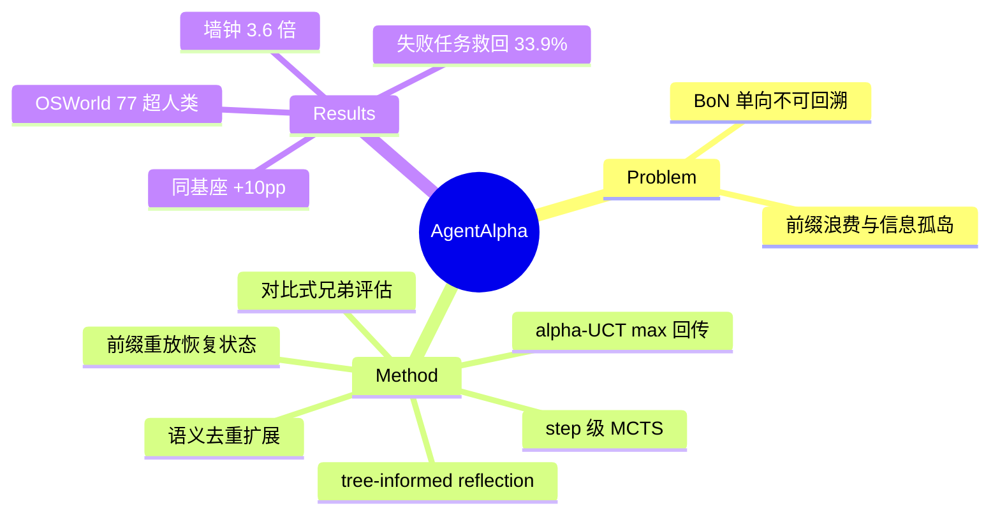

## Summary

Agent Alpha 把 test-time 搜索从 trajectory 级（Best-of-N 独立重跑）推进到 step 级 MCTS：alpha-UCT + max 回传 + 兄弟节点对比式评估 + 语义去重扩展，在 OSWorld 达 ~77%（超 Agent S3 bBoN 4.71pp、超人类 72.36%），且同基座对照下以 1/10 采样预算换 10pp 绝对增益——代价是 3.6× 墙钟时间。

## Problem & Motivation

现有 test-time scaling（CoT、Best-of-N 整轨迹采样）是单向过程：早期错误级联到失败、部分成功的前缀被整条丢弃、并行 rollout 之间信息不共享。GUI 任务的规划空间有树结构，trajectory 级采样无法利用它。核心动机是给 agent "regression capability"——从任意中间状态探索替代路径，而非承诺单条前向轨迹。

## Method

Step-level MCTS，四个组件针对 LLM-as-policy/evaluator 的三个失效模式：

- **Tree-informed reflection**：reflection 在每次 MCTS 迭代动态更新，累积搜索树中失败分支的教训，条件化后续动作生成——跨分支信息共享（Best-of-N 做不到的）。
- **Diversity-constrained expansion**：对齐后的 LLM 有 mode-seeking 问题（同状态重复采样得到近乎相同的动作）；用归一化算子剥离表面格式差异、只把功能上不同的动作加入树，压缩无效分支。
- **Comparison-driven evaluation**：LLM 独立打分有 range instability / scale-interpretation bias；改为对同一父节点的所有兄弟动作**联合相对评估**，消融显示换回独立打分 -6.31pp。
- **Alpha-UCT + max 回传**：评估间存在依赖（reflection 改变后续评估分布），违反标准 UCT 的独立性假设；把评估建模为 martingale，给出更紧的置信界（regret 随 reflection 精度提升趋近 O(ln T)）。回传用 max(Q, V_new) 而非均值——防止早期致命错误被均值稀释，消融中影响最大（换均值回传 -18.85pp）。
- 工程侧：action chunking（约 5 动作为一个评估单元，降低分支因子）；动作级 + 环境级并行（分别贡献 4.4× / 2.1× 加速）。
- **状态恢复 = 前缀重放**：无 checkpoint/快照机制，探索兄弟分支时从头重执行动作序列到目标状态——O(depth) 且依赖环境确定性。

## Key Results

- **OSWorld ~77%**：超最强 baseline Agent S3 + Best-of-N（N=10）4.71pp，超人类（72.36%）；VSCode 100%、GIMP 96.15%、Writer 91.30%。
- **同基座公平对照（GPT-5-mini）**：64.27% vs Agent S3 54.29%（+10pp 绝对）；平均步数更少（7.98 vs 8.88）；但墙钟 1116.5s vs 313.4s（**3.6× 慢**）。
- **恢复能力**：Agent S3 失败的 165 个任务中救回 56 个（33.9%）——regression capability 的直接证据。
- 搜索预算：20 次迭代 × 5 扩展节点 ≈ 100 次前向/任务，N=5、20 迭代后收益平台化。

## Strengths & Weaknesses

**Strengths**
- 与 wide scaling（Agent S3 bBoN 的整轨迹 Best-of-N）构成同预算直接对比：step 级搜索通过前缀共享和跨分支 reflection 更省采样、更高成功率——"分支收益来自结构而非数量"的证据。
- 对 LLM 做 MCTS 组件的三个失效模式（打分不稳、mode-seeking、评估依赖）各给了针对性修正且逐一消融，max 回传 -18.85pp 的消融尤其有信息量。
- 33.9% 的失败任务救回率把"回溯能力"从机制描述变成了可量化指标。

**Weaknesses / 边界**
- **前缀重放是全文最大的隐含依赖**：无快照，回溯成本 O(depth) 且要求环境确定性——3.6× 墙钟开销大部分源于此；作者自列 state reconstruction errors 为失效来源。引擎级 fork 原语可直接消掉这块开销（连接 runtime primitives 议题）。
- 3.6× 延迟使其定位是离线/高价值任务，交互式场景不可用。
- 仅 OSWorld（Ubuntu 沙盒）；live 环境下前缀重放既不可行也不安全，方法无法迁移。
- 未开源（截至 v1），~77% 主结果的基座模型与 fair-comparison 表不同，需注意区分。

## Mind Map

## Notes

- 与 [[2510-ScalingAgents]]（Agent S3/bBoN）是 test-time scaling 两条路线的直接对话：任务级 wide scaling vs step 级树搜索；Agent Alpha 用后者在同预算下压过前者，但依赖沙盒确定性——live 场景下 bBoN 仍是唯一选择。
- 状态恢复靠 reset+replay，与 [[2407-TreeSearchLMAgents]] 同谱系、未见改进——[[Topics/AgentRuntimePrimitives-Survey]] 的"恢复保真度决定收益上限"论断在 2026 年仍成立。
- 对比式评估（相对分替代绝对分）与 [[2607-EvoCUA15]] 的 PRM reward hacking 发现互补：两者都指向"LLM 绝对打分不可靠"，但解法不同（结构化比较 vs 锚定环境状态）。
