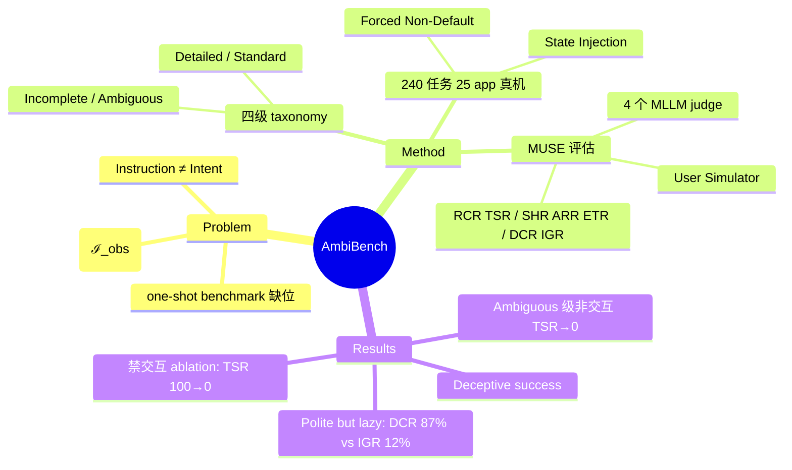

## Summary

针对现有 mobile GUI agent benchmark 隐含的 "Instruction equals Intent" 假设，提出 AmbiBench：基于 Cognitive Gap 形式化构建四级指令清晰度（Detailed/Standard/Incomplete/Ambiguous）的 240 个真机任务，并配套 MUSE（MLLM-as-a-judge 多智能体评估框架），从 outcome / execution / interaction 三维度衡量 agent 通过主动澄清对齐用户意图的能力。

## Problem & Motivation

现有 mobile GUI agent 评测假设用户一次性给出完整无歧义的指令，但真实用户常说 "order a burger meal" 这类欠规格指令。论文把这形式化为 cognitive gap：ground-truth intent 𝒰_gt 与 observed instruction 语义覆盖 𝒮(ℐ_obs) 之差 𝒢 = 𝒰_gt \ 𝒮(ℐ_obs)。当 𝒢 ≠ ∅ 时，缺乏交互机制的 agent 只能做 "probabilistic guessing"，one-shot 执行准确率无法反映真正的 intent alignment 能力——而这一能力此前完全没有 benchmark 覆盖。

## Method

**四级指令 taxonomy**（基于 Gulf of Envisioning 理论）：
- **Detailed**：需求 + 显式 UI 操作路径全给出（𝒢 = ∅）
- **Standard**：目标导向、需求完整但无操作步骤（𝒢 = ∅）
- **Incomplete**：有 anchor requirement 但缺显式/隐式约束参数
- **Ambiguous**：连核心 anchor 都缺失，意图本身未定义

**Benchmark 构建**（Requirement-First 反向推导）：先锚定 ground-truth 需求（分析 VoiceBench、AITW 并遍历应用功能树），再做复杂度注入（跨 app 链、"Forced Non-Default Principle"——所有可省略参数强制取非默认值，防止 agent 靠系统默认值蒙对），最后受控剥离信息生成各清晰度级别指令。共 240 任务、25 个 app（7 系统 + 18 三方），108 个任务必须交互才能完成；运行在 20 台 Snapdragon 865 真机（Android 13）+ 高保真模拟器上，用 State Injection Scripts 预置前置数据。

**MUSE 评估框架**（两阶段）：
- **Phase I 动态执行**：HTTP API 解耦被测 agent；User Simulator 持有 𝒰_gt，只对 Incomplete/Ambiguous 任务回应澄清请求（Detailed/Standard 拒答）；Man-in-the-Middle ADB proxy 采集执行轨迹（截图 + 动作日志）
- **Phase II 自动裁决**（四个 MLLM judge agent）：Trajectory Serializer（原始多模态轨迹→语义轨迹）、Outcome Verifier（逐原子需求判定）、Process Inspector（LCS 语义对齐算关键步命中与冗余操作）、Interaction Auditor（识别违规提问 + 计算 Information Gain Score）

**三维指标**：Outcome（RCR 需求覆盖率、TSR 任务成功率）、Execution（SHR 关键步命中、ARR 动作冗余率、ETR 错误终止率）、Interaction（DCR 对话合规率、IGR 信息增益率）。人类一致性：3 位专家双盲标注 100 条轨迹 Fleiss' κ = 0.91；MUSE 与人类对齐 Jaccard 0.92（需求判定）/ 0.84（关键步）。

## Key Results

评测 7 个配置：端到端（UI-TARS-7B、AutoGLM-9B、Qwen-3-VL-8B）+ 框架（AppAgent、Mobile-Agent-V2 均基 GPT-4o；Fairy 基 GPT-4o + Gemini-3-Flash / UI-TARS）。

- **清晰度崩塌**：非交互 agent 在 Ambiguous 级 TSR 归零（AutoGLM 从 Detailed 65.2% → Ambiguous 0%）；具交互能力的 Fairy 在 Incomplete 级仍拿到 26.2% TSR
- **"Deceptive success"**：高 RCR/SHR 伴随 TSR=0，说明 agent 在做概率性猜测而非真正理解意图
- **执行质量诊断**：AutoGLM 在 Detailed 级 ARR 高达 44.5%——成功指标掩盖了 trial-and-error 策略；UI-TARS 冗余 <5%；Fairy 的低 SHR（56.7%）归因于线上环境 XML UI-Tree 感知不可靠而非决策失败
- **"Polite but lazy"**：UI-TARS DCR 87.2% 但 IGR 仅 12.0%，Qwen-3-VL IGR 仅 2.4%——agent 有回应澄清的能力，但缺乏主动发起澄清的 awareness
- **交互必要性 mini-ablation**：对 Fairy 在 Incomplete 级成功任务禁用交互后，TSR 100% → 0%，RCR 100% → 23.8%

## Strengths & Weaknesses

**亮点**：
- 问题选得准——"指令欠规格时 agent 应澄清而非猜测" 是 GUI agent 落地的真瓶颈，此前 benchmark 系统性缺位；cognitive gap 的集合论形式化让四级 taxonomy 有明确判据而非拍脑袋分类
- Forced Non-Default Principle 是聪明的实验控制：堵死 "靠默认值蒙对" 的假阳性通道，使 TSR 真正反映意图对齐
- 过程指标（ARR/IGR）比结果指标信息量大：44.5% 冗余率揭穿 AutoGLM 的 trial-and-error、"polite but lazy"（高 DCR 低 IGR）把澄清能力拆成 capability vs awareness 两个正交维度，是本文最有价值的发现
- 真机 + MITM ADB proxy + κ=0.91 的人类校准，评估可信度做得扎实

**局限**（多为作者自认）：
- 线上真实 app 的非确定性（A/B test、广告、延迟）可能把环境噪声误判为 agent 失败；作者承认高保真本地动态 app 是未来工作
- User Simulator 和四个 judge 都是 LLM-based，simulator 幻觉会污染 Interaction 指标；judge 的偏差只在 100 条轨迹上校准过
- Incomplete vs Ambiguous 的边界依赖 anchor requirement 的主观认定，taxonomy 在长尾任务上未必稳定
- 240 任务规模偏小，且被测端到端模型只有 7B-9B 级别，缺少 top 闭源模型（如 Claude computer-use、Gemini）作为上界参照——"agent 缺澄清 awareness" 的结论是否随模型规模消失，未知

**影响推测**：IGR/DCR 这类交互质量指标可能被后续 mobile agent 工作沿用；"awareness 缺失而非能力缺失" 的诊断直接指向训练侧解法（在 agent RL 中奖励高信息增益的澄清提问）。

## Mind Map

## Notes

- 与 vault 中 GUI agent 评测线（如 Mobile-Agent-v3.5、See-Plan-Snap）互补：那些测执行能力，这篇测意图对齐能力，两者正交
- "capability vs awareness" 的拆分可迁移到其他 agent 交互场景（web agent 的用户确认、embodied agent 的 disambiguation）
- 值得追问：澄清行为能否通过 RL 用 IGR 作 reward 直接训出来？还是需要专门的澄清数据 SFT？
