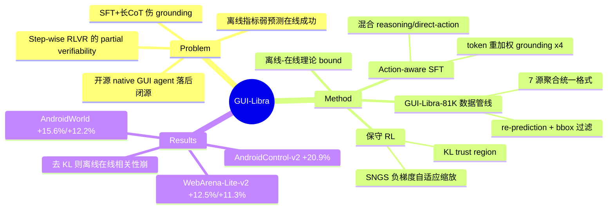

## Summary

针对开源 native GUI agent 的 post-training 提出 GUI-Libra 训练配方：诊断出通用 pipeline 的两个失效模式——SFT 加长 CoT 会伤害 grounding、step-wise RLVR 存在 partial verifiability（多个动作都对但只有一个演示动作被用于 verify），并分别用 action-aware SFT（混合 reasoning/direct-action 数据 + token 重加权）和保守 RL（KL trust region + success-adaptive negative gradient scaling）解决。附带发布 81K 条 action-aligned GUI reasoning 数据，在 web/mobile 多个离线与在线 benchmark 上同时提升 step accuracy 和端到端任务完成率。

## Problem & Motivation

开源 native GUI agent 在 long-horizon 导航任务上仍显著落后于闭源系统。作者归因于两点：(1) 高质量、与动作对齐的 reasoning 数据稀缺；(2) 直接照搬通用 LLM post-training pipeline，忽视了 GUI agent 的特有挑战。具体诊断出两个被忽视的问题：

- **CoT-grounding 张力**：标准 SFT 配长 CoT reasoning 往往损害 grounding 准确率（ablation 显示 response 越长 grounding 掉得越多）；
- **Partial verifiability**：step-wise RLVR 用单条演示动作做 verification，但同一状态下多个动作可能都正确，导致离线 step-wise 指标是在线任务成功率的弱预测器（offline-to-online gap）。

## Method

两阶段训练配方 + 数据管线：

**数据构建（GUI-Libra-81K）**
- 聚合 7 个开源数据源（AndroidControl、GUI-Odyssey、AMEX 等），统一为 `<think>...</think><answer>JSON</answer>` 格式；
- 两阶段过滤：SFT 侧用模型 re-prediction（accuracy > 0.3）+ bounding box 校验得 81K steps；RL 侧降采样早期 step 和 mobile domain 得 40K steps 以平衡分布。

**Stage 1: Action-aware SFT (ASFT)**
- 混合 reasoning-then-action 与 direct-action 两类监督，调和 reasoning 与 grounding；
- Token 重加权：action token 权重 α_a=2、grounding token 权重 α_g=4，显式强调动作与坐标 token。

**Stage 2: 保守 RL（KL 正则化 GRPO）**
- 与 RLVR 社区"去掉 KL"的惯例相反，指出在 partial verifiability 下 **KL trust region（β=0.001–0.005）是 offline-to-online predictability 的关键**；
- **Success-adaptive Negative Gradient Scaling (SNGS)**：按 group 级成功率估计缩放负梯度 λ_g(s) = min(λ₀ + κ·p̂_g(s), 1)，降权不可靠的负样本（演示外可能正确的动作被误判为错）。

**理论**：给出 partial verifiability 下的 offline-online bound（Thm 5.2）：J(π) ≥ 1 − H·C(π)·(1 − M_off(π) − η̄_π)，说明 KL 约束同时控制 distribution shift 和演示外歧义项 η̄_π。

## Key Results

基座为 Qwen2.5-VL-3B/7B 与 Qwen3-VL-4B/8B。相对各自 baseline 的提升：

| Benchmark | 提升 |
|:---|:---|
| AndroidWorld（在线） | 4B +15.6%，8B +12.2%（达 42.6%，据称与 GPT-4o+UGround 相当） |
| WebArena-Lite-v2（在线） | 4B +12.5%，8B +11.3% |
| Online-Mind2Web（在线） | 4B +4.0%，8B +8.7% |
| AndroidControl-v2 Pass@1（离线） | 3B +20.9%，7B +12.8% |
| MM-Mind2Web-v2 Pass@1（离线） | 3B +19.3%，7B +14.0% |

Ablation 关键发现：长 CoT 显著拉低 grounding（ASFT 的混合监督 + token 重加权缓解）；去掉 KL 后 offline-online 相关性明显减弱；SFT/RL 两侧的数据过滤各自都有显著贡献。核心 takeaway：不做昂贵的 online data collection，精心设计的 post-training + 数据 curation 就能显著提升端到端能力。

## Strengths & Weaknesses

**Strengths**
- 问题诊断比方法本身更有价值：把"离线 step 指标预测不了在线成功率"归因到 partial verifiability，是对 GUI agent RLVR 一个具体、可检验的 problem formulation。
- **反 convention 的证据点**：RLVR 社区普遍去 KL，本文论证在 partial verifiability 场景 KL trust region 反而是稳定与可预测性的关键，且配了理论 bound——这类"什么条件下惯例会 break"的结论跨论文复利价值高。
- 同时汇报离线 + 在线（AndroidWorld / WebArena-Lite-v2 / Online-Mind2Web）指标，且承诺全开源（数据/代码/模型），可复现性好。

**Weaknesses**
- SNGS 是对 partial verifiability 的**降权式绕行**而非解决：不去验证演示外动作是否真的正确（如引入 judge 或环境反馈），只是把不可靠负梯度整体调小，天花板受限（推测）。
- 数据 mobile 占绝对主导（web 仅 14.3%），web 结果依赖本地部署 benchmark，对真实网站的泛化未知。
- AndroidWorld 42.6% 的绝对水平只对标 GPT-4o+UGround 一代的组合系统，与 2026 年闭源 SOTA agent 仍有明显差距；提升幅度均是相对自家 baseline。
- Token 重加权（α_a=2, α_g=4）与 β 区间为手调超参，跨基座/跨 domain 的敏感性未充分讨论。

## Mind Map

## Notes

- 与 vault 中 GUI agent post-training 一线的笔记可对照：本文的"KL 必要性"结论与主流 agentic RLVR（去 KL、纯 verifiable reward）路线直接矛盾，是值得记录的 contradiction 信号——差异条件在于 reward 的可验证程度（fully vs partially verifiable）。
- "长 CoT 伤 grounding"与 GUI 领域多篇工作观察一致，本文给的解法（token 重加权而非砍 CoT）是一个可迁移的中间路线。
