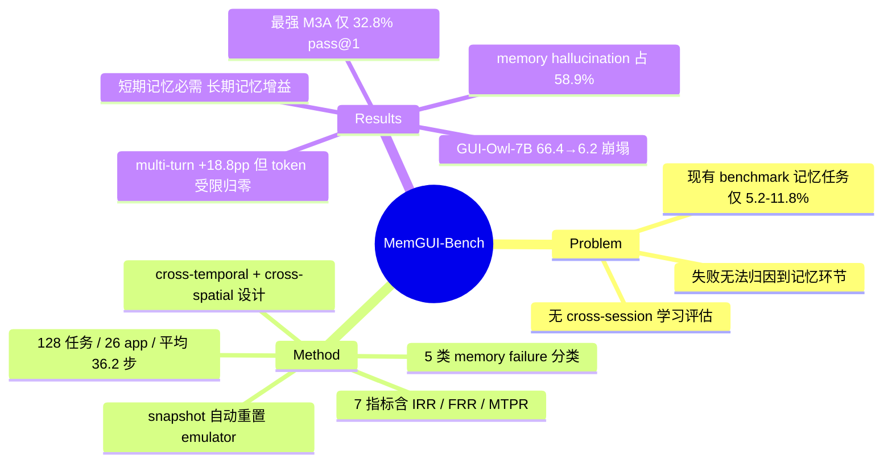

## Summary

MemGUI-Bench 针对现有 mobile GUI agent benchmark 几乎不考察记忆能力（memory 相关任务仅占 5.2-11.8%）的空白，构建了 128 个跨 26 个真实 app 的记忆密集型任务（89.8% 需要 cross-temporal / cross-spatial 信息保持），并配套 IRR、MTPR、FRR 等记忆专用指标；对 11 个 SOTA agent 的评测显示成绩相比既有 benchmark 大幅崩塌（如 GUI-Owl-7B 66.4% → 6.2%），且 memory hallucination 占非超时失败的 58.9%。

## Problem & Motivation

现有 mobile GUI agent benchmark（AndroidWorld、SPA-Bench 等）以短程单 app 任务为主，记忆相关任务占比极低（AndroidWorld 116 任务中仅 6 个），且完全没有 cross-session 长期学习的评估。这导致两个后果：一是 agent 在这些 benchmark 上的高分掩盖了真实长程使用场景（跨 app 信息搬运、多步中间状态保持、从历史失败中恢复）中的脆弱性；二是社区无法区分 agent 失败究竟源于感知/grounding 还是记忆机制缺陷。作者认为记忆是 long-horizon 移动自动化的核心瓶颈，需要一个专门的、可自动重置的动态环境 benchmark 来暴露和归因这类失败。

## Method

**Benchmark 构建**
- 128 个任务、26 个真实 app，按 app-crossing 复杂度分 4 档（单 app 到跨 4 app），78.1% 任务需要跨 app 信息转移；任务长度 3-160 步（平均 36.2 步）；难度分布：简单 37.5% / 中等 32.8% / 困难 29.7%。
- 89.8% 的任务通过 **cross-temporal**（时间维：任务执行期间保持并利用上下文信息）与 **cross-spatial**（空间维：跨 app 搬运信息）两类设计显式挑战记忆。
- 环境为 Android emulator，基于 snapshot 的框架支持快速自动重置（对比 SPA-Bench 无自动重置）。

**指标体系（7 项，其中 4 项 memory-specific）**
- 基础：Success Rate（SR）、Information Retention Rate（IRR，衡量中间信息是否被正确保持到使用点）
- 长期学习：pass@k、Failure Recovery Rate（FRR，从历史失败中恢复的比例）
- 效率：Average Step Ratio、Time Per Step、Cost Per Step
- 综合：Memory-Task Proficiency Ratio（MTPR）

**评测对象（11 个）**
- Agentic workflow 类：Agent-S2、Mobile-Agent-E、Mobile-Agent-V2、M3A、T3A、SeeAct、AppAgent
- Agent-as-a-Model 端到端类：UI-TARS-1.5-7B、UI-Venus-7B、GUI-Owl-7B、CogAgent

**失败模式归因**：定义 5 类记忆相关失败——Partial Memory Hallucination、Process Memory Hallucination、Output Memory Hallucination、Knowledge Deficiency、Intent Misunderstanding。

## Key Results

- **整体成绩崩塌**：最强的 M3A 仅 32.8% pass@1（47.7% pass@3）；Agent-S2 27.3%/49.2%；端到端 7B 模型全面失守——GUI-Owl-7B 6.2%、CogAgent 0.0%。与既有 benchmark 对比：Agent-S2 54.3% → 27.3%，GUI-Owl-7B 66.4% → 6.2%。
- **Memory hallucination 主导失败**：平均占非超时失败的 58.9%。
- **短期记忆是必需品**：M3A 移除记忆组件后 SR 32.5% → 2.5%，IRR 35.1% → 0.0%；Agent-S2 移除后 27.5% → 5.0%。
- **长期记忆是增益项而非必需品**：Agent-S2 移除长期记忆 pass@3 从 45.0% → 25.0%（-20pp），FRR 15.5% → 9.1%，但 agent 仍可工作；有显式长期记忆的 agent 平均 +21.9pp。
- **长上下文的朴素用法有效但昂贵**：M3A 从 single-turn 换成 multi-turn 对话，32.8% → 51.6%（+18.8pp）；但 token 受限时 Agent-S2 从 49.2% 崩至 0.0%，暴露记忆-计算成本权衡。
- **跨 app 复杂度代价**：从单 app 到跨 4 app，性能下降 16-40pp。
- **设计建议（5 条）**：multi-granularity memory buffer（按信息类型分槽）、带持久目标跟踪的层级任务分解、超越朴素历史拼接的策略性长上下文利用、显式 cross-session 长期记忆机制、framework 级记忆管理 + 高效端到端模型的混合架构。

## Strengths & Weaknesses

**亮点**
- 问题选得准：memory 确实是现有 GUI agent benchmark 系统性忽略的维度，5.2-11.8% 的任务占比统计有说服力，填的是真空白。
- 归因做得比打分深：IRR/FRR/MTPR 把"失败"拆到记忆环节，5 类 memory failure 分类 + ablation（移除记忆组件后 SR 崩塌）形成了因果链，比单纯报 SR 的 benchmark 信息量大。
- "短期记忆必需、长期记忆增益"的区分和 multi-turn +18.8pp vs token 受限崩至 0 的对照，直接给出了可操作的架构 trade-off 结论。

**局限**
- 同团队约四个月后发布 MemGUI-Agent（[[2606-MemGUI]]）并在本 benchmark 上报 SOTA，存在 benchmark 与方法共演化的风险，第三方结果更值得关注。
- Emulator + snapshot 环境保证了可复现，但回避了真机上的通知打断、网络波动等真实动态性，"dynamic environments" 的措辞略有 overclaim。
- 5 类 failure mode 是先验分类学，hallucination 归因依赖人工/规则判定，memory 失败与 perception/grounding 失败的边界未必干净——58.9% 这个数字的稳健性取决于归因协议（论文披露程度未知）。
- 端到端 7B 模型全面低分部分可能反映的是 context window 工程问题而非记忆机制本质缺陷，与 workflow 类 agent 的对比不完全公平。
- 机构信息未在 arXiv HTML 页公开，主分类为 cs.DC 也显得反常（疑似误分类）。

## Mind Map

## Notes

- 与 [[2606-MemGUI]]（MemGUI-Agent，同团队后续方法论文，Context-as-Action）构成 benchmark→method 配对；MemGUI-Agent 的 "prompt explosion / critical fact dilution" 动机正对应本文 "朴素历史拼接昂贵且脆弱" 的发现。
- "短期记忆必需、长期记忆可选" 与本 vault 中 agent memory 方向笔记（[[2607-TSR]]、[[2607-KnowActGUIClaw]] 曾引用 MemGUI 系）可交叉验证：值得追问长期记忆的 +21.9pp 增益有多少来自 pass@k 的重试统计效应而非真正的 cross-session 学习。
- 待跟进：项目页 https://lgy0404.github.io/MemGUI-Bench/ 承诺开源代码与评测结果，可核对失败归因协议的自动化程度。
