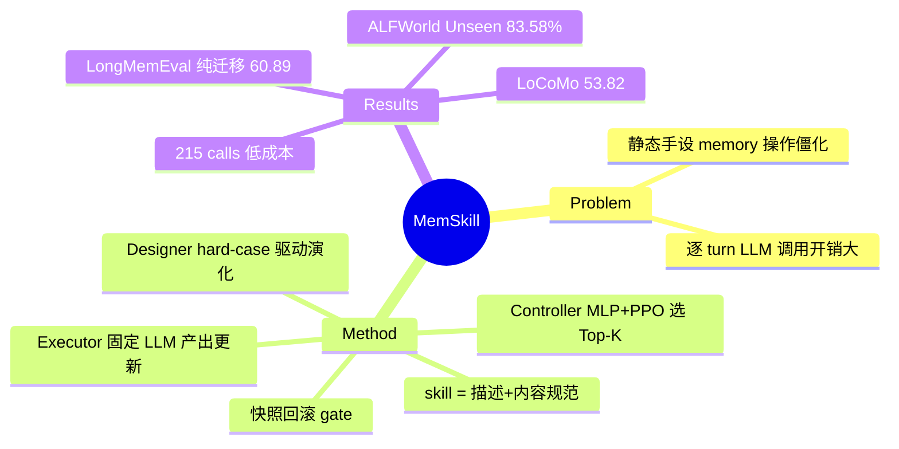

## Summary
MemSkill 把 agent memory 系统里"如何从交互轨迹提取/修订记忆"这套操作本身从固定原语（add/update/delete/skip）抬升为**可学习、可演化的 memory skills**：PPO 训练的轻量 controller 按当前 span 选 Top-K skills，固定 LLM executor 按 skill 规范产出结构化 memory 更新，LLM designer 周期性分析 hard cases 来增改 skill bank。在 LoCoMo（L-J 53.82）、LongMemEval（纯迁移 60.89）、HotpotQA、ALFWorld（Unseen SR 83.58%）上全面超过 Mem0/A-MEM/MemoryOS/LightMem 等 memory 系统 baseline，且 token 成本低一个量级。

## Problem & Motivation
现有 LLM agent memory 系统（Mem0、MemGPT、A-MEM、MemoryOS 等）的记忆构建依赖一小组**静态、手工设计的操作**——什么值得存、如何修订，全部硬编码了人类先验。这带来两个问题：(1) 面对多样交互模式（闲聊 vs 具身任务）时僵化，领域先验无法自动调整；(2) 逐 turn 调用 LLM 做记忆操作，在长历史上开销大。作者的 formulation 是把记忆构建看作"应用一小组通用、可复用的 memory skills 的结果"，从而让**记忆操作本身**成为学习与演化的对象——这是与"演化记忆内容"（[[Papers/2409-AgentWorkflowMemory]] 的 workflow、ReasoningBank 的推理策略）不同的 meta 层。

## Method
**Memory skill 的定义**：一个 skill = (i) 短描述（用于 skill 表示与选择）+ (ii) 详细内容规范（指导 executor 做 memory 提取/修订的 procedure）。本质是自然语言写成的"记忆操作程序"，不是记忆内容本身。skill bank 初始只有四个原语：Insert / Update / Delete / Skip，其余 skill 全部由演化产生。

三组件架构，处理单位是 **span**（默认 512 tokens）而非单 turn：

- **Controller（可训练，三个独立轻量 MLP：f_ctx/f_skill/f_score）**：状态 h_t 由固定 embedding 模型编码的当前 span + 已检索记忆拼接而来；每个 skill 由其描述的 embedding 表示。共享 scorer 对所有 (state, skill) 对并行打分，Gumbel-Top-K 无放回采样选出 K 个 skill（训练 K=3；评估时 LoCoMo/LongMemEval K=7、ALFWorld K=5）。**PPO** 训练（clipped surrogate + GAE），reward 直接用下游任务性能（QA 的 F1 / ALFWorld success rate）。并行打分设计使其天然兼容动态扩张的 skill bank。
- **Executor（固定 LLM）**：接收当前 span、已检索记忆、被选中 skills，产出结构化 memory 更新并应用到 memory bank。实验用 LLaMA-3.3-70B-Instruct 与 Qwen3-Next-80B-A3B-Instruct（另有 Llama-3.1-8B 小模型实验）。
- **Designer（固定 LLM，周期演化）**：每 100 training steps 触发一次。维护 hard-case sliding-window buffer，难度分 d(q) = (1−r(q))·c(q)（任务 reward × 失败次数），KMeans 按语义聚类保证覆盖不同错误类型；LLM 分析选中的 hard cases，找出"缺失或错配的 memory 行为"，提出对既有 skill 的编辑或新 skill，**每轮最多 3 个 edits**。

**防退化机制（skill-bank 层的 gate）**：维护 best-performing skill bank 快照；用 stabilized reward（最后 1/4 训练步的平均任务 reward）作判据，本轮演化不升则回滚到最佳快照；连续多轮无改善则 early stopping。新 skill 引入后短暂提升对它们的探索偏置。

推理/检索侧：Qwen3-Embedding-0.6B 做 memory retriever，所有方法统一最多检索 20 条 memory items 保证可比。

## Key Results
- **LoCoMo**（LLaMA-3.3-70B）：L-J **53.82** / F1 44.21，vs LightMem 51.95、A-MEM 49.71、MemoryOS 48.64、MemoryBank 44.43。
- **LongMemEval（纯迁移）**：skill bank 在 LoCoMo 上学得、**不重训**直接评，L-J **60.89**，vs MemoryOS 39.83、A-MEM 38.04——迁移设置下反而是最大幅领先。
- **ALFWorld**：Seen SR 77.14%（Mem0 74.29%）、**Unseen SR 83.58%**（Mem0 81.34%、LightMem 75.37%），且平均步数更少（Unseen 16.63 vs Mem0 17.15）。
- **跨 backbone 迁移**：LoCoMo 训练的 bank 换 Qwen executor 不重训，LoCoMo L-J 54.14、ALFWorld-Seen 85.71%、Unseen 76.87%，仍超 baselines。
- **跨分布（对话→文档）**：HotpotQA 50/100/200 docs 上 L-J 约 62/58/54，均领先 MemoryOS（约 55/49/45）与 A-MEM。
- **Ablation（LoCoMo L-J）**：w/o Controller 掉到 48.43/42.84（LLaMA/Qwen），**w/o Designer 掉更多**：46.50/36.15；Refine-only（只改不增）47.45/48.88——skill 演化比 skill 选择贡献更大，Qwen 上尤甚。
- **效率（Table 3, LoCoMo）**：MemSkill（span 512）input 249K / output 18K tokens / **215 次 LLM 调用**，vs MemoryOS 1013K/165K/1288、A-MEM 2850K/362K/1548、LightMem 789K/209K/685。span-level 构建是主要来源。
- 案例（Figure 4）：LoCoMo 演化出的 skill 偏重 temporal context 与 activity 细节，ALFWorld 的偏重 action constraints 与 object locations——skill 内容随域特化。

## Evidence Ledger
| Claim ID | Claim | Type | Source locator | Evidence excerpt | Status |
|:--|:--|:--|:--|:--|:--|
| C1 | LoCoMo L-J 53.82 / F1 44.21，超 LightMem 51.95、A-MEM 49.71、MemoryOS 48.64 | number | Table 1 | "MemSkill L-J 53.82 ... F1 44.21" | source-verified |
| C2 | LongMemEval 60.89 为 LoCoMo 学得 skill bank 的纯迁移结果，无重训 | benchmark-setting | Table 1 + §Experiments | "evaluated purely by transferring the skill bank learned on LoCoMo" | source-verified |
| C3 | ALFWorld-Unseen SR 83.58%（Mem0 81.34%），步数 16.63 < 17.15 | number | Table 1 | "MemSkill SR 83.58% ... #Steps 16.63" | source-verified |
| C4 | skill = 短描述 + 详细内容规范；初始 bank 仅 Insert/Update/Delete/Skip | causal-mechanism | §Method + Appendix C | "(i) a short description ... (ii) detailed content specification that instructs the executor" | source-verified |
| C5 | designer 每 100 步触发；d(q)=(1−r(q))·c(q) 选 hard case；每轮 ≤3 edits；快照回滚 + stabilized reward + early stopping | causal-mechanism | §Method designer 节 | "maintain snapshots of the best-performing skill bank and roll back if an update degrades" | source-verified |
| C6 | controller 为轻量 MLP + PPO + Gumbel-Top-K；reward 为下游任务性能；训练 K=3、评估 K=7/5 | causal-mechanism | §Method controller 节 | "independent lightweight multilayer perceptrons (MLPs)" / "PPO" | source-verified |
| C7 | 跨 backbone（→Qwen，LoCoMo 54.14 / ALFWorld-Seen 85.71%）与跨分布（HotpotQA 三档均领先）迁移成立 | comparison | Table 1 + Figure 3 | "evolved skills capture reusable memory behaviors" | source-verified |
| C8 | 效率：249K/18K tokens、215 calls，远低于 MemoryOS 1013K/165K/1288 | number | Table 3 | "higher L-J scores while using fewer input/output tokens and LLM calls" | source-verified |
| C9 | w/o Designer（−7.32/−17.99）掉分大于 w/o Controller（−5.39/−11.30） | number | Table 2 | "disabling the designer yields an even larger degradation, especially under Qwen" | source-verified |

## Strengths & Weaknesses
**亮点**：
1. **Problem formulation 是真贡献**：在"演化记忆内容"（AWM workflow、ReasoningBank 推理策略）与"固定记忆操作"（Mem0/MemGPT 系）之间，占住了"演化记忆操作本身"这个 meta 层空白。skill 是"怎么写记忆"的 procedure，不是记忆条目——与 [[Papers/2409-AgentWorkflowMemory]] 是正交维度。
2. **迁移证据设计得好，且是主张的核心支撑**：LongMemEval 纯迁移拿最大领先（60.89 vs ~39）、跨 backbone（LLaMA→Qwen）不重训仍超 baseline、对话→文档（HotpotQA）跨形态成立。三条线一致指向"skill 捕获的是可复用的记忆行为而非数据集表面形式"。
3. **效率结果实质性**：span-level + 学到"何时 Skip"，LLM 调用 215 vs 1288/1548，量级差距，不是边际改进。
4. **承认演化会退化并内建了 gate**：快照回滚 + stabilized reward + early stopping，比多数 self-evolving 工作"只进不退"的设计诚实。ablation 里 designer 贡献大于 controller，也反过来说明演化环节确实在做事。

**局限**：
1. **Gate 只在 skill-bank 层、只看任务 reward**：单条 memory 写入没有 per-item 验证，skill 编辑的接受判据是 aggregate task reward——这正是 misevolution 文献（[[Papers/2509-Misevolution]]、[[Papers/2604-ExperienceSafetyRisks]]）指出的暴露面：reward-only 演化在良性任务上也可能强化不安全行为，本文完全没有安全维度的评估（正文未见相关讨论；Appendix F Limitations 未能获取全文）。designer 直接改写"agent 如何构建记忆"的 procedure，出错时影响是系统性的，比单条坏记忆的 blast radius 更大。
2. **Credit assignment 链条长而稀疏**：skill 选择 → memory 构建 → 检索 → 下游 QA/行动 → reward，PPO 拿到的信号隔了多层介导（检索器还是固定的 Qwen3-Embedding-0.6B）。[[Ideas/RetrievalMediated-MemoryMisevolution]] 的检索介导视角在这里同样适用：skill 的功劳/过错可能实际由检索动力学决定。
3. **训练规模很小**：LoCoMo 仅 10 个样本约 200 queries，PPO + LLM-designer 在此规模上的方差与过拟合风险论文未充分讨论；跨 seed 稳定性未见报告。
4. **Skill bank 的终态不透明**（就已抓取内容而言）：最终 bank 多大、演化出的 skill 离四原语多远、有没有退化成"把领域先验重新手写一遍"（只是由 LLM 代笔），Figure 4 案例描述偏定性；Appendix C 全文未获取。
5. **Baseline 族系错位**：对比对象全是 memory-content 系统（Mem0/A-MEM/MemoryOS/LightMem/CoN），没有与 AWM/ReasoningBank 式经验记忆、也没有与"固定操作 + 更强 prompt 工程"的 tuned 版本对比——"可学习操作优于精心手设操作"的强主张其实缺一个 strong hand-designed 对照。

## Mind Map

## Notes
- **Connections**：
  - [[Papers/2409-AgentWorkflowMemory]] — 对照轴心：AWM 演化**记忆内容**（任务 workflow），MemSkill 演化**记忆操作**（写记忆的 procedure），两者正交可组合；AWM 的"分布差距越大领先越多"与 MemSkill 的 LongMemEval 纯迁移最大领先是同构证据模式。
  - [[Papers/2601-MemRL]]（同批消化）— 同为 RL 进 memory 环节；MemRL 偏 retrieval/utilization 侧、MemSkill 偏 construction 侧，合读可拼出 memory pipeline 的 RL 化版图。
  - [[Papers/2604-ExperienceSafetyRisks]] / [[Papers/2509-Misevolution]] — MemSkill 的 reward-only designer gate 是这两篇所述风险面的新实例：演化对象从经验内容升级为操作 procedure，misevolution 的 blast radius 相应放大；MemSkill 的快照回滚只护 utility 不护 safety。
  - [[Ideas/RetrievalMediated-MemoryMisevolution]] — MemSkill 固定检索器、只学构建侧，恰好是该 idea "内容 vs 检索通道"分解的另一半：若检索介导假设成立，skill 演化的收益/风险归因也需过检索这一层。
  - [[Topics/SelfEvolvingAgents-Survey]] — 归入 memory(context) 演化路线，但应记为该路线的新亚型："操作级演化"（区别于既有的内容级：AWM/ReasoningBank/Mem0）；其 rollback 机制可并入 survey Takeaway 4 的"演化步 verifier gating"证据链（gate 判据= aggregate reward，无 per-step verification）。
  - [[Papers/2607-MetaSkillEvolve]]、[[Papers/2604-SkillClaw]]、[[Papers/2606-SkillMemoryBudget]] — skill 库演化/管理族系的近邻，待 survey-refresh 时统一对齐。
- institute 主导为 NTU（7 作者中 4 位含通讯作者 Wenya Wang 属 NTU，致谢 NTU Start-Up Grant / MOE AcRF Tier 1），另有 UIUC、UIC、Tsinghua 三合作机构（PDF 首页脚注核；HTML 版不渲染 affiliation，正文搜 Nanyang 零命中）。
- **核验记录（verifier）**：10/10 source-verified；C1 的 LightMem 51.95、C3 的 LightMem 75.37 分别出自 Table 3 效率表与 Appendix A.1、非 Table 1 主表（数字正确）；controller 为三个独立 MLP（f_ctx/f_skill/f_score）非单个。
- 未获取内容：Appendix C 演化后 skill 全文、Appendix F Limitations、designer 所用具体 LLM（正文只说 "an LLM-based designer (fixed)"；gpt-oss-120b 是 LLM judge 非 designer）、最终 skill bank 规模。若需补，走 lexmount dump 或 GitHub repo。
- v2（2026-05-24）已更新；本笔记基于 v2 HTML。
