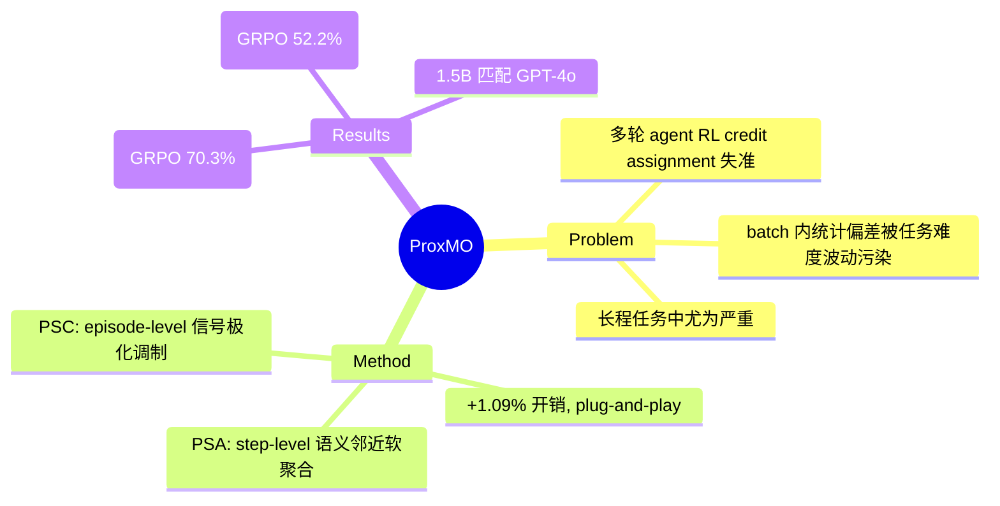

## Summary

ProxMO 提出 episode-level 的 Polarized Signal Controller (PSC) + step-level 的 Proximity-based Soft Aggregation (PSA) 两个轻量机制，解决多轮 agent RL 训练中 credit assignment 因任务难度波动而失准的问题，在 ALFWorld/WebShop 上以 +1.09% 开销实现 GRPO +20%+ 的提升。

## Problem & Motivation

多轮 LLM agent 训练中，group-based RL 方法（如 GRPO）依赖 batch 内统计偏差来分配 credit，但当任务难度波动时会系统性地错配：简单任务的失败可能是随机噪声，困难任务的成功才是真正的能力突破。现有方法无法区分这两种信号，导致梯度被噪声污染。这个问题在 GUI/web agent 等长程任务中尤为严重——不同 episode 的难度差异可达数倍。

## Method

**Episode-Level: Polarized Signal Controller (PSC)**

根据 episode 成功率 p 动态调制 advantage：
- 权重 w(R,p) = 1 + β·f(R,p)，其中 f 基于 Sigmoid 函数
- 核心逻辑：低成功率组中放大成功信号（巩固稀有突破），高成功率组中衰减失败噪声
- 参数：β=0.1 控制调制强度，α=4.0 控制陡峭度

**Step-Level: Proximity-based Soft Aggregation (PSA)**

替代 GRPO 的 hard group statistics，用连续语义加权计算 step-level baseline：
- 用 TF-IDF 向量计算 state 间的 cosine similarity
- Temperature-scaled softmax 得到相似状态的软权重
- Baseline = 加权聚合相似状态的 discounted return
- Step advantage = 自身 return − 软 baseline

**统一目标**: A = Ã^E + ω·A^S，用 clipped PPO + KL penalty 优化。两个机制轻量（仅算术运算，无额外网络），总开销仅 +1.09%。

## Key Results

**ALFWorld "All" success rate (Qwen2.5-1.5B-Instruct):**
- GRPO: 70.3% → GiGPO: 85.2% → **ProxMO: 90.6%** (+28.9% relative vs GRPO)

**ALFWorld (Qwen2.5-7B-Instruct):**
- GRPO: 79.8% → GiGPO: 89.5% → **ProxMO: 94.5%** (+18.4% vs GRPO)

**WebShop (Qwen2.5-1.5B-Instruct):**
- GRPO: Score 73.1 / Success 52.2% → **ProxMO: Score 85.3 / Success 67.1%** (+28.5% success)

**关键发现**: 训练后的小模型（1.5B/7B）在 ALFWorld 上匹配甚至超越 GPT-4o (48.0%) 和 Gemini-2.5-Pro (60.3%)。

**Ablation**: PSA 的贡献 > PSC（尤其长程任务），但两者组合有超加性协同效应。

## Strengths & Weaknesses

**亮点**：
- 两个机制设计简洁、开销极低（+1.09%），plug-and-play 兼容 GRPO
- 在长程任务（Look, Cool, Pick2）上提升尤为显著（+41%~+86%），说明对 credit assignment 稀疏问题确实有效
- 小模型匹配闭源大模型的结果有实际部署价值

**局限**：
- Benchmark 仅 ALFWorld + WebShop，未在 GUI grounding 或真实 web agent 环境（如 OSWorld）验证
- TF-IDF 用于 state similarity 可能过于粗糙——对于 GUI 截图等视觉状态，需要更语义化的相似度度量
- Binary reward (R∈{0,1}) 假设限制了对连续奖励场景的适用性
- 相比 GiGPO 的提升在 7B 模型上较小（+5%），说明大模型本身的 credit assignment 能力可能已足够

**对 GUI Agent 方向的启示**:
- ForkPoint-CreditAssignment idea 面临的拥挤赛道（SOLAR-RL, GiGPO, ProxMO 等 5+ concurrent works）通过本文得到进一步确认
- PSA 的 state similarity 思路可以迁移到 GUI grounding：不同分辨率下的 GUI 截图可视为"相似状态"，用于跨分辨率的一致性约束
- ProxMO 的 episode-level modulation 思路对 GUI agent 的稀疏奖励训练有直接参考价值

## Mind Map

## Notes

- 与 SOLAR-RL (`[[Papers/2604-SOLAR-RL]]`) 的对比：SOLAR-RL 从离线数据重建 rollout + first failure point detection，ProxMO 在在线训练中通过 state similarity 做软 credit 分配。两条路线互补——SOLAR-RL 解决"没有在线数据"的问题，ProxMO 解决"在线数据中信号被噪声淹没"的问题。
- 与 ForkPoint idea (`[[Ideas/ForkPoint-CreditAssignment-GUI]]`) 的关系：ProxMO 进一步证实 credit assignment 赛道拥挤，但其 PSA 的 state similarity 思路可能是差异化方向——将 GUI grounding 的跨分辨率 consistency 作为 state similarity 的先验。
- 待验证：PSA 的 TF-IDF similarity 在 GUI 截图场景下是否有效？可能需要替换为 visual feature similarity（如 CLIP embedding cosine similarity）。
