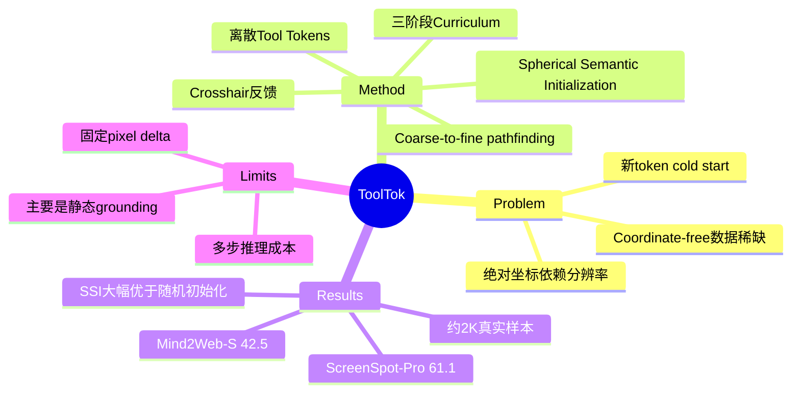

## Summary

ToolTok 不再让 GUI agent 一步回归绝对坐标，而是把光标移动、点击、返回、输入等操作编码成可学习的离散 tool tokens，通过 coarse-to-fine 多步 pathfinding 找到目标。借助 Spherical Semantic Initialization 与 easy-to-hard curriculum，一个 Qwen3-VL-4B 模型只用约 5K synthetic samples 和约 2K real-world samples，就在 ScreenSpot-Pro 达 61.1%、Mind2Web-Simplified 达 42.5%，并显著提高跨分辨率/宽高比鲁棒性。

## Problem & Motivation

主流 GUI grounding 把动作写成 `[click, x, y]`，要求训练和测试图像共享固定坐标系。截图 resize 会损伤小型 UI 元素，而分辨率或 aspect ratio 偏离训练设置时，坐标表示本身也发生 distribution shift。coordinate-free 方法虽然缓解这一问题，但仍多是“一步选视觉 patch”，没有把动作语义和 VLM 预训练的语言知识充分连接起来。

作者的关键问题是：能否像人移动鼠标一样，把 GUI 操作转成相对、离散、可解释的工具调用序列？困难在于新增 token 从随机 embedding 起步，在 GUI 高质量数据不足时会出现严重 cold start。

## Method

ToolTok 在截图上渲染当前隐式光标的 crosshair，模型每步生成 CoT 与一个 tool token。动作词表分为四组：不同方向/尺度的 `<MOVE_*>`，`<GO_BACK>` / `<GO_HOME>`，click/scroll 交互，以及 text start/end。移动又分 FAR、MID、CLO 三档，执行器分别转成约 500、150、30 pixels 的相对位移，使搜索自然形成 coarse-to-fine path。

**Spherical Semantic Initialization (SSI)** 为每个新 tool token 指定一组功能词，例如 `<MOVE_UP_FAR>` 对应 move/up/north/far。作者先求 anchor embeddings 的中心，再把它投影到原词表平均 norm 的 hypersphere 上；这样既保留方向语义，又避免简单平均导致向量 norm 过小。

**三阶段 curriculum**：(1) 5,000 个无噪 synthetic samples，覆盖 token-definition QA、text-guided tool selection 与 simplified visual pathfinding；(2) 将 ScreenSpot 的静态 image/bbox 转成从随机光标到目标框的 greedy shortest tool path，并为每步程序化生成 CoT，action token loss 赋权 20；(3) 再用更难的 ScreenSpot-Pro 继续训练。模型骨干是 Qwen3-VL-4B-Instruct。

## Key Results

| Model | ScreenSpot | ScreenSpot-Pro | Mind2Web-S | ScreenSpot-V2 |
|---|---:|---:|---:|---:|
| Qwen3-VL-4B | 88.0 | 46.6 | 26.4 | 86.4 |
| Holo2-4B | 90.8 | 57.9 | 32.5 | 88.9 |
| TT-4B-ScreenSpot-Pro | **91.8** | **61.1** | **42.5** | **89.5** |
| Qwen3-VL-235B | 92.0 | 60.3 | 50.5 | 92.4 |

TT-4B 在同尺度模型中领先，并在 ScreenSpot-Pro 略高于 235B generalist，但在 OOD 的 Mind2Web-S 和 ScreenSpot-V2 仍落后 235B。作者还报告仅约 2K real-world samples，相比约 1M 样本的 coordinate baseline 得到超过 500× 的自定义 Data Efficiency 提升；增加允许的 pathfinding steps 会持续提高性能。

关键消融很有解释力：Zero/Random/Average/SSI 初始化在 ScreenSpot 上分别为 55.2/56.4/68.5/87.6，在 Mind2Web-S 上为 15.3/16.5/19.0/29.3；说明 semantic anchor 与 spherical norm 都重要。训练顺序方面，Only Pro、SS mix Pro、Only SS、SS→Pro 在 Mind2Web-S 分别为 22.8、24.4、29.3、42.5，支持 easy-to-hard 而非简单混合。

## Strengths & Weaknesses

**Strengths**

- 把“分辨率鲁棒性”追溯到绝对坐标 action representation，而不是只通过更多 resize augmentation 修补症状，problem formulation 简洁。
- SSI 的对照包含 zero、random 和无球面投影的 semantic average，因果证据比只报最终准确率完整。
- 离散相对工具兼具语义可解释性和 test-time scaling，且保留 Qwen3-VL 的 SimpleVQA/MIA-Bench 能力远好于 Holo2-4B。

**Weaknesses**

- 多步 pathfinding 用更长 trajectory 换取一次定位，论文强调数据效率，却没有充分报告 inference latency、平均步数与累计误差成本。
- 实验核心仍是静态 grounding：oracle 从已知 bbox 合成最短路径，尚未证明该表示能在真实动态长任务中稳定恢复。
- FAR/MID/CLO 对应固定 pixel delta，虽比绝对坐标鲁棒，却并非完全 scale invariant；极端 DPI、缩放和小目标下仍可能需要额外步数。
- 与 235B 的比较混合了模型大小、训练方式和 action interface，不能据此断言 tokenization 普遍优于大模型坐标回归。

**已知**：SSI 与顺序 curriculum 的消融增益大，TT-4B 在所测同尺度 grounding baseline 中表现最好。**推测**：主要优势来自把连续回归改成带强先验的离散分类，并不一定要求显式 CoT。**不知道**：在 AndroidWorld/OSWorld 等 online benchmark 上的 task success、操作延迟和长链失败率。

## Mind Map

## Notes

这篇与 HiViG 的共同点是都通过在 screenshot 上显式渲染位置标记，把模型从“文字描述坐标”拉回到视觉状态；差别是 HiViG 用 marker 验证 policy 提案，ToolTok 用 marker 形成可迭代的控制状态。它提示 GUI action space 可能不应被视为输出格式细节，而是决定 data efficiency、robustness 与 test-time compute 的核心建模选择。
