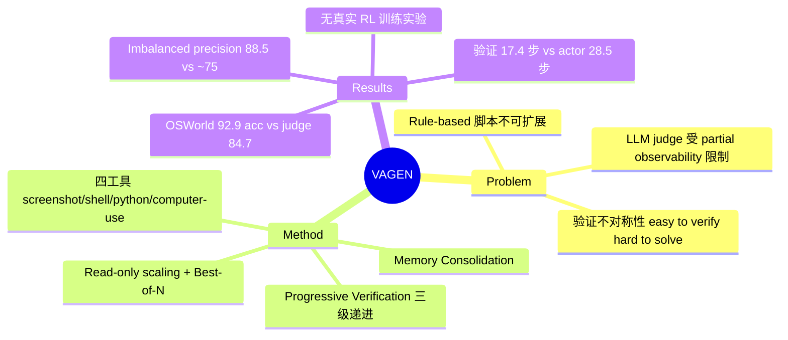

## Summary
提出 VAGEN：用一个带交互工具的 verifier agent 在轨迹结束后**主动探测环境**（调截图/跑 shell/跑 python/直接操作 GUI）来判定 GUI 任务成败，替代被动看截图的 LLM-as-a-Judge。在 OSWorld-Verified 人评 GT 上达 92.9% acc / 94.0% precision（最强 judge baseline 84.7% acc），验证平均只需 17.4 步（actor 解任务要 28.5 步）。

## Problem & Motivation
GUI agent 的 RLVR 需要可扩展的 outcome reward。现有两条路都有硬伤：rule-based（OSWorld/AndroidWorld 的手写测试脚本）无法覆盖 open-ended 任务、扩展成本高；LLM-as-a-Judge 只被动看截图序列，受 partial observability 限制——文件属性、后台进程、系统配置等 latent state 在截图里根本看不到。

核心 insight 是 GUI 任务的**验证不对称性**（"easy to verify, hard to solve"）：Table 1 用同一个 Claude-Sonnet-4.5 量化——在 OSWorld 上做任务 SR 55.9%（28.5 步），做验证 acc 83.1%（17.4 步）；AndroidWorld 上 62.1% vs 93.1%。既然验证比求解容易得多，就该让验证者也变成 agent。

## Method
**范式**：从 passive evaluation 转向 Agentic Interactive Verification——verifier agent 在轨迹终态的环境上在线运行，自主规划验证策略、主动取证。

1. **Trajectory Memory Consolidation**：把 actor 轨迹逐段压缩成客观的 state observation + action description，丢弃 actor 的主观 planning/reasoning（防止 verifier 被 actor 的自我叙述带偏）。
2. **四个验证工具**：
   - `check screenshot`：按需调取轨迹中任意历史步的截图（不必全量输入）；
   - `execute shell`：查文件属性、后台进程等截图不可见的 latent state；
   - `execute python`：复杂逻辑/数据校验；
   - `computer use`：与 actor 同款 GUI 动作空间（点击、输入、导航菜单），主动打开页面核对状态。
3. **Progressive Verification（三级递进）**：Stage 1 static assessment——免工具，仅凭终局截图+操作摘要快判，输出 reward + confidence（LOW/MEDIUM/HIGH）；Stage 2 visual retrospection——按摘要挑历史截图回看；Stage 3 proactive probing——证据仍不足才动用 shell/python/computer-use 探测。先便宜后昂贵。
4. **Test-time scaling**：verifier 侧 **read-only scaling**——限制写操作使环境状态不变，同一环境实例上串行跑 N 次验证 + majority vote，免去 VM snapshot 恢复的 I/O 开销；actor 侧用 VAGEN 当 reward 做 Best-of-N rejection sampling（附 Theorem 3.1 的成功率界）。
5. **副作用控制**：read-only 靠 prompt guidance + secondary LLM 判定（软约束，非能力级沙箱）。作者自述验证过程以读操作为主、"rarely alters key evidence, even when unrestricted"，并建议实际部署放沙箱+最小权限。

## Key Results
Verifier backbone 均为 Claude-Sonnet-4.5；actor 分别为 Claude-Sonnet-4.5（class-balanced）与 UI-TARS-1.5-7B（class-imbalanced）。

- **OSWorld-Verified（human eval GT）**：balanced 下 VAGEN 94.0 P / 95.2 R / 94.6 F1 / **92.9 Acc**，vs FullTrajEval 84.7 Acc、ZeroGUI 83.7、AndroidGen 80.2、WebRL 79.8、DistRL 75.6、DigiRL 73.8。imbalanced（弱 actor，负样本占多）下 VAGEN **88.5 P** / 90.1 R / 93.4 Acc，vs FullTrajEval 74.8 P / 85.3 Acc、ZeroGUI 76.6 P / 86.7 Acc——judge 类方法在弱 actor 上 precision 崩到 ~75%，VAGEN 仍守住 88+。
- **AndroidWorld（泛化）**：VAGEN 93.1 Acc（Claude actor）/ 92.2（UI-TARS actor），比最强 baseline 高约 5 pp。
- **Test-script GT 下所有方法 precision 都偏低**（VAGEN 79.2）：作者归因于 OSWorld 脚本 GT 自身的 false negative（与 Lin/Xie 等已有报告一致），故补做人评 GT。两套 GT 下 VAGEN 都是第一。
- **成本**：验证平均 17.4 步（UI-TARS 轨迹 15.3 步）；11.9 张输入图 / 1218 输出 token，vs ZeroGUI 14.1 图 / 832 token——截图更少（memory consolidation 替代全量截图）但输出 token 多 ~46%。去掉交互工具后仅 6.4 步、F1 从 86.2 掉到 82.8（test-script GT）。
- **工具使用统计**：computer use 调用最频繁（支撑"静态观察不够"的核心假设），execute shell 1070 次，execute python 仅 179 次。
- **Ablation**：w/o computer use → 83.4 F1（最大单项损失）；w/o shell+python → 85.3；w/o progressive mechanism → 84.5。Memory Consolidation 对强 backbone 无益（去掉反而 86.5 > 86.2），对 UI-TARS +2.1 F1（70.1→72.2）。
- **Backbone 鲁棒性**：换 Gemini-3-Flash（85.3 F1）/ Doubao-Seed-1.8（82.1 F1）仍大幅领先 judge baselines。
- **Scaling**：read-only majority vote N=7 → 88.1 acc；actor Best-of-N 下 VAGEN 用 N=5 达到 baselines N=8 的 SR。
- **注意**：全文没有真正的 RL 训练实验——"reward modeling" 的落地只到 Best-of-N rejection sampling。

## Strengths & Weaknesses
**Strengths**
- 问题选得准、解法对症：judge precision 低的根因是 partial observability（[[Papers/2504-AgentRewardBench]] 测出天花板 ~70%），本文不去卷 prompt 而是给 verifier 交互权限直接消灭信息差，是结构性修复。
- 验证不对称性用 Table 1 定量确立（83.1 vs 55.9，步数还少 40%），给整个范式提供了 first-principles 依据，而非直觉口号。
- Imbalanced setting 下 precision 88.5 vs ~75 是最有实战价值的数字——RL 训练里 actor 恰恰是弱的、轨迹恰恰是负多正少，judge 的 false positive 会直接毒化 reward。
- Read-only scaling 是个务实的工程设计：绕开 VM snapshot 恢复，让 verifier 侧 test-time scaling 可行。

**Weaknesses**
- **题目写 reward modeling，实验止步于评测精度 + Best-of-N**：没有用 VAGEN reward 跑一次真 RL 训练。17.4 步/条的验证成本在 RL rollout 规模下是否可担、actor 是否会学出骗过 verifier 探测路径的 reward hacking，全部未验证。
- 副作用控制是 prompt 级软约束：无污染率的量化测量，"rarely alters key evidence" 是自述性统计。verifier 的 computer use 与 actor 同权限，误操作改状态在无沙箱场景是现实风险。
- Verifier 必须在轨迹终态环境上**在线**运行——离线轨迹（环境已重置）无法用，与环境实例强耦合，这限制了它替代 offline judge 的场景。
- 人评 GT 由作者方组织（App A.2 协议细节未细读），方法提出者同时控制 ground truth 有轻微既当运动员又当裁判的问题；不过 test-script GT 下结论方向一致，缓解了这一担忧。
- 只做 outcome-level；step-level reward 留作 future work（作者自认）。

**影响推测**：验证不对称性 + verifier agent 化，很可能成为 GUI RLVR 的默认组件方向；与程序化 verifier（[[Papers/2605-OpenComputer]] 94.1% 人类对齐）相比，VAGEN 以免写脚本的方式逼近了同级精度。

## Mind Map

## Notes
- 与 vault 证据链的接续：[[Papers/2504-AgentRewardBench]]（judge precision ≤70%）→ [[Papers/2510-CUARewardBench]]（UPE 用弃权换 precision 89.8%，recall 崩到 56.8%）→ 本文（交互取证同时拿到 88.5-94.0 P 和 90+ R，不牺牲 recall）。交互式验证是目前唯一同时保住双指标的路线。
- 与 AFE `verify()` affordance 主张同构：可靠评测的关键变量是环境状态可观测性；VAGEN 等于让 verifier 自己去获取可观测性，而非要求环境暴露断言接口。
- 开放问题：作为 RL reward 用时，verifier 与 actor 共享动作空间意味着 actor 理论上能学到"伪造 verifier 会检查的表面证据"——对抗鲁棒性完全未测。
