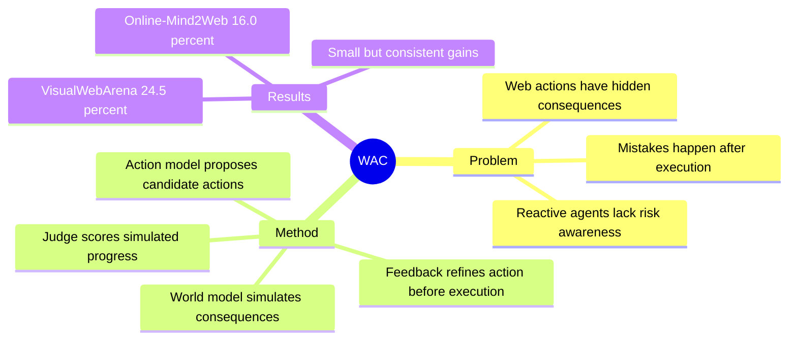

## Summary
WAC 把 world model 放到 web agent 的动作执行前，用候选动作生成、后果模拟、judge 评分和 action refinement 做 pre-execution correction。它在 VisualWebArena 和 Online-Mind2Web 上分别带来 +1.8pp、+1.3pp 的小幅提升，价值更像是证明“simulate before act”可以作为 web agent 的风险控制原语，而不是已经解决训练基础设施问题。

## Problem & Motivation
Web agent 的错误经常来自对页面状态转移的错误预期：一个 click / type 可能打开弹窗、改写表单、触发不可逆提交，agent 在真实页面执行后才发现失败。纯 reactive agent 缺少对候选动作后果的显式推演，因此在 irreversible 或 high-risk web actions 上容易累积错误。

作者的动机是把 world model 当作 web-environment expert：不直接替代 policy，而是在动作落地前预测候选动作可能造成的页面变化，并把反馈交回 action model 修正。这个设定和训练 infra 的关系在于：它把“环境转移模型”从 offline simulator 推到 inference-time guard。

## Method
**Model collaboration.** WAC 让 action model 和 world model 协作。Action model 根据当前 observation 和 task 生成候选动作；world model 提供页面理解、元素语义和潜在状态变化的知识；router 决定何时需要 world-model guidance。

**Consequence simulation.** 对候选动作，world model 先模拟动作后果，再由 judge 判断该后果是否与 task progress 一致。若 judge 分数低于阈值，系统触发 correction loop：把模拟反馈交给 action model，重新生成或细化动作。

**Action correction before execution.** 关键点是修正发生在真实 browser 执行前，而不是失败后 rollback。WAC 因此不需要真实环境 fork，但也无法提供可验证的真实状态分支；它依赖 world model 的预测质量。

## Key Results
- **VisualWebArena.** WAC 报告 success rate 24.5%，相对基线提升 +1.8pp。
- **Online-Mind2Web.** WAC 报告 success rate 16.0%，相对基线提升 +1.3pp。
- **机制层结果。** 论文把收益归因于 action deduction 和 feedback-based refinement：world model 先预测候选动作后果，judge 再筛掉风险动作，减少执行前的明显错误。

## Strengths & Weaknesses
**已知的强点。** WAC 直接针对 web agent 的一个真实 failure mode：agent 并不理解 action effect。它的设计轻量，可以作为现有 web agent 的 wrapper，不要求重新构建环境或收集新训练数据。

**已知的局限。** 主要结果提升幅度较小，且绝对成功率仍低。系统的可靠性取决于 world model 和 judge 的预测，而不是来自真实 browser state 的可验证分支；一旦 world model 错误预测页面转移，correction loop 可能给出更自信但仍错误的动作。

**推测。** WAC 对 AFE 的启发是：agent-facing environment 不一定只暴露真实 fork/rollback，也可以暴露 low-cost simulated affordance。但如果目标是训练 infra，单纯模拟后果不够，还需要把 correction 信号转成可复用的数据、reward 或 policy update。

## Mind Map

## Notes
这篇适合放在“world-model as runtime guard”一侧，而不是“大规模训练环境”主线。它补上一个重要对照：如果没有真实环境 fork，world model 仍可在执行前提供 cheap risk filter；但它不能替代 deterministic reset、branching rollout、verifier-grounded reward 这些训练 infra 必需品。

和 [[Topics/CUA-Survey]] 的关系：WAC 属于 inference-time simulated branching，但 branch 不是真实状态。和 [[Reports/2026-07-08-WebAgentTrainingInfra-Pulse]] 的关系：它是 cost/fidelity ladder 中最低成本、最低真实性的一档。
