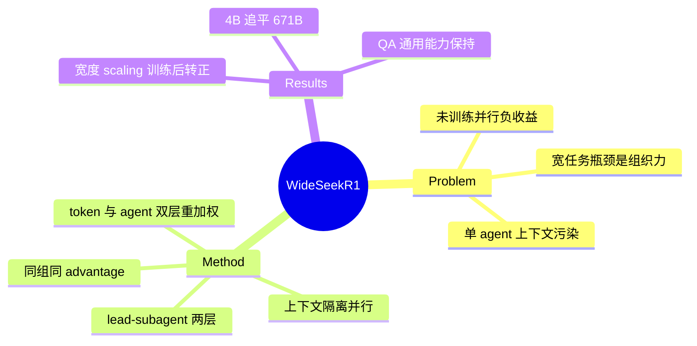

## Summary

WideSeek-R1 把 multi-agent 并行（lead agent 分解子任务 → subagent 并行检索）作为**可训练对象**：共享一个 4B 模型、上下文隔离，用扩展 GRPO 的 MARL 联合训练 lead 与 subagent（同 rollout 同组归一化 advantage + token/agent 双层重加权），WideSearch item F1 40.0%，追平 DeepSeek-R1-671B（170× 参数差）。

## Problem & Motivation

Depth scaling（单 agent 长推理链）之外的正交维度：broad information seeking（多实体多属性汇总成表）的瓶颈不是单点能力而是**组织能力**——单 agent 存在 context pollution（无关信息累积）与顺序执行低效。并行 subagent 天然提供上下文隔离与并行执行，但 prompt 拼出来的 multi-agent 不会随 agent 数变多而变好（未训练的 Qwen3-4B 加 subagent 反而掉分）——组织能力需要训练。

## Method

- **架构**：两层固定层级。lead agent 用受限的 `call_subagent` 工具做多轮任务分解与派发（自身不看检索内容，避免 context pollution）；subagent 持 `search`/`access` 工具在隔离上下文中并行执行；同轮所有 subagent 完成后控制权回到 lead。
- **MARL（扩展 GRPO）**：
  - 不做精细 credit assignment：同一 multi-agent rollout 内所有 agent（lead + subagents）拿**同一个组归一化 advantage**——稳定性优先，防 reward hacking。
  - **双层重加权**：token 级平均防长 turn 主导梯度；agent 级平均防"多开 subagent 的 rollout 淹没梯度"（后者顺带抑制无谓委派）。
  - Reward：item F1 + 格式 + 工具使用 − 长度罚。
- 训练数据：从 HybridQA 自动构造 20k 宽检索任务（Gemini 生成 + 一致性≥0.9 过滤），宽/深数据 1:1 混合。~3,000 H100 GPU 时。

## Key Results

- **WideSearch**（200 任务）：item F1 40.0%（Avg@4）/ 51.8%（Max@4），追平单 agent DeepSeek-R1-671B（41.3%），超 Qwen3-4B multi-agent +8.8pp、OWL-8B、MiroFlow-8B。
- **宽度 scaling 曲线**：subagent 1→10，训练后的模型 F1 ~30%→40% 持续上升；未训练基座随 agent 数增加**下降**——组织能力是训练出来的，不是架构自带的。
- 7 个标准 QA benchmark 平均 59.0%，未牺牲通用能力。
- 消融：lead 与 subagent 联合优化有协同；宽/深混合数据优于任一单独。

## Strengths & Weaknesses

**Strengths**
- 核心论断"width scaling 的收益需要训练解锁"有干净证据（同架构，训练前负 scaling、训练后正 scaling）——对 prompt 拼装 multi-agent 的流行做法是直接反驳。
- 同组同 advantage + 双层重加权是**多智能体版的"分解后保持组平衡"**：与 EvoCUA-1.5 的 STEPO/mini-group batching 在不同分解维度（step vs agent）解决同构问题，两者互为印证。
- 4B 追平 671B 的参数效率数字直观有力。

**Weaknesses / 边界**
- 作者自认粗粒度 credit assignment 无法区分"分解错了还是执行错了"——组织层面的 per-agent 归因完全未解决。
- 两层层级在训练时固定，递归 spawn 使 MARL 不稳定——"自主组织深化"做不到。
- 域是文本信息检索（无状态、子任务天然可分解、无副作用）——正是 multi-agent 并行最容易受益的域；迁到 GUI/browser（有状态、顺序依赖强）时本文结论不保证成立。
- 90% 训练时间耗在 rollout 长尾，与 GUI online RL 的基建瓶颈同病。

## Mind Map

## Notes

- 与 [[2512-ScalingAgentSystems]] 互补：后者说 naive multi-agent 平均收益为负、错误放大 17.2×；本文展示了转正的一条路——**把协调本身作为 RL 训练对象**（而非 prompt 约定），且任务选在可分解性最高的宽检索域。两文合读给出 multi-agent 并行的适用边界与解锁条件。
- Agent 级 advantage 重加权与 [[2607-EvoCUA15]] STEPO 的 step 级重分配是同一原理（分解后保持组归一化）在不同轴上的实例——"advantage 质量守恒"可能是 multi-turn/multi-agent RL 的通用设计模式，值得单独提炼。
- GUI 域对应物：lead-subagent 分解在 GUI 上的可行性取决于子任务间的状态耦合——浏览器多 tab 天然提供隔离（每 tab 一个 subagent），但共享登录态/购物车会破坏隔离假设。
