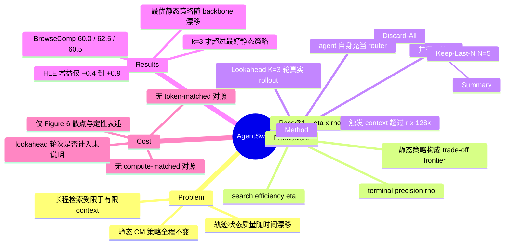

## Summary

针对 long-horizon information-seeking agent 全程只用一种固定 context management 策略的问题，AgentSwing 在每个 context 溢出触发点并行展开 Keep-Last-N / Summary / Discard-All 三条被管理分支，各自在真实环境中多走 K 步后由 agent 自身挑选最优续接。配套提出把 Pass@1 拆成 search efficiency η 与 terminal precision ρ 的概率视角，在 BrowseComp / BrowseComp-ZH / HLE 上三个 backbone 均超过最好的静态策略。

## Problem & Motivation

Deep information-seeking 任务往往需要几十到几百轮 search / visit / verify / backtrack，而 context 容量有限，agent 常常在拿到答案前先把 workspace 用光。现有做法（Discard-All、Keep-Last-N、Summary）都是选定一种操作后在整条轨迹上反复施加。

作者的核心观察是：轨迹状态的质量随时间变化。有些时刻累积上下文里含有值得保留的中间结构，有些时刻则被噪声、drift、失败的局部探索主导，需要更激进的重置。固定策略无法区分这两种状态。

论文进一步指出 Pass@1 在长程场景下不是一个单一指标：它同时反映"能不能在资源耗尽前走到终止点"和"走到之后答得对不对"，这两件事对 context management 的偏好是相反的。

## Method

### 概率视角：η 与 ρ

对任务 τ 与测试时策略 π，定义 S 为"到达停止点并给出最终答案"事件、C 为"答案正确"事件：

- **search efficiency** η = P(S | τ)：在资源（context budget、最大交互轮数）耗尽前抵达终止点的概率
- **terminal precision** ρ = P(C | S, τ)：抵达终止点的条件下答案正确的概率
- 由链式法则，**Pass@1 = η · ρ**（Eq. 5）

实证估计为 η ≈ N_finish / M、ρ ≈ N_correct / N_finish；资源耗尽未出答案的任务直接计失败。由于不同策略完成的任务子集不同，另定义 aligned terminal precision ρ_align = N_aligned-correct / N_aligned-finish 用于跨策略比较。

对 Discard-All，论文把多次 reset 建模为 N 次独立尝试：η^DA = 1 − ∏(1 − η_i) ≈ 1 − (1 − η_single)^N（Eq. 10，条件独立近似）。这解释了为什么单次尝试更弱的 Discard-All 仍能超过 baseline——每次 reset 的 context 更小因而 ρ 更高，而 η 的损失可以靠增加 reset 次数补回来。

框架**预测的是策略在 η-ρ 平面上的定位，不是该选哪个策略**：w/o CM 处于高 η 低 ρ 一端，Discard-All 处于低 η 高 ρ 另一端，Summary 与 Keep-Last-N 落在中间，四者构成一条经验 trade-off frontier。Figure 2 另给出一个可检验的推论：固定 400 轮上限时，aligned terminal precision 随 context budget 单调下降（作者归因于 context rot）。

### AgentSwing 的两个组件

**(1) Parallel Context Management。** 当前 context 长度超过 max context length 的固定比例 r 时触发。在同一份 raw context 上并行施加**三种**候选策略：

| 策略 | 保留内容 |
|:--|:--|
| Keep-Last-N | 最近 N 个 (thinking, tool call, tool response) 三元组，N=5 |
| Summary | 原始 user prompt + 轨迹压缩摘要，即 (q, Sum) |
| Discard-All | 只保留原始 user prompt q |

**没有 folding 分支，也没有 masking 分支。** 论文在 Related Work 里把 folding 类工作（AgentFold、Yu et al. 2025）归入"与 Summary 密切相关的 context compaction"，因而未作为独立 baseline 运行。

**(2) Lookahead Routing。** 三条分支各自在真实环境中继续交互 **K 个 turn**（主实验 K=3），然后把三条候选续接连同**原始 raw context** 一起交给 agent model 本身，由它选出"最合理"的分支；其余分支丢弃，被选中的续接成为新主轨迹。路由器就是 agent 自己，没有训练专门的 router 或 verifier。这使得选择依据不只是被管理 context 的表面质量，还包括它在真实环境反馈下的短期下游行为。

值得注意的是，η/ρ 框架并没有给出路由准则——router 是一个 LLM 自选提示，与概率框架只是松耦合：框架用来解释静态策略为何各有所长，方法则靠 lookahead 经验性地绕开 trade-off。

## Key Results

**Setup。** Benchmark：BrowseComp（随机抽 200 题）、BrowseComp-ZH（全量 289 题）、HLE（500 道 text-only）。Backbone：GPT-OSS-120B、DeepSeek-v3.2、Tongyi-DR-30B-A3B。工具为 Search（batched Google，top-10）与 Visit；HLE 另加 Google Scholar 与 Python Interpreter（SandboxFusion）。max context 128k，max interaction budget 400 turns，触发比例 r=0.2（GPT-OSS-120B）/ r=0.4（另两个）。评测用 LLM-as-a-Judge。Summary 的摘要步骤**一律由 GPT-OSS-120B 执行**，与 agent backbone 无关。

**主结果（Table 1，Pass@1 %）。**

| Backbone | CM | BrowseComp | BrowseComp-ZH | HLE |
|:--|:--|--:|--:|--:|
| GPT-OSS-120B | w/o CM | 39.5 | 28.4 | 33.2 |
| | Discard-All | 50.5 | 31.5 | 34.2 |
| | Keep-Last-N | 52.5 | 33.6 | 34.1 |
| | Summary | 48.0 | 30.8 | 34.4 |
| | **AgentSwing** | **60.0** | **38.0** | **35.1** |
| DeepSeek-v3.2 | w/o CM | 43.5 | 61.6 | 40.2 |
| | Discard-All | 58.0 | 70.2 | 42.0 |
| | Keep-Last-N | 52.0 | 69.9 | 39.6 |
| | Summary | 48.5 | 69.2 | 43.5 |
| | **AgentSwing** | **62.5** | **71.3** | **44.4** |
| Tongyi-DR-30B-A3B | w/o CM | 48.0 | 47.1 | 31.7 |
| | Discard-All | 58.0 | 53.9 | 32.7 |
| | Keep-Last-N | 53.0 | 50.1 | 32.2 |
| | Summary | 55.0 | 49.1 | 32.0 |
| | **AgentSwing** | **60.5** | **56.7** | **33.1** |

相对**各自最好的静态策略**的增量：BrowseComp +7.5 / +4.5 / +2.5，BrowseComp-ZH +4.4 / +1.1 / +2.8，**HLE 只有 +0.7 / +0.9 / +0.4**（500 题上约 2–5 题之差）。论文全篇没有报置信区间或显著性检验。

一个对本 survey 更关键的读法：**最好的静态策略随 backbone 和 benchmark 漂移**——GPT-OSS-120B 上 BrowseComp 最好的是 Keep-Last-N，DeepSeek-v3.2 与 Tongyi-DR 上是 Discard-All，DeepSeek-v3.2 的 HLE 上又变成 Summary。这是"需要路由"最硬的经验证据，比 AgentSwing 自身的增量更有说服力。

**Aligned 子集（Table 2）。** 只统计三种策略都触发过 context management 的任务（N_align = 122 / 73 / 45，分别对应三个 backbone；原表把该列并入首行，此处的分解经四列算术自洽性核对）。

| Backbone | Strategy | N_finish | N_correct | η % | ρ % | Pass@1 % | 平均轮数 |
|:--|:--|--:|--:|--:|--:|--:|--:|
| GPT-OSS-120B (N_align=122) | Discard-All | 51 | 35 | 41.8 | 68.6 | 28.7 | 297.2 |
| | Summary | 68 | 35 | 55.7 | 51.5 | 28.7 | 248.0 |
| | Keep-Last-N | 91 | 43 | 74.6 | 47.3 | 35.2 | 205.4 |
| | AgentSwing | 90 | 51 | 73.8 | 56.7 | 41.8 | 190.3 |
| DeepSeek-v3.2 (N_align=73) | Discard-All | 40 | 24 | 54.8 | 60.0 | 32.9 | 268.3 |
| | Summary | 72 | 22 | 98.6 | 30.6 | 30.1 | 132.2 |
| | Keep-Last-N | 53 | 23 | 72.6 | 43.4 | 31.5 | 183.5 |
| | AgentSwing | 68 | 26 | 93.2 | 38.2 | 35.6 | 151.9 |
| Tongyi-DR-30B-A3B (N_align=45) | Discard-All | 11 | 9 | 24.4 | 81.8 | 20.0 | 340.8 |
| | Summary | 35 | 9 | 77.8 | 25.7 | 20.0 | 215.7 |
| | Keep-Last-N | 42 | 9 | 93.3 | 21.4 | 20.0 | 153.0 |
| | AgentSwing | 34 | 14 | 75.6 | 41.2 | 31.1 | 203.6 |

结构上确实印证了框架：Keep-Last-N / Summary 拿 η，Discard-All 拿 ρ，AgentSwing 两头都靠近较好的一侧。但样本量极小——Tongyi-DR 上的"31.1 vs 20.0"实际是 45 题里对 14 题 vs 对 9 题，DeepSeek-v3.2 上是 73 题里 26 vs 24。

**Lookahead 消融（Table 3，BrowseComp Pass@1 %）。**

| Routing | GPT-OSS-120B | Tongyi-DR-30B-A3B |
|:--|--:|--:|
| random | 51.0 | 56.5 |
| w/o Lookahead | 50.0 | 57.0 |
| Lookahead k=1 | 52.5 | 58.0 |
| **Lookahead k=3** | **60.0** | **60.5** |
| Lookahead k=5 | 55.0 | 59.0 |

这张表回答了"路由是否胜过永远选最好的那个静态策略"，而答案比作者的叙述更窄：**只有 k=3 胜出**。GPT-OSS-120B 上最好静态策略是 Keep-Last-N 52.5，而 random（51.0）、w/o Lookahead（50.0）都低于它，k=1 恰好持平 52.5；Tongyi-DR 上最好静态策略是 Discard-All 58.0，random（56.5）、w/o Lookahead（57.0）同样更低，k=1 又恰好持平 58.0。也就是说，增益几乎全部来自 k=3 的前瞻 rollout，而不是"手里有多个候选"这件事本身。k=5 在两个 backbone 上都回落，作者归因于可能触碰模型最大长度限制——这是实现约束而非机制结论。

**Appendix。** Appendix A（Figure 8，仅图无数字）比较不同候选策略组合：作者承认"某些单一策略、尤其是 Discard-All，本身已经很强"，但组合（如 Discard-All + Summary）通常更好。Appendix B 显示策略转移矩阵明显非均匀且依赖 backbone：DeepSeek-v3.2 与 Tongyi-DR 倾向转向 Summary，GPT-OSS-120B 更常转向 Discard-All。

### 成本：论文没有做算力对齐比较

这是本 survey 最需要留意的一点。**AgentSwing 每次触发要跑 3 条分支 × K=3 轮 = 9 个额外交互轮，外加一次路由调用，而该路由调用的 prompt 同时包含三条候选续接与原始 raw context（按定义 ≥ r·128k，即 ≥25.6k 或 ≥51.2k token）。论文没有对这一开销给出任何数值。**

全文关于成本的证据只有 Figure 6：在 Table 2 的 aligned 完成任务上，每个完成任务画一个点，横轴总交互轮数、纵轴终止时累计 token 数。正文只有定性两句：

> "Although AgentSwing introduces additional token usage due to lookahead routing, the overhead remains modest in practice."

> "Taken together, these results show that AgentSwing does not achieve its gains by paying a substantially larger overall cost."

支撑理由也是相对的而非绝对的：Keep-Last-N 在相近轮数下累计 token 更高（保留了更多历史），Discard-All token 少但需要更多轮。换言之，作者论证的是 AgentSwing 落在既有静态策略的成本区间内，而不是量化了自身的额外开销。

具体缺口：

1. **没有 token-matched 或 compute-matched 比较。** Table 1 的主对比固定的是最大交互轮数（400）与 context 比例 r，不是 token 预算、FLOPs 或调用次数。Table 3 的消融同理。
2. **没有报每题触发次数**，因此从论文数据无法反推总的推理放大倍数。
3. **未说明被丢弃分支的 token 是否计入 Figure 6 的"cumulative token count at termination"。** 前引那句"introduces additional token usage"暗示计入，但没有给出口径定义。
4. **未说明 lookahead 的 9 个轮次是否计入 400 轮预算，也未说明是否计入 Table 2 的平均轮数。** 这直接影响"平均轮数 190.3 vs Discard-All 297.2"这类效率论断的可比性——lookahead 分支里的 search / visit 也是真实的工具调用与真实成本。
5. **摘要与 Introduction 的"up to 3× fewer interaction turns"没有正文数字支撑**，只能从 Figure 1 / Figure 5 的曲线上读取；而且它衡量的是 turn 而非 token 或算力。
6. Summary 分支的摘要一律由 GPT-OSS-120B 生成，是一次跨模型的额外调用，同样未计入成本讨论；AgentSwing 把 Summary 作为候选之一，因此也继承了这个外部依赖。

## Evidence Ledger

> 状态来自一次独立 verifier pass（只给 primary source、claim package 与状态定义，不给本笔记的分析与优缺点判断）。`source-verified` 仅表示原文确实包含该信息，不表示结果已被独立复现。

> 本笔记由 finder 产出，尚未经独立 verifier 核查；Status 一栏统一记 `pending`，locator 与 excerpt 供后续独立核查使用。

| Claim ID | Claim | Type | Source locator | Evidence excerpt | Status |
|:--|:--|:--|:--|:--|:--|
| C1 | context-management 分支恰为 Keep-Last-N（N=5）、Summary、Discard-All 三种，另加 w/o CM；三者中无 folding/masking 分支（全文零次 "mask"）。AgentFold 仅作为 Table 1 的外部对比系统出现，未作为 CM 分支运行 | benchmark-setting | Sec 3 (1); Sec 4.1 Baselines; Table 1 | "we compare AgentSwing with ... Discard-All, Keep-Last-N (N=5), and Summary" | source-verified（AgentFold 的出现位置由独立 verifier 补齐） |
| C2 | 论文在 Related Work 中把 folding 类工作（含 AgentFold）与 Summary 一并归为 compaction；未说明为何不单独设为 baseline | benchmark-setting | Sec 5 Related Work | "context compaction strategies closely related to Summary (Yu et al., 2025; Ye et al., 2026 ...)" | source-verified（原表述的因果推断"因而未独立设为 baseline"论文未给，已删） |
| C3 | 概率框架为 Pass@1 = η·ρ，η 为 search efficiency、ρ 为 terminal precision | causal-mechanism | Sec 2.1, Eq. 1-5 | "Pass@1^π = P(Success^π) = P(S^π ∩ C^π) = η^π ρ^π" | source-verified |
| C4 | Discard-All 的 η 建模为 1−(1−η_single)^N，依赖跨 reset 段的条件独立近似 | causal-mechanism | Sec 2.2, Eq. 10 | "under a conditional independence approximation across reset-based segments" | source-verified |
| C5 | 触发条件为当前 context 长度超过 max context length 的比例 r；r=0.2 (GPT-OSS-120B)、r=0.4 (另两个)，max context 128k | benchmark-setting | Sec 3; Sec 4.1 Hyper-parameters | "we use r=0.2 for GPT-OSS-120B and r=0.4 for both Tongyi-DR-30B-A3B and DeepSeek-v3.2" | source-verified |
| C6 | 并行分支数为 3，每条 lookahead K 个 turn；路由由 agent model 自身在候选续接 + 原始 raw context 上选择 | causal-mechanism | Sec 3 (1)(2); Fig 4 caption | "presents the candidate continuations together with the original raw context to the agent model, which then selects" | source-verified |
| C7 | GPT-OSS-120B BrowseComp：w/o CM 39.5、Discard-All 50.5、Keep-Last-N 52.5、Summary 48.0、AgentSwing 60.0 | number | Table 1 | "GPT-OSS-120B ... 39.5 ... 50.5 ... 52.5 ... 48.0 ... 60.0" | source-verified |
| C8 | DeepSeek-v3.2 AgentSwing 62.5 / 71.3 / 44.4，对应最好静态 58.0 / 70.2 / 43.5 | number | Table 1 | "AgentSwing (Ours) 62.5 71.3 44.4" | source-verified |
| C9 | Tongyi-DR-30B-A3B AgentSwing 60.5 / 56.7 / 33.1，对应最好静态 58.0 / 53.9 / 32.7 | number | Table 1 | "AgentSwing (Ours) 60.5 56.7 33.1" | source-verified |
| C10 | HLE 上 AgentSwing 相对各自最好静态策略的增益仅 +0.7 / +0.9 / +0.4 | number (derived) | Table 1 算术 | 35.1−34.4；44.4−43.5；33.1−32.7 | source-verified |
| C11 | 最好的静态策略随 backbone/benchmark 变化（Keep-Last-N / Discard-All / Summary 各有胜出场景） | comparison (derived) | Table 1 逐列比较 | GPT-OSS BC 最优 Keep-Last-N；DeepSeek HLE 最优 Summary | source-verified |
| C12 | Table 3：random 51.0/56.5，w/o Lookahead 50.0/57.0，k=1 52.5/58.0，k=3 60.0/60.5，k=5 55.0/59.0 | number | Table 3 | "random 51.0 56.5 / w/o Lookahead 50.0 57.0 / Lookahead (k=3) 60.0 60.5" | source-verified |
| C13 | 去掉 lookahead 或随机路由后，路由不再超过最好的单一静态策略（52.5 / 58.0） | comparison (derived) | Table 1 + Table 3 交叉 | 50.0 与 51.0 均 < 52.5；57.0 与 56.5 均 < 58.0 | source-verified |
| C14 | 论文未提供 token-matched 或 compute-matched 比较；token 成本证据仅 Figure 6 散点与一句定性表述，轮数成本另见 Table 2 的 N̄_turn 列，但两者都不是算力对齐的对照。全文无任何 aggregate token 数字 | benchmark-setting | Sec 4.3 "Comparison of Token Efficiency"; Fig 6; Table 2 | "the overhead remains modest in practice" | source-verified（N̄_turn 一项由独立 verifier 补齐） |
| C15 | 成本结论原句：AgentSwing 未以显著更大总成本换取增益 | comparison | Sec 4.3 | "AgentSwing does not achieve its gains by paying a substantially larger overall cost" | source-verified |
| C16 | 主对比固定的是最大交互轮数 400 与 context 比例 r，不是 token/算力预算 | benchmark-setting | Sec 4.1 | "we set the maximum interaction budget to 400 turns for all context management strategies" | source-verified |
| C17 | "up to 3× fewer interaction turns" 出现在 Abstract 与 Intro，正文无对应数字，仅由 Figure 1/5 曲线支撑 | comparison | Abstract; Sec 1; Fig 1, Fig 5 | "matching or exceeding their performance with up to 3× fewer interaction turns" | source-verified |
| C18 | Table 2 aligned 子集规模 N_align = 122 / 73 / 45；AgentSwing 平均轮数 190.3 / 151.9 / 203.6 vs Discard-All 297.2 / 268.3 / 340.8 | number | Table 2 | "Discard-All 122 51 35 41.8 68.6 28.7 297.2 ... AgentSwing 90 51 73.8 56.7 41.8 190.3" | source-verified |
| C19 | Summary 的摘要步骤一律由 GPT-OSS-120B 执行，与 agent backbone 无关 | benchmark-setting | Sec 4.1 Baselines | "For Summary, the summarization step is always performed by GPT-OSS-120B" | source-verified |
| C20 | Table 1 中带 ‡ 的分数为全量 benchmark 结果，未标记者为作者自设子集（BrowseComp 200 / HLE 500 text-only） | benchmark-setting | Table 1 caption; Sec 4.1 | "Scores marked with ‡ represent full-benchmark results, whereas unmarked scores correspond to our benchmark settings" | source-verified |
| C21 | Appendix A 的策略组合对比只有图（Figure 8），正文无数字；作者承认 Discard-All 单用已很强 | benchmark-setting | Appendix A | "some single strategies, especially Discard-All, already perform strongly" | source-verified |
| C22 | 全文未见代码发布声明；正文唯一的工具链接是 SandboxFusion，Alibaba-NLP/DeepResearch 出现在参考文献中（Tongyi-DR backbone），其余外部链接均为引文 URL | license-code | 全文检索（our code / code available / we release / artifact / github / reproduc*） | 无 code release 声明 | source-verified（原括号内的链接清点被独立 verifier 判为 contradicted，已改写） |

## Strengths & Weaknesses

**Strengths.**

η/ρ 分解是这篇论文真正可复用的部分。它把"context management 到底改善了什么"这个含糊问题变成两个可分别测量的量，并且解释了一个反直觉现象：最激进的 Discard-All 反而 terminal precision 最高，因为小 context 意味着更少 context rot；它的劣势在 η 上，而 η 可以靠增加 reset 次数补回来。这个视角对任何 harness 组件归因都适用，不局限于 context management。

Aligned finished subset（ρ_align）的设计也值得借鉴：不同策略完成的任务集本就不同，直接比 accuracy 会把 η 的差异混进 ρ 里。

"最优静态策略随 backbone 和 benchmark 漂移"这一经验事实（Table 1 逐列可读出）是支持自适应路由最有力的论据，尽管作者并未把它当作主论点来写。

**Weaknesses.**

*成本论证是最弱的一环。* 方法在结构上把每个触发点的推理量放大了近一个数量级（3 分支 × 3 轮 + 一次含全部候选与原始 context 的路由调用），而论文只给了一张散点图和"overhead remains modest"这样的定性判断，没有 token 计数、没有触发频次、没有口径定义、没有任何 compute-matched 对照。作者的辩护是"Keep-Last-N 在相近轮数下 token 更多"，这只说明 AgentSwing 没有跑出静态策略的成本区间之外，不等于开销被测量过。对 harness 设计来说这恰恰是要害：一个允许 3 倍推理预算的静态策略（比如更大的 r、更多 reset、或对同一策略做 3 次采样投票）能否拿到同样的 60.0，论文完全没有回答。

*Turn 作为成本代理不成立。* 主实验固定 400 turn，Table 2 拿平均轮数当效率证据，但论文没有说明 lookahead 的 9 个轮次是否计入。如果不计入，"AgentSwing 190.3 轮 vs Discard-All 297.2 轮"就是在拿净化过的数字比毛数字。这一点无法从论文本身消解。

*增益的统计基础偏薄。* HLE 上三个 backbone 的增益都 ≤0.9 点（500 题上 2–5 题）；Table 2 的 aligned 子集只有 45 / 73 / 122 题，Tongyi-DR 的核心对比是"对 14 题 vs 对 9 题"。全文没有置信区间、没有多次运行、没有显著性检验。BrowseComp 只用了 200 题的随机子集。

*框架与方法只是松耦合。* 论文以概率框架为卖点，但 router 并不使用 η 或 ρ 的任何估计，而是让 agent 自己看着三条续接选一条。框架用于事后解释静态策略的定位，方法则是纯经验的 test-time search。若真的按框架设计，应当去估计各分支的 η/ρ 后再决策——这条路论文没有走，也未讨论为何不走。

*"多候选"本身没有价值。* Table 3 与 Table 1 交叉读出的结论是：去掉 lookahead 后并行三条分支反而略低于最好的单一静态策略。这意味着标题里的 "Parallel Context Management" 不是增益来源，"Lookahead" 才是。而 k=3 与 k=5 的非单调性被解释为触碰最大长度限制，属于实现约束；只测了三个 k 值、两个 backbone、一个 benchmark。

*候选集不完整。* Folding 被并入 Summary、masking / 结构化 memory / 外部 scratchpad 类策略完全缺席。作者在 Appendix A 已承认效果依赖候选集的多样性与互补性，那么当前三元组的选择是否最优就成了未验证的前提。

*可比性瑕疵。* Summary 分支跨 backbone 统一用 GPT-OSS-120B 做摘要，对 Tongyi-DR-30B-A3B 而言引入了一个更强的外部模型。Table 1 里"超过若干闭源基座"的说法把 500 题 text-only HLE 子集（且额外配备 Google Scholar 与 Python Interpreter）与闭源模型的全量 HLE 分数并排。代码未开源。

**对领域的影响。** 把 context management 从"选一个压缩函数"重构为"按状态路由"是正确的问题重述，η/ρ 分解也提供了一个能被后续工作直接采用的度量语言。但作为方法本身，它是一个成本未被审计的 test-time search，且增益集中在 BrowseComp 一个 benchmark 上。在 harness 设计的语境下，它更适合被引为"静态策略无单一赢家"的证据，而不是"自适应路由已被证明划算"的证据。

## Mind Map

## Notes

**Tag 归属。** 尽管标题写的是 "Web Agents"，本文的 agent 只调用 Search 与 Visit 做开放网络检索与答案生成，不产生 GUI/browser state transition。按 `references/tags.md` 的收窄定义应归 `deep-research` 而非 `web-agent`；benchmark 为 BrowseComp / HLE，也命中 `Topics/WebAgent-Survey.md`（Deep Research 专题）的 keywords 与 `Topics/CUA-Survey.md` 的 `hard_exclude_keywords`。

**Table 2 的 N_align 为重建值。** arXiv HTML 把每个 backbone 的 N_align 只写在首行，抽取后其余行缺列。本笔记中 122 / 73 / 45 的分配经四组算术自洽性验证（η = N_finish/N_align、ρ = N_correct/N_finish、Pass@1 = N_correct/N_align 三式在全部 12 行同时成立）。独立 verifier 宜复核原表版式。

**留给 survey 的开放问题。**
1. 把静态策略的 compute 提到与 AgentSwing 相同水平（更多 reset、self-consistency 采样、或对同一策略并行多轨迹取优），60.0 是否仍然领先？论文未做，这是判断该方向是否值得投入的关键实验。
2. Lookahead 的价值究竟来自"看到了下游反馈"，还是仅仅来自"多跑了 9 轮探索"？k=1 恰好持平最好静态策略、k=3 才拉开，这个形状同时符合两种解释。
3. η/ρ 分解能否推广到本 survey 的其他 harness 轴（工具集设计、verifier、recovery）？这是本文最可迁移的部分。

**相关笔记。** [[Papers/2510-ContextFolding]]、[[Papers/2512-FoldAct]]、[[Papers/2510-MemAct]]（folding / compaction 路线，本文未作为独立 baseline）；[[Papers/2504-BrowseComp]]（评测集）；[[Papers/2607-ProgressiveDisclosure]]、[[Papers/2607-HarnessBank]]（harness 组件视角）。
