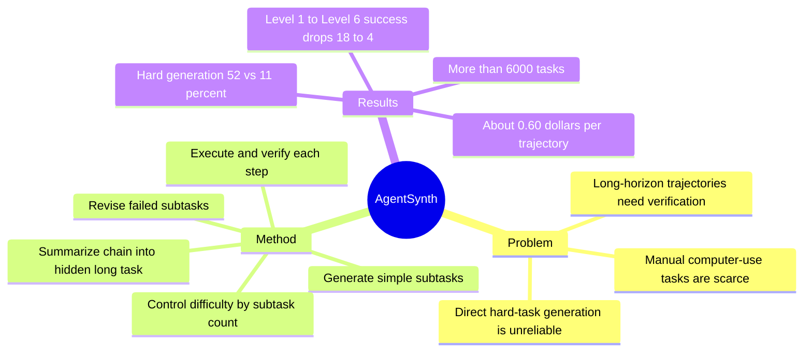

## Summary
AgentSynth 用“先合成简单可验证子任务，再把子任务链总结成长程任务”的 information asymmetry 机制，为 computer-use agents 自动生成 6,000+ 任务与轨迹。它的核心价值是把 task supply 从人工标注转成可扩展的 LLM-agent pipeline，并用 verifier / reviser 控制质量和难度。

## Problem & Motivation
Computer-use agent 的训练数据瓶颈不只是缺轨迹，还缺可执行、可验证、有难度梯度的任务。直接让 LLM 生成复杂长程任务时，容易出现目标含糊、不可完成、轨迹无法验证的问题；人工设计任务又贵且覆盖有限。

AgentSynth 的核心假设是：简单子任务更容易生成和验证，复杂任务可以通过组合多个简单子任务得到。生成器知道子任务链，但最终 agent 只看到被总结后的高层任务，因此任务对 agent 是 long-horizon，而对数据工厂是可控合成。

## Method
**Agentic task factory.** Pipeline 包含 task proposer、executor、verifier、reviser、follow-up proposer 和 summarizer。每一步都由 LLM agent 驱动，但 verifier / reviser 会过滤不可完成或不一致的子任务。

**Information asymmetry.** 系统先顺序生成并执行多个简单子任务，每个子任务都在当前环境状态上可验证；最后 summarizer 把子任务链压缩成一个自然语言长程任务。训练或评测 agent 不知道中间子任务，只能从高层目标推断完整操作序列。

**Difficulty control.** 难度主要由子任务数量控制。论文在 OSWorld 上构建多级任务，并在 appendix 中把框架迁移到 InSTA web environment；WebGym 后续也把 AgentSynth-Web 纳入 seed task sources。

## Key Results
- **Scale.** 论文构建 6,000+ tasks；超过 60% 的轨迹涉及两个及以上 app，Level 6 任务通常需要 40-60 steps。
- **Difficulty gradient.** SOTA agents 从 Level 1 的 18% success drop 到 Level 6 的 4% success，说明合成任务难度能拉开模型差异。
- **Generation quality.** 对 100 个 sampled tasks 的人工评估中，各项质量指标均超过 85%。Verifier stress test 中，near-miss trajectory 只有 12% 被误接受，而 paraphrase-equivalent trajectory 有 96% 被接受。
- **Hard-task generation.** 直接生成 hard tasks 的成功率约 11%，AgentSynth 组合式生成 hard tasks 成功率约 52%。
- **Cost.** 论文报告五个 follow-up subtasks 的完整 trajectory 约 \$0.60；六个 task levels 平均约 \$0.10/task。
- **Web appendix.** 在 InSTA Docker web environment 上，AgentSynth 可迁移生成 web tasks；论文报告 summarized InSTA tasks 比原始任务更难，GPT-4o success 降到 6.45%。

## Strengths & Weaknesses
**已知的强点。** AgentSynth 明确把 task generation、execution、verification、revision 拆成数据工厂流水线，而不是只给一个 prompt。information asymmetry 是一个简洁有效的设计：生成过程知道子任务，评测过程只给最终任务，从而同时获得可控性和长程性。

**已知的局限。** 质量控制仍依赖 LLM verifier，人工评估样本量有限。组合子任务产生的长程任务未必等价于真实用户目标的复杂性；它更擅长制造 multi-step difficulty，不一定覆盖真实 web/app usage 中的模糊意图、外部知识和网站动态变化。

**推测。** AgentSynth 是 WebGym / large-scale web RL 的任务供给侧先驱：它不是解决 browser rollout throughput，而是解决“哪里来这么多可验证任务”。对 AFE 来说，它提示 task factory 和 environment runtime 应该分层：前者负责目标分布，后者负责状态、fork、verification 和 rollout。

## Mind Map

## Notes
这篇应作为“训练任务工厂”锚点。它和 [[Papers/2606-WebGym]] 的关系很直接：WebGym 需要大规模 seed tasks 和 task decomposition，AgentSynth 提供了一类可扩展来源；但 WebGym 仍要额外解决 website breadth、rubric reward、async rollout。

后续如果做 `Agent-Facing Environment Runtime`，AgentSynth 不应被当作竞争方案，而应被视为上游：它生成目标和初始轨迹，AFE runtime 决定这些任务能否被 fork、reset、verify、recover，并把失败轨迹变成训练信号。
