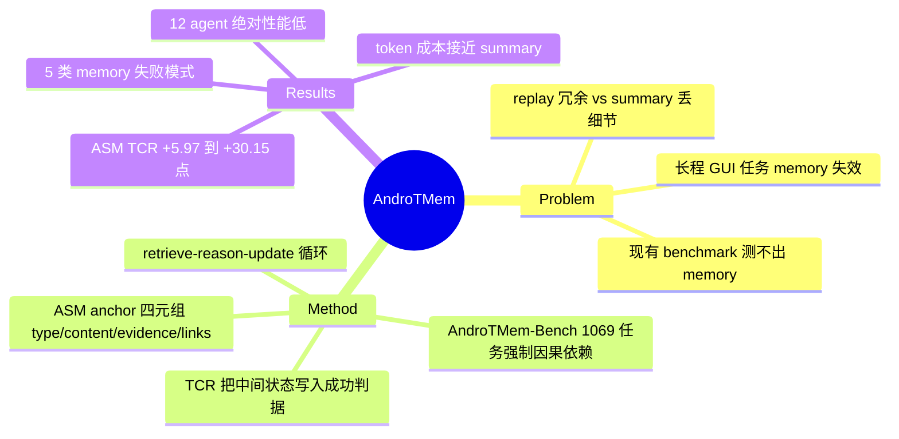

## Summary

针对长程 Android GUI 任务中 within-task interaction memory 的失效问题，构建了强制 step-to-step 因果依赖的 benchmark AndroTMem-Bench（1,069 任务、34,473 步、平均 32.1 步/任务），并提出 Anchored State Memory（ASM）——把交互历史组织成稀疏、带因果链接的 intermediate-state anchor 集合，在 10 个模型上相对 raw replay / summary 基线把 TCR 提升 5%–30.16%。

## Problem & Motivation

真实移动端长程任务（跨 app、几十步）的关键难点不再是单步感知或 grounding，而是**维护、检索、复用关键中间状态**：早期步骤提取的值（价格、联系人、复制的文本）往往在多步之后才产生因果作用。现有两条主流历史表示路线都有缺陷——full-sequence replay 冗余且放大噪声，free-form summary 抹掉依赖关键的细粒度信息与可溯源性。而现有 benchmark（AITW、AMEX、AndroidWorld 等）任务短或步骤间弱耦合，后续决策不依赖早期信息也能成功，测不出 memory 能力。三个 gap：(1) 数据集不强制跨步因果依赖；(2) 端到端成功率混淆 perception / action / memory 三类失败，无法诊断退化来源；(3) 历史建模停留在 replay vs summary 的两难。

## Method

**AndroTMem-Bench（数据）**：半自动 pipeline——GUI 专家基于 50 个常用 app（16 个功能组）设计 70+ 个跨 app 任务模板（模板槽位实例化 + GPT-4o 改写为自然表达），标注平台基于 ADB 闭环执行（真机/模拟器），每步同步记录 screenshot、accessibility tree、reasoning、summary 和 **State Anchors**。8 类 primary intent（Lookup、Compare & Decide、Purchase/Order、Booking、Communicate、Share、Create Content、Configure），11 种 action。

**评估指标**：AMS（step 级动作匹配，tap 用 14% 归一化距离或 SAM2 分割的元素命中，text 用 ANLS）+ **TCR**（基于 anchor 的任务完成率：到达 final anchor 且满足前置 anchor 间的因果依赖才算成功）。注意：评估在**预录制轨迹**上进行（固定 screenshot + 标注 action），非 live 环境。

**Anchored State Memory（ASM）**：每个 anchor 为四元组 `m_k = ⟨type, content, evidence, links⟩`：
- **type**：6 类——subgoal / state_change / dependency / exception / context_info / finish
- **content**：状态的语义描述；**evidence**：溯源到轨迹中的 UI 观察/步骤（不引入新信息）
- **links**：与其他 anchor 的因果依赖，4 种关系——prerequisite / enables / result_of / blocks（例：`Cheaper_Item` depends on `Price_JD` + `Price_Taobao`）

运行方式为 **retrieve–reason–update** 循环：`Â_t = Retrieve(s_t, A_{t-1})` → `a_t = Act(s_t, Â_t)` → `A_t = Update(A_{t-1}, s_t, a_t)`。anchor 由**被评估模型自己在线生成**（非人工标注 ground truth）：统一 prompt 模板（附录 Table 10）规定输出 schema（action + content_en + description_en + causal_link），仅在出现语义上有意义的任务状态时生成 anchor，仅对 decision-critical 依赖建 link；用统一 prompting + schema 强制 + 无效输出重试来消除模型输出风格差异。公平性控制（附录 B.3）：三种历史表示同源自同一轨迹、无额外 evidence 信号、每步的 current observation + instruction 完全一致，只有历史的**表示形式**不同。

## Key Results

- **Benchmark 主表（raw history 设置，12 个 agent）**：整体绝对性能低——最强 Gemini-3-Flash 才 46.14 AMS / 55.21 TCR；GPT-4o 14.24/11.75、GPT-5 12.37/11.46；开源最强 UI-TARS-1.5-7B 35.62/34.55；多智能体框架（Mobile-Agent-E、COLA）也只有 ~12% TCR。
- **诊断**：所有模型性能随 step 数增长一致退化（Fig. 1/4）；依赖非局部状态复用的 intent（Compare & Decide、Purchase/Order）最难。
- **History ablation（Raw vs Summary vs ASM，10 个模型；两个多智能体框架未做 ASM 变体）**：ASM 在所有模型上 AMS 和 TCR 双双最优。TCR 相对 Raw 的绝对提升从 +5.97（GPT-4o）到 +30.15（Qwen2.5-VL-7B：16.04→46.19）；最亮眼的是 Gemini-2.5-Pro 41.11→63.40（+22.29）。AMS 提升 4.93（UI-Venus）–24.66（Gemini-2.5-Pro）。
- **效率**：ASM token 消耗接近 Summary（如 GPT-4o：1265 vs 993），远低于 Raw（2671），推理时间相当或更快。
- **失败模式定性分类（5.4 节）**：State Loss / State Mis-binding / Context Drift / Unverified Progress / Interruption Handling Failure。

## Strengths & Weaknesses

**亮点**：
- 把"长程 = memory 问题"从 folklore 变成可测量对象：benchmark 设计上强制因果依赖 + TCR 把中间状态一致性写入成功判据，是对现有 GUI benchmark 盲区的直接回应（Table 1 对比列显示唯一支持 ASM 式 history modeling 的数据集）。
- history ablation 的控制变量设计干净：同源轨迹、同 observation、模型自己生成 summary/anchor（避免人工 anchor 泄露信息强度），使"结构化表示本身带来增益"的归因可信。
- ASM 的 anchor schema（type/content/evidence/links）简单、模型无关，token 成本接近 summary。

**局限（含论文自认 + 我的批判）**：
- **失败归因是定性的**：论文声称"退化由 memory 失败主导而非 perception 错误"，但没有给出量化的 per-failure-type 归因协议或比例数字——证据链是 (a) 性能随 step 退化曲线 + (b) 换历史表示（感知输入不变）性能大幅变化的反事实论证 + (c) 定性轨迹检查（C.3）。这个 claim 的强度弱于其表述。
- **离线评估**：在预录制轨迹上做 step-wise 评估，agent 的动作不真正改变环境；TCR 的"到达 final anchor"实际是沿标注轨迹检查语义状态一致性，与 live 执行（AndroidWorld 式）有本质差距。
- **Retrieve 的实现含糊**：正文形式化了 Retrieve(s_t, A_{t-1})，但附录 B.2 表明每步模型直接收到"previously generated anchors"，即所谓 retrieval 很可能就是把全部 anchor 放进 context 由模型自己注意——没有独立的检索模块或检索消融。
- 论文自认（Sec. 6）：不覆盖 cross-session / 多 episode / 中断后恢复场景；benchmark 是固定目标 + 稳定 app 状态的 curated 轨迹，缺 UI drift、内容更新、随机结果。
- Table 2 与 Table 4 中 Mobile-Agent-E 和 COLA 的数字互换（15.77/11.71 vs 17.22/11.85），疑似笔误。
- Gemini-3-Flash 一枝独秀（55.21 TCR vs GPT-5 的 11.46）且 GPT-5 反常地低，绝对数需谨慎解读（作者在 C.3 也自辩了这一点）。

## Mind Map

## Notes

- 与 amnesia/resumability idea 的关联：ASM 条件下每步 context ≈ instruction + 当前 screenshot + anchor 集合，形式上接近"每步都清空对话历史只留结构化状态"的弱化版 sufficiency 测试——但论文**没有**做显式的 context-reset / 中断恢复实验，也没有验证 anchor 集合单独是否"充分"（anchor 生成时模型仍可访问 interaction history，B.2）。这正是我们 idea 的空位。
- anchor 由 agent 在线自生成 → anchor 质量与 agent 能力耦合；弱模型（如 UI-Venus）提升最小，可能是 anchor 写不好，论文用"同一模型也写 summary"来反驳，但没有 anchor 质量的独立度量。
