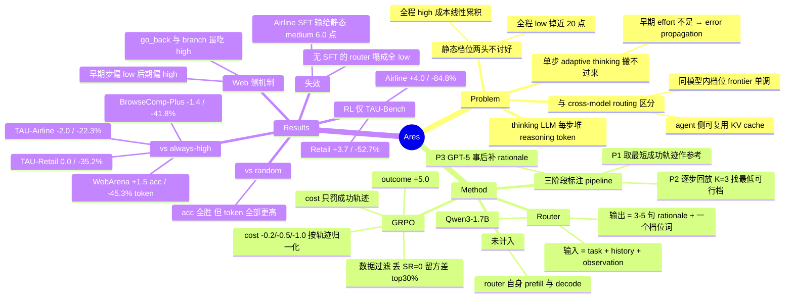

## Summary

Ares 用一个 1.7B 的轻量 router，在多步 agent 任务的每一步预测 backbone LLM 该用 low / medium / high 中的哪一档 reasoning effort，训练标签来自一条"锚定最短成功轨迹、逐步回放、找出能稳定复现该步正确动作的最低档"的自动标注 pipeline。在 TAU-Bench / BrowseComp-Plus / WebArena 上相对 always-high 削减 22%–45% 的 agent reasoning token，准确率变化落在 −2.0 到 +1.5 点之间；再叠一层 GRPO 后在 TAU-Bench Retail 达到摘要宣称的 52.7% 削减且准确率反升 3.7 点。但全文报告的 token 只统计 agent 侧，router 自身的 prefill 与 decode 开销没有任何数字。

## Problem & Motivation

thinking LLM 让 agent 更准，代价是每一步都堆 reasoning token，在多步轨迹上线性累积。现成的省钱手段是用模型自带的 high/medium/low 档位，但静态策略两头不讨好：gpt-oss-20b 从全程 high 换成全程 low，性能掉近 20 个点（§1/Fig 1）。

作者的两点问题定位值得记：

1. **单步 adaptive thinking 搬不过来。** math / competitive programming 上的 difficulty-adaptive reasoning 假定决策独立，而 agent 早期一步 effort 不够就会 error propagation，效率与长期成功率的权衡不再可分解。
2. **与 cross-model routing 的差别是刻意选的。** 跨模型 routing 的 cost-performance 关系非单调，换模型还要为新模型重新 encode context；限制在同一模型内部切 effort 档位，frontier 更良定义，且 agent 侧可以跨档位复用 KV cache。这个 framing 比方法本身更值得记住——但它同时埋下本文最大的记账漏洞（见 Weaknesses 1）。

## Method

### Router 形式化与输入

- agent $\mathcal{M}_{\text{agent}}$（gpt-oss-20b）在第 $t$ 步给定 $h_t=(x,o_1,a_1,\dots,o_{t-1},a_{t-1})$、当前观测 $o_t$ 与 effort $e_t$ 产生动作 $a_t$。
- router $\mathcal{M}_{\text{router}}$（Qwen3-1.7B）**拿到与 agent 完全相同的上下文** $(h_t, o_t)$，输出 $e_t \in \{\text{low}, \text{mid}, \text{high}\}$。输出格式为先在 `<think>` 里写 3–5 句 rationale，再给一个 label 词。
- 优化目标 $\max_\theta \mathbb{E}[\mathcal{V}(\tau) - \lambda \sum_t \text{cost}(e_t)]$，其中 $\text{cost}(e_t)$ 被明确定义为"**agent** 在该 turn 生成的 token 总数（thinking + action）"。目标函数里从一开始就不含 router 自己的开销。

### 三阶段 SFT 数据 pipeline

核心是把 $|\mathcal{E}|^T$ 的联合搜索拆成 $T$ 个独立的单步分类。

**Phase 1 · 轨迹采集。** 对每个训练任务在 $e_{\text{high}}$ 下采 $N$ 条成功轨迹，取步数最少的一条 $\tau^*$ 作参考路径。理由有二：短轨迹的 reasoning 需求信号更干净；固定动作序列后，长 horizon 优化可拆成逐步标注。
实际执行中三个域只有 BrowseComp-Plus 真走了这条自采样路径——TAU-Bench 直接用 APIGen-MT 的公开轨迹（每步带 ground-truth action），WebArena 直接用 AgentOccam 放出的成功轨迹。作者把这当兼容性优点讲。

**Phase 2 · effort 标注。** 对每一步把 $a^*_t$ 当 ground truth，对每档 $e$ 采 $K=3$ 次，取能稳定复现 $a^*_t$ 的最低档作为标签 $y_t$。等价性判据按域定制：

| 域 | 判据 |
|:--|:--|
| tool use | tool name 匹配且关键参数一致 |
| web agent | 与 $a^*_t$ 以完全相同的方式与环境交互（如 `click[1316]`）；附录 A 的 annotator prompt 是字符串级 exactly identical，禁止 action type / 参数 / URL / selector / identifier 任何差异 |
| deep research | LLM judge 判 search query 语义等价 |
| 自然语言消息（询问用户、最终答案） | 一律 LLM judge（GPT-4o） |

⚠️ 方法节（§3.2 Phase 2）写"≥M/K 多数通过"且"无一档通过就丢弃该步"；实现节（§4.1 Training）写"三次全对才算通过""三次都不全对时保留正确率最高的最低档"。两处规则不一致，后者会把本该丢弃的噪声步保留成有效标签。

**Phase 3 · rationale 生成。** GPT-5 拿到 $(h_t, o_t, y_t)$ 与各档位的模型回复，事后写 ≤5 句解释"为什么 $y_t$ 合适"，从最新 observation 复杂度、任务进度、下一子任务难度三个角度展开。限长 3–5 句的明说理由就是压 router 自身延迟。

**SFT。** 在 $\mathcal{D}=\{(h_t,o_t,r_t,y_t)\}$ 上做标准 next-token prediction，3 epoch，lr 5e-6，global batch 64。

### RL（GRPO，只在 TAU-Bench 上跑）

动机是 SFT pipeline 把多轮 routing 退化成贪心单步决策：它假设此前每步 effort 都最优，学不到"从前面的错误选择里恢复"；且每个 query 只有一条 step-wise 最优标注，缺少 query 级别的对比信号。

奖励 $R(\tau)=R_{\text{out}}+R_{\text{cost}}+R_{\text{form}}$，其中 $R_{\text{cost}}$ **只在成功轨迹上生效**——否则 router 会学到"故意选 low 让任务快速失败以少扣累积惩罚"这种 degenerate policy。

- $R_{\text{out}}$：成功 +5.0 / 失败 0
- $R_{\text{cost}}$：每步 $-0.2/-0.5/-1.0$（low/mid/high），按轨迹长度归一化 $R_{\text{cost}}=\frac{1}{T}\sum_t c(e_t)$
- $R_{\text{form}}$：违反 `<think>` 模板 $-1.0$ 并立即终止判失败（作者说把格式错误路由到固定档位会让训练不稳）

**数据过滤**（这一步是效率信号的来源）：每 prompt 用 SFT router 跑 $N=8$ 次；丢掉 SR=0 的（超出 backbone 能力，router 会被迫为 agent 的固有失败背锅）；在 SR=100% 的样本里只留 reward 方差 top 30%——同样都成功但成本差异大，正是"选 effort 能改变什么"的最强信号。

RL 超参：$G=16$，max prompt 4,096 / response 512 token，Adam lr 1.5e-6，KL coef 0.01，5 epoch，batch 32。

## Key Results

### 评测覆盖（web 综述最需要先看清的一格）

| 环境 | 类型 | 浏览器/网页状态转移 | 出现在哪些实验 |
|:--|:--|:--|:--|
| TAU-Bench (Retail / Airline) | tool-use 对话，GPT-4o 当 user simulator，成败看最终数据库状态 | 否 | Table 1、Table 2 (RL)、Table 3/4 (ablation)、Table 5 (跨规模) |
| BrowseComp-Plus | deep research；用 gpt-oss 原生 search/browsing 工具，但检索目标是 BM25 索引的**固定语料**而非开放网络 | 实质无（见下注） | 仅 Table 1 |
| WebArena | web agent；AgentOccam scaffold，accessibility tree 观测，click / type / go_back / branch | 是 | 仅 Table 1 + Figure 3 |

> 注：论文本身没有做"哪个环境算 web state transition"的分类，上表第三列是我的判读——依据是 BrowseComp-Plus 明确"replacing open-web search with a fixed corpus"，agent 每步产出的是 reasoning + search action 或最终答案，不改变任何页面状态。

训练数据量（附录 C, Table 6）：

| 数据集 | 总标注步数 | High | Medium | Low |
|:--|--:|--:|--:|--:|
| TAU-Bench | 43,358 | 12,261 | 6,222 | 24,875 |
| BrowseComp-Plus | 12,366 | 6,184 | 3,091 | 3,091 |
| **WebArena** | **1,718** | **1,095** | **72** | **551** |

WebArena 只占全部 57,442 条标注步数的 **3.0%**，且 medium 标签只有 72 条（4.2%）——web 上训出来的 router 实际接近一个二值 low/high 策略。RL、component ablation、跨规模泛化三组实验**没有一组**在 WebArena 上做过。

### 主表（Table 1，backbone gpt-oss-20b；格式 Acc% / $T_{\text{total}}$）

| 环境 | Low | Medium | High | Random | GPT-5 router | Gemini-3-Pro router | **Ares (SFT)** |
|:--|:--|:--|:--|:--|:--|:--|:--|
| TAU-Retail | 35.0 / 25k | 47.3 / 137k | 54.8 / 1007k | 43.5 / 359k | 40.0 / 132k | 46.1 / 128k | **54.8 / 652k** |
| TAU-Airline | 32.0 / 12k | 42.0 / 98k | 38.0 / 873k | 34.0 / 521k | 34.0 / 396k | 36.0 / 239k | **36.0 / 678k** |
| BrowseComp-Plus | 8.00 / 5k | 34.0 / 538k | 42.7 / 1841k | 30.7 / 392k | 38.7 / 1398k | 37.3 / 1144k | **41.3 / 1071k** |
| WebArena | 37.4 / 67k | 42.6 / 538k | 45.0 / 2763k | 40.3 / 857k | 41.1 / 1159k | 41.9 / 1164k | **46.5 / 1512k** |

三条对比线：

**(a) vs always-high** — Retail ±0.0 acc / −35.2% token；Airline −2.0 / −22.3%；BrowseComp-Plus −1.4 / −41.8%；**WebArena +1.5 / −45.3%**。四个设置里只有 WebArena 是严格 Pareto 支配（更准且更省）。

**(b) vs always-low** — +19.8 / +4.0 / +33.3 / +9.1 acc，但 token 分别是 low 的 **26× / 57× / 214× / 23×**。所谓"节省"完全是相对 high 的，相对 low 是巨额加价。

**(c) vs random** — acc +11.3 / +2.0 / +10.6 / +6.2，但 **Ares 在四个设置里 token 全部高于 random**（652k vs 359k、678k vs 521k、1071k vs 392k、1512k vs 857k）。换算成相对 always-high 的削减幅度，random 是 64.3% / 40.3% / 78.7% / 69.0%——**每一个都大于 Ares**。Ares 赢在准确率，不赢在成本。

**补充：vs always-medium** — WebArena +3.9 acc 但 2.81× token（frontier 上的正常权衡）；TAU-Airline SFT 却是 **−6.0 acc 且 6.9× token**，被静态 medium 全面支配。

### RL（Table 2，仅 TAU-Bench）

| | Acc | $T_{\text{total}}$ | vs always-high |
|:--|--:|--:|:--|
| Retail · SFT | 54.8 | 652k | ±0.0 acc / −35.2% |
| Retail · **RL** | 58.5 | 476k | **+3.7 acc / −52.7%** |
| Airline · SFT | 36.0 | 678k | −2.0 acc / −22.3% |
| Airline · **RL** | 42.0 | 133k | **+4.0 acc / −84.8%** |

摘要与 §1 的"up to 52.7%"就是 Retail 的 RL 那一格，两处均未标明它需要 RL 阶段（§1 那句"even slightly improves performance"对 SFT 的 ±0.0 也不成立）。有意思的是 Airline RL 的 84.8% 削减更大，"up to"反而低报了自己。**web 场景下可复现的最好数字仍是 SFT 的 45.3%。**

### Web 侧的 effort 分布（Figure 3 / §4.4，全文唯一针对 web 的机制分析）

- **按 step index**：0–2 步以 low 为主（进入 landing page / forum 这类 observation→action 映射直接的导航），随任务推进 high 比例显著上升。作者归因于 web observation 的感知复杂度上升 + context 变长。
- **按 action type**：`go_back` 与 `branch` 的 high 占比最高。go_back 对应"从错误导航路径战略性回退"，branch 对应"实质性修改现有导航计划"——即 effort 主要该花在自我纠错与重规划节点上。（`branch` 是 AgentOccam 引入的 planning action，不属于 WebArena 原生动作空间。）

### Ablation（Table 3/4，全部在 TAU-Bench）

| 设置 | Acc | $T_{\text{total}}$ |
|:--|--:|--:|
| Ares (SFT) · Retail | 54.8 | 652k |
| − SFT（Qwen3-1.7B 直接用） | 41.7 (−13.1) | 128k |
| − Rationale（直接分类） | 51.3 (−3.5) | 474k |
| Airline · 归一化 cost reward | 42.0 | 133k |
| Airline · 不归一化 | 41.3 (−0.7) | 157k |

GRPO 训练动态（Figure 4，Airline）：SFT 初始化的 router 在 **>50%** 的步上选 high，RL 把它压到 **<20%**，low 比例升到约 **70%**；reward 归一化把 high 比例压到约 **15%**（不归一化停在约 **30%**）。

### 跨规模泛化（Table 5，TAU-Retail，gpt-oss-120b backbone）

Ares 65.2% / 428k vs always-high 67.8% / 558k（−2.6 acc，约 23% token 削减）。router 只在 20b 上训过，backbone 大 6 倍仍可用。

### Router 自身成本：不在任何报告数字里

$\text{cost}(e_t)$ 在 §3.1 就被定义为 agent 侧 token；§4.1 的 $T_{\text{total}}$ / $T_{\text{task}}$ / $T_{\text{step}}$ 统计的都是 agent 的 reasoning token。**全文（含附录）没有一处给出 router 的 token 数、FLOPs 或 wall-clock 延迟**，只有定性表述："remains lightweight and fast"、"only introduces very trivial router cost compared to them"。3–5 句 rationale 上限与 RL 时 512 token 的 response 上限是**约束**，不是**测量**。

另：三个 benchmark 的评测任务数全文都未给出（WebArena 只说"沿用 Sun et al. 2025 / Qi et al. 2024 / Yang et al. 2024 的 train-test split"），可比性无法核对。

## Evidence Ledger

> 以下状态来自一次独立 verifier pass（只给 primary source、claim package 与状态定义，不给本笔记的分析、评分与优缺点判断）。`source-verified` 仅表示原文确实包含该信息，不表示结果已被独立复现。frontmatter 仍按 coordinator 要求保持 `unverified`，待其自己的 verifier 复核后升级。

| Claim ID | Claim | Type | Source locator | Evidence excerpt | Status |
|:--|:--|:--|:--|:--|:--|
| C1 | router 是 fine-tuned Qwen3-1.7B，每步接收与 agent 相同的 (task, history, observation)，输出 3–5 句 rationale + 一个 {low,mid,high} label | causal-mechanism | §3.1；§3.2 Phase 3；§4.1 | "the router receives the same input context as the agent—the task, history, and current observation" | source-verified |
| C2 | 标签 = 能复现参考动作的最低档；参考轨迹 = 在 high effort 下采样出的**步数最少**的成功轨迹 | causal-mechanism | §3.2 Phase 1–2；Fig 2 | "we sample N successful trajectories... under the maximum effort level e_high... we select the most concise trajectory τ*" | source-verified |
| C3 | 鲁棒性判据方法节与实现节不一致：§3.2 "≥M/K 多数通过 + 全不通过则丢弃" vs §4.1 "三次全对 + 全不通过则保留正确率最高的最低档" | causal-mechanism | §3.2 Phase 2 vs §4.1 Training | "correct in at least M out of K trials... the step is discarded" vs "correct action in all three trials... retain the lowest reasoning effort level with the highest accuracy" | source-verified |
| C4 | WebArena：Ares 46.5% / 1512k vs High 45.0% / 2763k → +1.5 acc，−45.3% token | number | Table 1；§4.2 | "Ares 46.5 – 8.9 1512k"；"High 45.0 ↑1.5 10.0 2763k ↓1251k" | source-verified（复算 1251/2763 = 45.28%） |
| C5 | BrowseComp-Plus：Ares 41.3% / 1071k vs High 42.7% / 1841k → −1.4 acc，−41.8% token | number | Table 1；§4.2 | "High 42.7 ↓1.4 55.4 1841k ↓770k"；"Ares 41.3 – 36.5 1071k" | source-verified（复算 770/1841 = 41.83%） |
| C6 | TAU-Retail：Ares 54.8% / 652k vs High 54.8% / 1007k → ±0.0 acc，−35.2% token | number | Table 1；§4.2 | "High 54.8 ↓0.0 13.8 1007k ↓355k"；"Ares 54.8 – 14.6 652k" | source-verified（复算 355/1007 = 35.25%） |
| C7 | TAU-Airline：Ares 36.0% / 678k 比 High(38.0) 低 2.0 点、比 Medium(42.0 / 98k) 低 6.0 点且耗 6.9× token | number, comparison | Table 1 | "High 38.0 ↓2.0 10.6 873k"；"Medium 42.0 ↓6.0 13.2 98k"；"Ares 36.0 – 12.3 678k" | source-verified（复算 678/98 = 6.92×） |
| C8 | vs always-low：+19.8 / +4.0 / +33.3 / +9.1 acc；low 的 $T_{\text{total}}$ 为 25k / 12k / 5k / 67k | number, comparison | Table 1 (Low rows) | "Low 35.0 ↑19.8 13.5 25k"；"Low 8.00 ↑33.3 4.6 5k"；"Low 37.4 ↑9.1 8.9 67k" | source-verified |
| C9 | vs random：Ares acc 四项全胜（+11.3/+2.0/+10.6/+6.2），但 token 四项全部**高于** random（652k vs 359k、678k vs 521k、1071k vs 392k、1512k vs 857k） | number, comparison | Table 1 (Random rows) | "Random 43.5 ↑11.3 14.5 359k"；"Random 40.3 ↑6.2 8.0 857k" | source-verified（WebArena Δ 印成 "↑655" 漏了 k；857k+655k=1512k） |
| C10 | 摘要的 52.7% 对应 Table 2 中 TAU-Retail 的 **RL** router（1007k→476k，54.8→58.5）；RL 只在 TAU-Bench 上跑过 | number, comparison | Table 2 标题与两个 block；§4.3；Abstract | "Ares RL 58.5 – 14.4 476k"；"Table 2: RL results in TAU-Bench" | source-verified（复算 531/1007 = 52.73%；摘要/§1 均未点明需 RL；Airline RL 的 84.8% 更大，"up to" 反而低报） |
| C11 | $T_{\text{total}}/T_{\text{task}}/T_{\text{step}}$ 只计 agent 生成 token；全文（含附录）无任何 router 自身 token / 延迟 / 算力的数值 | benchmark-setting | §3.1；§4.1 Evaluation；§4.2 | "Ares only introduces very trivial router cost compared to them" | source-verified（全文检索 overhead/latency/router-cost 只返回定性表述） |
| C12 | 三个环境为 TAU-Bench / BrowseComp-Plus / WebArena；Table 6 标注步数 43,358 / 12,366 / 1,718，WebArena 分布 High 1,095 / Medium 72 / Low 551 | number, benchmark-setting | §4.1 Environments；附录 C Table 6 | "WebArena 1,718 1,095 72 551" | source-verified（1,095+72+551=1,718） |
| C12b | 三者中只有 WebArena 涉及浏览器/网页状态转移 | benchmark-setting | §4.1 | "replacing open-web search with a fixed corpus"；BCP agent 用 "the original gpt-oss web search and browsing tools" | **downgraded** — 论文未做此分类；已在正文标注为我的判读，非原文断言 |
| C13 | WebArena 用 AgentOccam scaffold + accessibility tree 观测；其 router 训练轨迹取自 AgentOccam 公开的成功轨迹，非 gpt-oss-20b 自采样 | benchmark-setting | §4.1 Environments / Implementation / Training | "The WebArena training trajectories are obtained from successful trajectories released by AgentOccam" | source-verified |
| C14 | Table 3（TAU-Retail）：− SFT 41.7% / 128k（−13.1）；− Rationale 51.3% / 474k（−3.5）；ablation 只在 TAU-Bench | number | Table 3；§4.5 | "– SFT 41.7 ↑13.1 128k"；"– Rationale 51.3 ↑3.5 474k" | source-verified |
| C15 | Table 4 / Fig 5（TAU-Airline）：归一化 42.0% / 133k vs 不归一化 41.3% / 157k；high 选择比例约 15% vs 约 30% | number | Table 4；§4.5 Reward Design | "down to approximately 15%, compared to 30% in the unnormalized setting" | source-verified |
| C16 | Table 5（gpt-oss-120b, TAU-Retail）：Ares 65.2% / 428k vs High 67.8% / 558k → −2.6 acc，约 23% 削减 | number | Table 5；§4.6 | "High 67.8 ↓2.6 558k... Ares 65.2 - 428k" | source-verified（复算 130/558 = 23.3%） |
| C17 | WebArena effort 分布：0–2 步以 low 为主；high 随 step 推进上升；按动作类型 `go_back` 与 `branch` 的 high 占比最高 | causal-mechanism | §4.4（描述 Fig 3） | "In the early stages of a task (e.g., steps 0–2), the router predominantly selects low reasoning effort"；"go_back and branch—require the highest proportion of high reasoning effort" | source-verified（据 §4.4 正文；图像本身未渲染） |
| C18 | Airline GRPO 动态：SFT 初始 router 在 >50% 步选 high，RL 压到 <20%，low 升到约 70% | number | §4.3（描述 Fig 4） | "initially selects high effort for over 50% of the steps... dropping its usage to under 20%... low effort ratio climbing to approximately 70%" | source-verified |
| C19 | 论文未提供任何 code / data 发布链接 | license-code | 全文含附录 A–C；arXiv abs 页 | （零命中：github / huggingface / "available at" / "code"） | source-verified |
| C20 | gpt-oss-20b agent 从全程 high 换全程 low 掉"nearly 20%" | number | §1（配 Fig 1） | "suffers a nearly 20% drop after switching the reasoning effort from 'high' to 'low' at every decision step" | source-verified |
| C21 | 作者为 Jingbo Yang, Bairu Hou, Wei Wei, Yujia Bao, Shiyu Chang；arXiv HTML 与 abs 页均未给机构；v1 提交于 2026-03-09；primary subject cs.AI | benchmark-setting | arXiv abs header；HTML title block | "[v1] Mon, 9 Mar 2026 03:17:29 UTC"；致谢只列 NSF IIS-2338252 / IIS-2302730 | source-verified |
| C22 | §3.2 的 "functional equivalence" 与附录 A 的字符串级 exactly-identical 判据构成方法/实现矛盾 | causal-mechanism | §3.2 Phase 2；附录 A Reasoning Effort Annotator | "two actions are considered functionally equivalent if they produce the same effect"；"Two actions match if and only if they are exactly identical after trimming" | **downgraded** — 两段原文均存在，但 §3.2 紧接着给出的 web 域判据本身就是严格的（"interacts with the environment in exactly the same manner... e.g., click[1316]"），附录只是把它 operationalize。已在正文改写为"web 域按设计就用严格串比"的标注偏差论点，不再称矛盾 |
| C23 | 三个域中两个用外部轨迹：TAU-Bench 用 APIGen-MT、WebArena 用 AgentOccam 公开轨迹，只有 BrowseComp-Plus 走本文 Phase 1 的 rejection sampling | benchmark-setting | §4.1 Training | "we use APIGen-MT... For BrowseComp-Plus, we collect trajectories using rejection sampling within our pipeline" | source-verified |
| C24 | RL 时 router max prompt 4,096 / response 512 token；全文未描述任何 history 截断或压缩方案；三个 benchmark 的评测任务数均未给出 | benchmark-setting | §4.1 Training / Environments | "We set the maximum prompt and response lengths to 4,096 and 512 tokens, respectively" | source-verified |
| C25 | 附录 A 的 Router prompt 结尾要求 "Produce exactly one word: low, medium, or high"，未要求 rationale，与 §3.2/§3.3 "先写 3–5 句 rationale 再给 label" 的设计以及 "− Rationale" 作为独立 ablation 变体不吻合 | causal-mechanism | 附录 A Router prompt vs §3.2 Phase 3 / §3.3 Router Rollout | "Produce exactly one word: low, medium, or high" | source-verified（由 verifier 独立发现；哪一版是实际部署 prompt 无法从原文判定） |

## Strengths & Weaknesses

### Strengths

1. **问题被切得很干净。** 把 effort 分配限制在同一模型的内置档位、而非跨模型 routing，换来单调良定义的 cost-performance frontier，agent 侧还能跨档位复用 KV cache。这个 framing 比方法本身更有迁移价值。
2. **$|\mathcal{E}|^T \to T$ 个单步分类的分解是最实用的工程贡献。** "锚定一条最短成功轨迹，逐步回放测最低档"是可复用配方，而且被证明能吃外部轨迹数据（TAU-Bench 用 APIGen-MT、WebArena 用 AgentOccam 放出的轨迹就跑通了），不必人人自采样。
3. **RL 的两个设计选择有说服力且可迁移。** cost penalty 只加在成功轨迹上，堵掉"选 low 快速失败以少扣分"的 degenerate policy；cost 按轨迹长度归一化，避免长轨迹被过度惩罚（Table 4 差 0.7 acc / 15% token）。这两条对任何"带成本惩罚的 agent RL"都成立。
4. **TAU-Airline 的 non-monotonic 现象是全文信息量最大的 negative result。** medium 42.0 > high 38.0——更多 reasoning 不单调更好，overthinking 在受约束的 tool-use 域是真实失效模式。WebArena 上 Ares 反超 always-high 大概率也是同一效应，而不是 router 有多聪明。
5. **对 web 综述最有用的是 Figure 3 的 action-type 分解。** effort 需求集中在 `go_back` / `branch` 这类纠错与重规划节点，早期导航步可以廉价——这给"per-step budget 该往哪儿倾斜"提供了一个可迁移的先验，而且不依赖 Ares 这套具体实现。

### Weaknesses

1. **router 开销从未被测量，却被当作 "trivial" 写进结论——这是最大的问题。** router 是与 agent 不同的模型（Qwen3-1.7B vs gpt-oss-20b），**无法共享 agent 的 KV cache**，必须在每一步独立 prefill 整段 interaction history + observation。论文在 §1 用来贬低 cross-model routing 的那个 "re-encoding context for a different model" 的成本，原样落在自己的 router 上；文中把 KV cache 复用说成本框架的优势，但那条优势只属于 agent 在不同 effort 档之间切换，不属于 router。WebArena 的 accessibility tree 动辄数千 token，每步都要过一遍 1.7B，这笔 prefill 在 45.3% 的账里一个字都没有。（router 无法复用 agent KV cache 这一推论是我的判断——论文既未承认也未反驳；论文侧的事实是 C11：不存在任何 router 成本数字。）**引用这篇的省钱数字前必须加这个限定。**
2. **"random 提供不了有意义的成本削减"与自家 Table 1 相矛盾。** random 相对 always-high 的削减是 64.3% / 40.3% / 78.7% / 69.0%，每一项都大于 Ares。成立的结论是"random 换不来准确率"，而不是"换不来成本削减"。摘要那句话不成立。
3. **web 证据面很薄。** 三个环境里只有 WebArena 是真的网页状态转移，占标注数据 3.0%，medium 标签只有 72 条；RL、component ablation、跨规模泛化全部只在 TAU-Bench 上做。摘要的 52.7% 来自 RL + TAU-Retail，在 web 上没有对应结果。WebArena 的测试子集规模全文未交代，45.0 vs 46.5 这 1.5 点差异既无 seed 也无方差，很难排除噪声。
4. **rationale ablation 的结论不成立。** "− Rationale" 是 51.3% / 474k，Ares 是 54.8% / 652k——两者不构成支配关系，只是 frontier 上预算不同的两点。rationale 的作用可能只是让 router 整体倾向更高档位，而非"提高了选择质量"。要证成后者需在同等 token 预算下比较。（附录 A 的 Router prompt 只要一个词、不要 rationale，也让"实际部署的到底是哪一版"存疑，见 C25。）
5. **标注规则的两套说法会污染训练集。** §3.2 说"多数通过 + 全不通过则丢弃"，§4.1 说"三次全对 + 全不通过则保留正确率最高的最低档"。按后者，那些**没有任何档位能可靠完成**的步骤不会被丢弃，反而会被贴上一个低档标签——这正好是最容易诱发 error propagation 的一类步骤，标签方向恰恰反了。
6. **web 域的标签定义天然偏向 high。** 判据是与参考动作的严格串比（`click[1316]` 这一级，连 selector / identifier 都不许差；这是 §3.2 的域内设定，附录 A 只是照做，不是实现走样）。accessibility tree 的元素 index 本身不稳定，"功能相同但 index 不同"会被判成失败，系统性把 web 步骤推向"需要 high"。WebArena 1,095 high / 551 low / 72 medium 的分布与这个偏差方向一致。
7. **"最小 effort"其实是"复现某条参考轨迹的最小 effort"。** 参考轨迹在 TAU-Bench 与 WebArena 上都来自别的模型，标注问的是"gpt-oss-20b 在档位 $e$ 下能否精确复现另一个模型的动作"。这既不等于"完成该步所需的最小推理"，也不等于 gpt-oss-20b 自己的最优路径。论文把它当兼容性优点（"generalizes across different model sources"）讲，但它同时是标签定义上的偏差来源。
8. **router 的上下文处理没交代。** RL 训练把 router prompt 截到 4,096 token，WebArena 观测经常超过这个长度，history 怎么截断/压缩全文未说。这直接决定 router 在长 horizon 后段还能不能看到它自己声称在用的"任务进度"信号——而 Figure 3 恰恰说 high effort 需求集中在后段。
9. **成本口径单一。** 只有生成 token 数，没有 input/prefill token、没有 wall-clock 延迟、没有金额。对 harness 设计而言，per-step 多插一次模型调用带来的**串行延迟**往往比 token 更是瓶颈，而这一项完全没测。

### 对领域的潜在影响（推测）

把 per-step reasoning effort 当成 harness 的一个**可学习旋钮**、并给出一条能跑通且吃得下外部轨迹的自动标注配方，这个 framing 大概率会被后续 web agent 工作沿用。但"省了多少"这个数字在把 router 成本计入之前都不该被直接引用；本文真正稳的贡献是 Figure 3 那张 effort-by-action-type 的分布图和 TAU-Airline 的 overthinking 反例。

## Mind Map

## Notes

**与 vault 的连接**

- [[2604-ReadMoreThinkMore]] 管的是**输入侧**（web agent 的 observation reduction），Ares 管**输出侧**（reasoning token）。两者构成 web agent per-step token 预算的两个正交轴，而且都撞上同一个反直觉现象：给得越多不一定越好。survey 里适合并排。
- [[2606-SkillMemoryBudget]] 问"harness 模块值不值它花的 token"，Ares 问"同一步该分配多少 token"——同一节的两种预算问法。SkillMemoryBudget 那篇的记账纪律（把模块自身开销计入）恰好是 Ares 缺的那一环，可以互为对照。
- [[2510-ContextFolding]] 是本文引用的 Sun et al. 2025，BrowseComp-Plus 的 train/test 划分沿用它。
- [[2607-AgentBenchmarkBudget]] 是**评测侧**预算，与本文的**推理侧**预算互补。

**待补的竞品笔记**

- EvoRoute（Zhang et al. 2026, arXiv 2601.02695）— experience-driven self-routing，本文列为最新竞品，vault 无笔记
- ToolOrchestra（Su et al. 2025, arXiv 2511.21689）— orchestrator LLM 做联合 planning + routing，vault 无笔记

**可做的追问**

- 在**同等 token 预算**下比较 with/without rationale 的 router，验证 Weakness 4：rationale 到底提升了选择质量，还是只是抬高了平均档位？
- 把 router 的 prefill + decode 成本折算进 $T_{\text{total}}$ 重画 Figure 1 右图的 frontier，看 Ares 相对 always-medium 还剩多少优势——尤其在 WebArena 这种长观测场景。
- Figure 3 的 `go_back` / `branch` 结论能否脱离 AgentOccam 的动作空间成立？换 scaffold（如原生 WebArena action space、或 screenshot-based agent）后"纠错节点最吃算力"这个先验是否还在？

**tag 归属提示（供 coordinator 决策）**

三个环境里只有 WebArena 属于网页状态转移，占标注数据 3.0%，因此本笔记按主题实质打了 `[LLM, web-agent, agentic-RL]`，未加 `gui-agent` umbrella。若 coordinator 判定应把它并入 `Topics/CUA-Survey.md` 的 harness / efficiency 一节，需按 `references/tags.md` 的 GUI 复合归属规则补 umbrella tag（`gui-agent` 或 `computer-use`）。另注意 `CUA-Survey` frontmatter 有 `hard_exclude_keywords: [browsecomp]`——本笔记标题不含该词，但正文大量出现 BrowseComp-Plus，记账脚本若扫正文可能被误排除。
