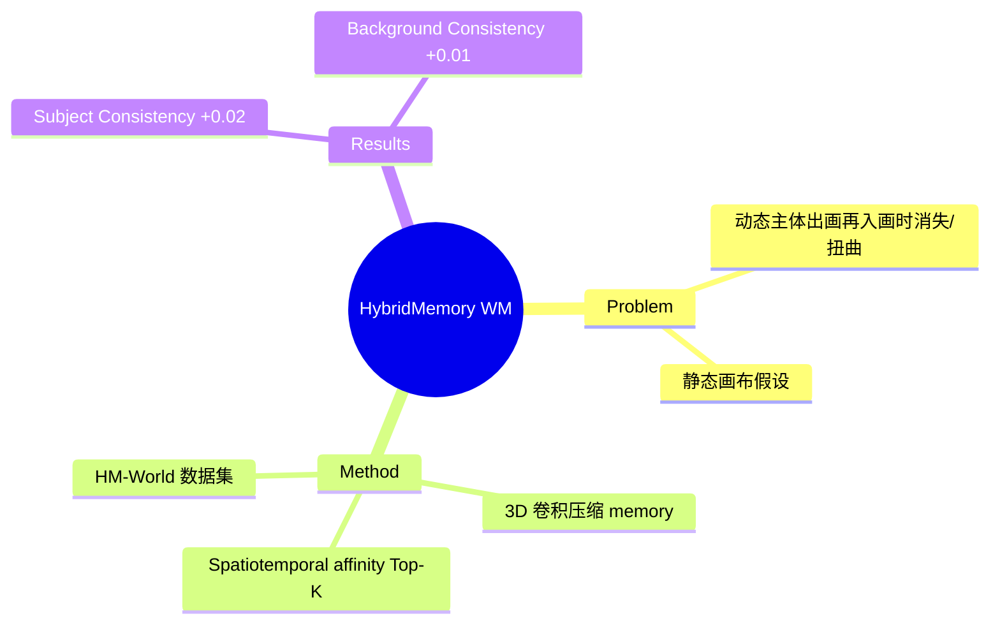

## Summary

现有 video world model 的 memory 机制把世界当静态画布，动态主体出画再入画时往往冻结、扭曲或消失。提出 Hybrid Memory 范式，要求模型同时记住静态背景 + 追踪动态主体的隐含轨迹。构建 HM-World 数据集（UE5 渲染的 59K 视频），提出 HyDRA 方法：用 3D 卷积把 memory latent 压缩成 token，再用 spatiotemporal affinity 做 Top-K 检索替代标准 self-attention。

## Problem & Motivation

现有 video world model 的 memory 机制存在问题：
- 把世界当静态画布
- 动态主体出画再入画时往往冻结、扭曲或消失
- 缺少对动态主体独立运动逻辑的记忆

## Method

**HyDRA 方法**：
1. 用 3D 卷积把 memory latent 压缩成 token
2. 用 spatiotemporal affinity 做 Top-K 检索替代标准 self-attention

**数据集**：
- HM-World：UE5 渲染的 59K 视频
- 专门设计 exit-entry 场景测试

## Key Results

- Subject Consistency: 0.903 → 0.926
- Background Consistency: 0.925 → 0.932
- 小数点后两位的边际提升

**Baseline**：Baseline（Wan2.1 + camera encoder）、DFoT、Context-as-Memory

## Strengths & Weaknesses

**亮点**：
- 问题提得不错：现有 memory 确实忽略动态主体的独立运动逻辑
- exit-entry 场景是合理的压力测试

**局限**：
- 整篇论文是在 UE5 沙盒里自导自演：数据集是自己渲染的、方法是只在自己数据上训的、评估也是在自己数据上评的
- Baseline 太弱
- 增益数字经不起细看

## Mind Map

## Notes

> [基于月度总结的点评，未获取全文]

实验闭环太封闭，离真实世界的复杂度差了至少两个数量级。