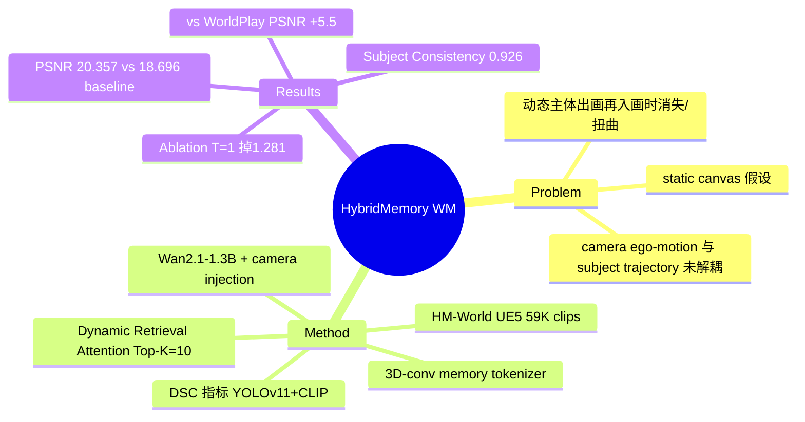

## Summary

现有 video world model 的 memory 机制把世界当"静态画布"，动态主体出画再入画时往往冻结、扭曲或消失。提出 Hybrid Memory 范式——模型需同时维持静态背景一致性 + 追踪动态主体在出画期间的隐含轨迹；构建 HM-World 数据集（UE5 渲染 59K clips，专门含 exit-entry 事件）并提出 HyDRA 方法：用 3D 卷积 memory tokenizer 压缩 memory latent，再用 spatiotemporal affinity 做 Top-K 检索注意力，恢复主体身份与运动。

## Problem & Motivation

当前 video world model 的 memory 机制（Vmem、Context-as-Memory、WorldMem、Memory Forcing）只擅长记忆**静止场景**，把环境当"static canvas"，在动态主体出画又入画的场景下崩坏，作者形象地称之为 "frozen statues, distorted phantoms, or vanishing subjects"。根本缺陷在于：

- 没有把 camera ego-motion 和 subject trajectory 做 spatiotemporal decoupling，无法对动态主体做 out-of-view extrapolation；
- 无法把动态 feature 从背景中分离出来单独记忆；
- 现有数据集没有专门为这种 hybrid consistency 问题设计的 exit-entry 评估场景。

问题本身是合理且被现有工作忽略的——动态主体在出画期间仍有自己的独立运动逻辑，模型应该"记住"它而非冻结它。

## Method

**Base 架构**：基于 Wan2.1-T2V-1.3B（causal 3D VAE + DiT + Flow Matching），使用 77 帧 context，经 3D VAE 做 4× 下采样。

**Camera Injection**：把 camera pose（旋转矩阵 R∈ℝ³ˣ³ + 平移 t∈ℝ³）展平为 c_cam∈ℝ^(f×12)，经 MLP 编码后空间广播，element-wise 加到 latent feature 上。

**Memory Tokenization**：3D-convolution-based memory tokenizer 把 memory latent Z_mem 压成紧凑 token M，kernel size 2×4×4（temporal×height×width），目的是捕获 long-duration motion information——时间维不能塌缩成 1（见 ablation）。

**Dynamic Retrieval Attention（核心）**：替代标准 self-attention。

1. 计算 query q_i 与 memory key 的 spatiotemporal affinity：S_{i,j} = (1/√d) Σ⟨q̃_i(x,y), k_mem,j(x,y)⟩；
2. Top-K 选出 10 个最相关 token；
3. 把检索到的 token 与 local 5-frame window 拼接，再做标准 attention：Softmax(q_i(K'_i)^T/√d)V'_i。

**HM-World 数据集**：UE5 渲染 59,225 clips，17 种风格化场景、49 个主体（人 + 动物）、10 条主体运动路径、28 条 camera 轨迹（刻意设计 back-and-forth 运动以诱发 exit-entry 事件）。标注含 video、caption、camera pose、逐帧主体位置、exit/entry 时间戳。

**新指标 DSC（Dynamic Subject Consistency）**：用 YOLOv11 检测框 + CLIP feature，在主体 re-entry 区域计算 spatially-averaged cosine similarity，专门衡量出画再入画后的主体一致性。

## Key Results

主结果（Table 2，对比 Baseline=Wan2.1+camera encoder、Context-as-Memory、DFoT）：

- HyDRA vs Baseline：PSNR 20.357 vs 18.696；SSIM 0.606 vs 0.517；LPIPS 0.289 vs 0.356；
- vs Context-as-Memory：PSNR 20.357 vs 18.921；vs DFoT：20.357 vs 17.693；
- DSC_GT：0.849（HyDRA）vs 0.839（Context-as-Memory）/ 0.826（DFoT）；
- Subject Consistency 0.926、Background Consistency 0.932。

对比 WorldPlay（Table 3）：PSNR 20.357 vs 14.855，SSIM 0.606 vs 0.355，DSC_GT 0.849 vs 0.832——差距较大。

Ablation：

- Memory tokenizer 时间维关键，T=1 导致 PSNR 掉 1.281；
- 检索 token 数 10 为最优（20.357），降到 5 则掉到 19.309；
- Dynamic affinity retrieval 优于 FOV overlap 检索（Subject Consistency 0.926 vs 0.908）；
- 空间 kernel 从 2×2 变到 8×8 时 PSNR 波动 <0.25，说明对空间核不敏感。

## Strengths & Weaknesses

**亮点**：

- 问题提得好——现有 memory 确实忽略动态主体的独立运动逻辑，exit-entry 是合理的压力测试；
- 方法上 spatiotemporal affinity + Top-K 检索 + memory tokenizer 是干净的设计，ablation（T=1 掉 1.281、token 数、affinity vs FOV）较有信息量；
- 对比 PSNR/SSIM 的提升（+1.6 PSNR over baseline）比早先基于月度总结的"小数点后两位"印象要实在，提升幅度其实是显著的；vs WorldPlay 差距更大。

**局限**：

- 整个实验闭环在 UE5 沙盒里自导自演：数据集自己渲染、方法只在自己数据上训、评估也只在自己数据上评，距真实世界复杂度差距大；
- 作者自己承认在 3+ 主体或严重 occlusion 的复杂场景下性能退化；
- Baseline 偏弱（Wan2.1+camera encoder），且都在 HM-World 上重训，缺乏跨数据集/真实视频的泛化验证；
- 新指标 DSC 依赖 YOLOv11+CLIP，本身有检测/特征误差，作为评判标准需谨慎。

潜在影响：把"动态主体记忆"从 static-scene memory 中独立出来是有价值的 problem formulation，但要从 UE5 沙盒走向 in-the-wild 还有至少两个数量级的距离。

## Mind Map

```mermaid
mindmap
  root((HybridMemory WM))
    Problem
      动态主体出画再入画时消失/扭曲
      static canvas 假设
      camera ego-motion 与 subject trajectory 未解耦
    Method
      Wan2.1-1.3B + camera injection
      3D-conv memory tokenizer
      Dynamic Retrieval Attention Top-K=10
      HM-World UE5 59K clips
      DSC 指标 YOLOv11+CLIP
    Results
      PSNR 20.357 vs 18.696 baseline
      Subject Consistency 0.926
      vs WorldPlay PSNR +5.5
      Ablation T=1 掉1.281
```

## Notes

- 问题 formulation 比方法更有价值：把 static-scene memory 与 dynamic-subject memory 分开，是对"world model memory"的合理细化。
- 完全合成 + 闭环自评是最大软肋，无法判断方法在真实视频上的泛化；下一步真正考验是跨数据集 zero-shot。
- 与 Context-as-Memory / WorldMem 一脉相承，可作为 video world model memory 机制演进的一个数据点对比阅读。
