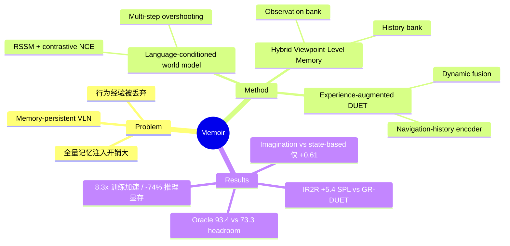

## Summary

Memoir 针对 memory-persistent VLN 中"记忆怎么取用"的问题，提出用 language-conditioned world model 想象未来导航状态作为 query，从 viewpoint 级混合记忆库中选择性检索环境观测与历史行为。在 IR2R unseen 上比最强 memory-persistent baseline GR-DUET 提升 5.4% SPL（73.3 vs 67.9），同时带来 8.3x 训练加速与 74% 推理显存下降。

## Problem & Motivation

传统 VLN 每个 episode 独立、导航后记忆清零；memory-persistent VLN（IR2R、GSA-R2R）要求 agent 在同一环境的连续 episode（tour）中累积经验、越走越熟。现有方法的两个核心缺陷：

1. **缺乏有效的记忆访问机制**：要么把整个持久记忆图全量塞进模型（如 GR-DUET 的 global graph，随 tour 增长导致训练/推理开销爆炸），要么只做 fixed-horizon lookup，无法按需取用。
2. **只存环境观测、不存行为模式**：过往 episode 中"从哪里走到哪里、走通没走通"的决策轨迹蕴含策略信息，但主流方法只存 topological/visual 记忆，行为经验被丢弃。

作者的核心洞察：检索的本质是预测——要知道该取哪段记忆，先要预测自己将要经历什么。于是把 model-based RL 中的 imagination 从"直接规划动作"改用为"生成检索 query"，规避 world model 预测不准直接毁掉策略的风险。

## Method

三个组件，实现在 DUET / ScaleVLN / GR-DUET 三种底座上：

**1. Language-conditioned World Model（RSSM 变体）**
- Inference model `q(z_t|z_{t-1}, o_t, ℓ)` 把观测+指令编码为 latent state；transition model `p(z_t|z_{t-1})` 递推想象未来状态（Transformer 优于 GRU，+1.16 SPL）；compatibility model 用 cosine 相似度 + NCE 对比学习判断 state-observation 匹配；reward model 预测 distance-to-goal，用于决定想象何时终止。
- 训练目标为扩展 ELBO（reward + NCE + KL 三项），并加 **multi-step overshooting**（强制 d 步长程预测准确，d=2..D 加权平均），对长时域想象质量 +1.36 SPL。
- 关键设计：contrastive（判别式）而非重构式 world model——只需要判断"这个想象状态和哪个记忆最匹配"，不需要像素级生成。

**2. Hybrid Viewpoint-Level Memory (HVM)**
- 双库结构，都以 viewpoint 为锚点：**Observation bank** 存 DUET observation encoder 池化后的视点特征；**History bank** 存过往 episode 在该视点的 inferred states + 对应想象轨迹（同一视点多次访问分开记录）。
- **观测检索**：想象状态与存储特征算 compatibility，沿持久拓扑图做逐阶邻域搜索 + percentile 过滤，取 top-W 视点并把 shortest path 并入当前 episodic graph。
- **行为检索**：想象轨迹与历史轨迹做序列相似度匹配，按匹配长度排序取 top-P 条，把后续视点与状态子图并入。

**3. Experience-Augmented Navigation Model**
- 在 DUET 的 coarse（全局图）/ fine（局部全景）双尺度基础上新增 **navigation-history encoder**：检索到的历史状态按 compatibility softmax 加权注入视点表示（`u_j = softmax(C_j/ζ)ᵀ Z_j + x_j`）。
- 三分支分数经 learned dynamic fusion（FFN + softmax 权重）合并出动作分布。

训练：world model 与导航模型在 R2R + 增广轨迹上联合预训练 5k iter，再用 imitation learning 微调。

## Key Results

- **IR2R**（离散，unseen tour 平均 71.2 个 episode）：Memoir 77.6 SR / 73.3 SPL，vs GR-DUET 72.7 / 67.9（**+5.4 SPL**）；tour 级 t-nDTW 66.9 vs 54.8（**+12.1**）。Seen split +11.6 SPL。相比不带持久记忆的 DUET/ScaleVLN 底座分别 +11.1 / +5.6 SPL。
- **GSA-R2R**（150 个 HM3D 场景 x 600 路径，10 种场景/指令组合）：平均 +2.3 SR / +2.5 SPL over GR-DUET，全部场景一致占优但幅度明显小于 IR2R。
- **效率**：训练 0.53s/iter vs GR-DUET 4.39s（**8.3x**），训练显存 13.1 vs 29.4 GB；推理显存 2.6 vs 9.9 GB（**-74%**）；代价是推理延迟 0.31s vs 0.25s（+28%，来自想象过程）。
- **检索策略 ablation（IR2R SPL）**：全量记忆 69.98 < 随机检索 70.34 < instruction-based 72.82 ≈ state-based 72.85 < imagination-based 73.46。
- **Oracle 分析**：完美检索（直接注入通向目标的记忆）可达 **93.4 SPL**，当前 73.3，差 20 个点。
- **失败模式**（Fig. 8）：world model 只能按语义相似检索、分不清 "nearest to the desk" 这类空间关系；想象过早终止导致检索覆盖不到正确目标；检索失败时 agent 仍倾向 exploitation 而非探索。

## Strengths & Weaknesses

**Strengths**
- "imagination 作 query 而非直接规划"是一个干净的 reformulation：world model 预测不准时只是检索差一点，不会像 model-based planning 那样直接执行错误动作，容错性设计合理。
- 判别式（contrastive）world model 避开像素重构，是让 world model 在 VLN 里真正可用的务实选择。
- 效率提升是实打实的结构性收益：选择性检索把 GR-DUET 全量 global graph 的开销砍掉，8.3x 训练加速 + 74% 显存下降在 tour 越长时越显著。
- Ablation 和 oracle/failure 分析诚实：明确给出 20 点 headroom 和三类失败模式，没有掩盖。

**Weaknesses**
- **核心卖点的净增益偏小**：ablation 显示 imagination-based 检索（73.46）只比简单的 state-based 检索（72.85）高 0.61 SPL，比 instruction-based 高 0.64——"dream" 的故事性远大于它相对朴素 query 的实际增益；主要收益其实来自"选择性检索 + 行为记忆"这个框架本身（vs 全量 69.98）。
- 全量记忆（69.98）甚至低于随机检索（70.34），说明 GR-DUET 式全量注入本身就是负优化，baseline 的 memory access 太弱，衬托了改进幅度。
- GSA-R2R 上只有 +2.5 SPL，方法收益对 benchmark 结构（tour 长度、episode 重叠度）敏感；IR2R 的大幅提升部分依赖其超长 tour 设定。
- 仍是 discrete graph-based（MP3D viewpoint 图）设定，连续环境只有 IR2R-CE，向真实机器人（连续控制、里程计噪声、无先验拓扑）的迁移未验证。
- 空间关系检索失败（分不清语义相似的两个 bedroom）说明该 world model 本质仍在做语义匹配，"想象"的空间推理成分有限。

**影响**：对 memory-persistent / lifelong navigation 方向是一个值得跟的框架级贡献（检索式记忆访问 + 行为记忆），也为 "world model as retrieval query generator" 提供了可迁移到 GUI/web agent 记忆系统的范式；但 imagination 本身的边际收益需要更强 world model 才能兑现（oracle 差 20 点）。

## Mind Map

## Notes

- 与 [[2411-WebDreamer]]（LLM 想象网页做 planning）对照：Memoir 把想象用于 retrieval 而非 planning，对 world model 精度要求更低——这个"降级使用"可能是 world model 落地 agent 的普遍模式。
- 行为记忆（存 state + 轨迹而非只存观测）与 GUI agent 的 experience replay/skill memory 有直接映射，可关注是否有人把这套 imagination-as-query 搬到 computer-use 场景。
