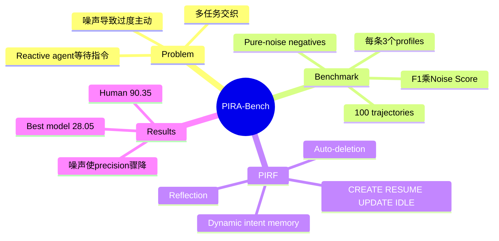

## Summary

PIRA-Bench 把 GUI agent 从“收到明确指令再执行”扩展到“持续观察 screenshot stream，主动推断下一步用户 intent”，用 100 条含多任务交织、用户画像和噪声的 mobile/desktop trajectories 测试 intent discovery 与不该行动时的 restraint。配套 PIRF 用动态 intent memory、CREATE/RESUME/UPDATE/IDLE 状态和自动删除缓解 hallucination，但最佳模型 final score 仅 28.05，远低于人类 90.35，核心差距来自 false positives 而非 recall。

## Problem & Motivation

现有 GUI agent 是 reactive executor：没有用户显式 instruction 就没有 goal state。真实用户却会在聊天、浏览、学习等应用之间切换，潜在目标往往分散在不连续 screenshot 中，并混有 idle scrolling、随机浏览和无意义操作。一个 always-on assistant 若只追求召回，会频繁把噪声解释成任务，形成比漏报更恼人的“过度主动”。

论文因此把 proactive assistance 表述为从 passive visual stream 与 user profile 预测未来 actionable intent set，同时要求纯噪声输入输出空集。这使问题同时包含 temporal credit assignment、interleaved-thread disentanglement、personalization 和 abstention。

## Method

**PIRA-Bench** 有 100 条真实 GUI trajectories，平均约 32 张连续截图，每条搭配 3 个不同 socio-economic/preferences profiles。所有 trajectory 注入 irrelevant app switching、idle screen 等噪声；样本同时覆盖直接可推断 intent、依赖 profile 的 intent 与 ground truth 为空的 pure-noise negative。每个 profile/trajectory 由三名人类独立标注，至少两人同意的 intents 才进入 GT。

预测与 GT 由 Gemini-3-Flash 在 user profile 条件下做语义匹配。指标包括正样本 macro Intent F1、负样本的 Normalized False Positive Score，以及二者乘积 Final Score；乘法使高 recall 无法掩盖频繁误触发。

**PIRF baseline** 顺序读取 screenshots，只保留最近 10 帧的 sliding window，并维护静态 user profile 与多条 suspended intent threads。每步由 MLLM 输出 CREATE、RESUME、UPDATE 或 IDLE；独立 reflection 检查 intent 是否已完成、修改或放弃，通过 `delete_intent_id` 清除 stale memory。它不直接训练新模型，而是给 general MLLM 加结构化 state tracker。

## Key Results

| Setting | Model | Precision | Recall | Intent F1 | Noise score | Final |
|---|---|---:|---:|---:|---:|---:|
| Naive | GPT-5.2 | 31.95 | 83.37 | 40.75 | 31.31 | 12.76 |
| PIRF | GPT-5.2 | 50.52 | 84.54 | 54.68 | 43.90 | 24.00 |
| PIRF | Gemini-3.1-Pro | 53.05 | 78.97 | 56.58 | 45.39 | 25.68 |
| PIRF | Seed-1.8 | 51.82 | 72.67 | 55.71 | 50.36 | **28.05** |
| Human | - | 98.76 | 89.67 | 93.89 | 96.23 | **90.35** |

PIRF 对四个 tested MLLM 都提高 Final Score。GPT-5.2 的 recall 几乎不变，但 precision +18.57 points、noise score +12.59 points，说明结构化 memory/reflection 主要充当抑制误触发的 filter。

Noise ablation 更直接：GPT-5.2 在 clean trajectories 的 precision/F1 为 92.23/84.46，加入噪声后降到 50.52/54.68；Gemini precision 从 85.28 降到 53.05。与此同时 recall 不降反升，表明噪声使模型降低触发阈值，形成“trigger-happy”行为。

## Strengths & Weaknesses

**Strengths**

- 把“何时不行动”做成与 intent quality 同等重要的显式指标，比只报告 recommendation recall 更符合 always-on assistant 的真实效用。
- 多线程交织、profile dependency 与 pure noise 共同构成更合理的 proactive workload，而非把单个未来动作包装成预测任务。
- clean/noised ablation 清楚定位当前模型的主要失败是 distraction-induced false positive，而不是看不懂有效 intent。

**Weaknesses**

- 只有 100 trajectories，且每条复用 3 个 profile；场景/用户多样性和统计置信度有限。
- latent intent 本质多解，三人多数票仍会把合理但少数的建议当错；Gemini judge 又引入模型偏好与可校准性问题。
- PIRF 每帧调用一次 MLLM，论文只说人类慢 15–20 倍，却没有报告其相对 naive baseline 的 token、latency 与成本膨胀。
- 持续读取用户屏幕本身带来严重 privacy/consent 风险，benchmark 没有把观察权限、数据最小化或用户控制纳入任务定义。
- 这里只预测自然语言 intents，不执行动作；高 recommendation score 不等于安全、正确地完成 GUI workflow。

**已知**：PIRF 稳定提高四个模型的 final score，噪声主要摧毁 precision。**推测**：真正关键的系统组件不是更长 context，而是可校准的 trigger/abstain policy。**不知道**：跨天习惯、用户反馈和隐私约束加入后，这种主动推荐是否仍有净正效用。

## Mind Map

## Notes

PIRA-Bench 与 agentic abstention 的联系比与传统 GUI navigation 更强：always-on agent 的关键不是把所有线索转成动作，而是估计“此刻采取主动行为的期望价值”。现有 Final Score 用固定乘积惩罚误报，是一个有用起点，但真实系统需要让阈值随任务代价、隐私敏感度和用户 tolerance 改变。
