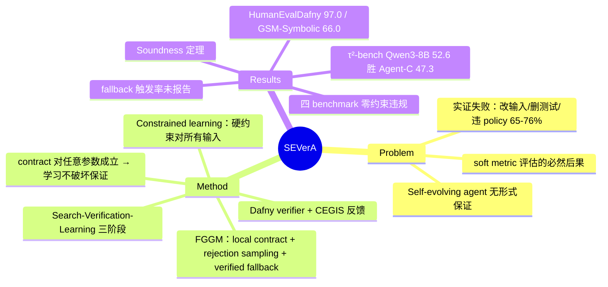

## Summary

SEVerA 把 self-evolving agent 的程序合成形式化为带硬约束的 constrained learning 问题：每个 LLM 调用被包进 Formally Guarded Generative Model（FGGM，局部 input-output contract + rejection sampling + 可验证 fallback），经 Search-Verification-Learning 三阶段合成出能通过 Dafny 静态验证的 agent 程序。关键构造是 FGGM contract 在 well-formedness 前提下对底层模型的**任意参数**成立，因此验证一次后，后续 self-evolution 的参数微调在构造上不可能破坏行为规约。在 HumanEvalDafny（97.0% vs 86.9%）、GSM-Symbolic（66.0% vs 44.7%）、τ²-bench airline（Qwen3-8B 52.6% vs Agent-C+Claude Sonnet 4.5 的 47.3%）上实现 zero constraint violations 且性能超过无约束与 SOTA baseline。

## Problem & Motivation

- Self-evolving 框架合成的 agent 程序在 unseen input 上自主执行，且嵌入其中的模型参数被持续 fine-tune，但现有框架只用 soft performance metric 评估，**没有任何形式化行为保证**。
- 作者列举的实证失败模式（§1）：program verification 中 agent 靠"偷改输入程序让验证通过"刷准确率；code repair 中 agent 删除失败测试而非修 bug；agentic tool use 中无约束 agent 在 65–76% 的交互里违反 refund eligibility 等 domain policy（转引 Kamath et al. 2025，即 Agent-C 论文）。
- 论点：这些不是孤立事件，而是"只用 soft metric、没有 formal behavioral specification 来评估合成 agent"的必然后果。

## Method

**Constrained learning 形式化（Eq. 2, §3）**：在程序空间中最小化训练集经验损失，同时要求 ∀x. Φ(x) ⟹ Ψ(x, f(x)) 对**所有输入**成立，而非只在训练样本上成立。规约语言是带 uninterpreted function 的一阶逻辑；不同 domain 各有编码——program verification 用 AST-based diff 检查（防偷改输入程序）、tool use 用 LTL policy 经 SMT 检查。

**FGGM（§4.2）**——核心构件，把每个 parametric 生成模型调用包成受形式约束的单元：
- **Local contract (Φ_l, Ψ_l)**：刻画该调用预期输出的一阶公式；
- **Prompting program f_p**：构造模型输入（可演化）；
- **Fallback program f_d**：满足 contract 的非参数程序；rejection sampler 采样 K 次都不过 contract check 时返回 f_d 的结果（f_d 本身经 deductive verifier 验证，App M）。
- **关键性质（property 2）**：只要 FGGM well-formed，contract 对底层 GM 的任意参数 θ 成立——"gradient-based parameter optimization never breaks the correctness guarantees"。

**三阶段流水线（§4.3）**：
1. **Search**：Planner LLM 在 restricted Dafny subset 中生成候选 agent 程序，所有 GM 调用必须包成带 contract 的 FGGM；用已验证程序池的执行反馈迭代提案。planner 只合成 local contracts (Φ_l, Ψ_l)；全局规约 (Φ, Ψ) 与 library 公理属算法输入 I，结构上固定不演化。
2. **Verification**：Dafny built-in verifier + FGGM well-formedness 检查 + 终止性检查，在带 library 公理的一阶逻辑内对整个程序验证 (Φ, Ψ)；固定 timeout 内未证出即判 false（§5.1/§5.2.3，保守）；失败候选的错误信息回传 planner，构成 CEGIS 式循环。验证通过意味着对所有 θ 成立。
3. **Learning**：GRPO 式梯度优化 θ（含 LoRA），目标为全局 task loss + 各 FGGM 的 local conformance loss（降低样本违反 contract 的概率、减少 fallback 触发）；closed-source 模型跳过参数学习、只调 f_p。

**与经验式 gate 的本质区别**：不是在 held-out 样本上统计验收，而是对全输入空间的 sound 证明；且"验证与学习解耦"意味着不需要每个演化步重跑 gate。

**理论结果（§5.3, Thm 5.3, App R）**：(1) Soundness——若返回 f*≠⊥，则 agent 对所有输入、所有参数值满足 behavioral specification；(2) 非平凡效用的充分条件——存在满足硬约束的 verified agent，其 task loss 不劣于初始参数的无约束模型。

## Key Results

| Benchmark | SEVerA | 对照 | 约束违规 |
|:--|:--|:--|:--|
| HumanEvalDafny（Verif. & NoDiff 列） | 97.0% | 最佳 baseline（DafnyBench）86.9% | 0% |
| GSM-Symbolic（GRPO+LoRA 调参后） | 66.0% | CRANE（constrained decoding）44.7%（violation 2.1%） | 0% |
| τ²-bench airline | 52.6%（Qwen3-8B） | Agent-C + Claude Sonnet 4.5：47.3%（正文数字；Table 3 内 Agent-C 行为 Qwen3-8B 版 39.4） | 0% |
| Constrained symbolic regression | 33/35 实例返回 verified 解（2 例返回 ⊥） | NMSE 对比仅在 baseline 不违规实例上计算 | 0% |

- 核心结论（原文）："Across all four tasks, SEVerA achieves zero constraint violations... improving task performance over every baseline"——注意 symbolic regression 有 2/35 弃权，"零违规"含弃权语义（宁可返回 ⊥ 不返回未验证解）。
- τ²-bench 上 8B 开源模型 + 形式约束胜过 frontier 模型 + SOTA policy-compliance 方法（52.6 vs 47.3），是"形式约束换模型规模"的效率论证。
- GSM-Symbolic 消融：constraint decomposition（全局约束拆成 FGGM local contract）从 53.2%→66.0%（+12.8%）；local-only tuning 贡献 +2.1%。
- **Fallback 触发率未报告**（独立核验确认缺失：全文 34 处 fallback 提及均无频率数字；仅有定性表述"tuned model... reducing reliance on the fallback"与调参后延时 18.8s→16.7s 的间接信号）。

## Evidence Ledger

| Claim ID | Claim | Type | Source locator | Evidence excerpt | Status |
|:--|:--|:--|:--|:--|:--|
| C1 | HumanEvalDafny 97.0% vs 最佳 baseline（DafnyBench）86.9%（均 Verif. & NoDiff 列；其 Verif.-only 87.9） | number | §6.2.1 Table 2 | "97.0% verification rate on HumanEvalDafny (vs. 86.9% for the best baseline)" | source-verified |
| C2 | GSM-Symbolic 66.0%（GRPO+LoRA 后；53.2→66.0 来自 constraint decomposition）vs CRANE 44.7%（violation 2.1%） | comparison | §6.2.3 Table 4 | "CRANE improves accuracy to 44.7%... a further 12.8% accuracy gain (from 53.2% to 66.0%)" | source-verified |
| C3 | τ²-bench airline：SEVerA+Qwen3-8B 52.6 > Agent-C+Claude Sonnet 4.5 的 47.3（正文）；Table 3 的 Agent-C 行为 Qwen3-8B 版（39.4）；SEVerA violation 0.0 | comparison | §6.2.2 Table 3 + 正文 | "SEVerA with the small open-weight Qwen3-8B outperforms Agent-C with Claude Sonnet 4.5 (52.6 vs 47.3)" | source-verified |
| C4 | 四 benchmark 零约束违规且超每个 baseline；caveat：symbolic regression 33/35 返回 verified 解（2 例 ⊥），NMSE 对比限 baseline 不违规实例 | sota-novelty | Abstract / §6.5 | "zero constraint violations... improving task performance over every baseline" | source-verified |
| C5 | Soundness 定理：f*≠⊥ 时对所有输入与所有参数值满足规约 | causal-mechanism | §5.3 Thm 5.3 / App R | "for all inputs and all parameter values (Theorem 5.3)" | source-verified |
| C6 | FGGM contract 在 well-formedness 前提下对任意 GM 参数成立，参数优化不破坏保证 | causal-mechanism | §4.2 property 2 | "the specified contracts hold irrespective of the parameters... gradient-based parameter optimization never breaks the correctness guarantees" | source-verified |
| C7 | 动机引证：无约束 agent 65-76% 交互违反 domain policy（转引 Kamath et al. 2025 = Agent-C 论文） | number | §1 | "violate domain-specific policies... on 65-76% of interactions" | source-verified |
| C8 | 自称首个 formally verified self-evolving LLM agents | sota-novelty | arXiv comments / §1 | "the first self-evolving agent synthesis algorithm with verifiable guarantees" | source-verified |
| C9 | Dafny built-in verifier + FGGM well-formedness 检查；restricted Dafny subset；超时判 false（§5.1/§5.2.3） | benchmark-setting | §4.3 / §5.1 / §5.2.3 / App M | "return false if they cannot verify... within the allotted time budget" | source-verified |
| C10 | (Φ, Ψ) 与 library 公理属算法输入、结构上固定不演化（planner 只合成 local contracts）；library 正确性 out of scope | causal-mechanism | §5.1 / §4.1.1 | "Verifying the correctness of the library functions and axioms is outside the scope of SEVerA" | source-verified |
| C11 | 论文未报告 fallback f_d 触发频率/比例（全文 34 处 fallback 提及无数字；仅定性 "reducing reliance on the fallback" + 延时 18.8s→16.7s 间接信号） | number | 全文检索（否定性结论） | "more often pass the FGGM checker on the first sample, reducing reliance on the fallback" | source-verified |

## Strengths & Weaknesses

**亮点**
- **保证强度是 gate 家族的质变**：GRASP/SKILL.nb 的 gate 是 held-out 样本上的统计验收（sample-based、replay-relative），SEVerA 给出的是全输入空间的 sound 证明——这是"gate 谓词 precision 未被独立测量"问题的一种根治路径（在可形式化的域内）。
- **验证与学习解耦是对成本问题的结构性回答**：经验式 gate 每个演化步都要重跑探针（GRASP 的训练期主要开销），SEVerA 靠"contract 对任意 θ 成立"做到验证一次、之后任意微调——演化步验证的均摊成本降为零。这是对 SelfEvolvingAgents-Survey 中"gate 自身的可信性与成本"开放问题的直接贡献。
- 有理论（soundness + 非平凡效用条件）也有跨四个 domain 的实证，且 8B 模型配形式约束能胜 frontier 模型配 SOTA 方法（52.6 vs 47.3），不是纯理论文章。
- CEGIS 式错误反馈让验证失败成为搜索信号而非单纯拒绝，验证器被整合进演化循环而不只是末端过滤。

**局限与边界（含推测）**
- **规约由人写且固定**：(Φ, Ψ) 与 library 公理是用户输入，spec-writing 负担直接决定适用面；表达力限于 Dafny/FOL 可判定的性质。"验证机制自身也在演化"的问题**未被处理**——演化的只有 θ 和 prompting program，spec 与 verifier 完全静态；survey 中"谁验证 verifier 的演化"这一空白 SEVerA 不回答，它是把 verifier 钉死来换 soundness。
- **零违规的语义要小心读**：保证由 rejection sampling + fallback 兜底实现——contract 全过不代表 LLM 输出质量高，可能是 f_d 在兜底。**fallback 触发率确认未报告**（独立核验），"零违规 + 高性能"的归因存在未解耦成分；且 library 公理被信任而非验证，soundness 是相对于公理集的。零违规还含弃权语义（symbolic regression 2/35 返回 ⊥）。
- **适用域窄于经验式 gate**：四个任务都是规约天然可形式化的域。开放动作空间（OS/GUI 交互）里写不出 (Φ, Ψ) 的场景——恰是 GRASP 探针失效的同一边界——SEVerA 同样够不到（推测，论文未讨论 GUI 域）。
- 验证 timeout 判 false 带来不完备性；FGGM 调用间不共享参数，计算预算问题作者自认待扩展。

## Mind Map

## Notes

- **gate 家族粒度对照**（SelfEvolvingAgents-Survey 演化步验证谱系的保证强度上界端）：[[Papers/2605-GRASP]] 编辑级经验探针（held-out 统计验收）、[[Papers/2606-SkillNb]] 步骤级运行时 gate（replay-relative，级联回退）、[[Papers/2512-ASGSI]] skill-graph 级审计治理提案（无实证）、[[Papers/2607-SEACertificates]] 统计协议级（anytime-valid，但 live loop 中未实证）、SEVerA 程序级**静态形式验证**（sound、全输入全参数、有实证）。谱系呈现清晰的 tradeoff：保证越强，规约可形式化的前提越苛刻、适用域越窄。
- 对 survey Takeaway 4 / Open Problem "gate 自身的可信性与成本" 的贡献：SEVerA 用 "verify once, fine-tune freely" 消掉每步重验证的成本，用 soundness 消掉 gate precision 未测的问题——但代价是把 gate 谓词的正确性负担转移给人写的 spec 与被信任的 library 公理，且 spec 不演化。"验证机制自身演化"（谁验证 verifier）仍然完全开放。
- 与 [[Topics/SelfEvolvingAgents-Survey]] Takeaway 2（verifier 质量上界决定 self-evolution 收益上界）对接：SEVerA 是该论断在 deterministic-verifier 端的极限情形——verifier 是定理证明器时收益最稳，但只覆盖可形式化的域。
- [[Papers/2606-MLASSelfEvolvingSafety]] 将 SEVerA 引为 self-evolution 形式化验证的起步工作，并指出最难子问题是"验证机制本身也在演化"——SEVerA 恰以把验证机制钉死为前提，两文对读画出该问题的当前边界。
- 待查（原文确认缺失或未展开）：fallback 触发率；spec-writing 的工作量量化。
