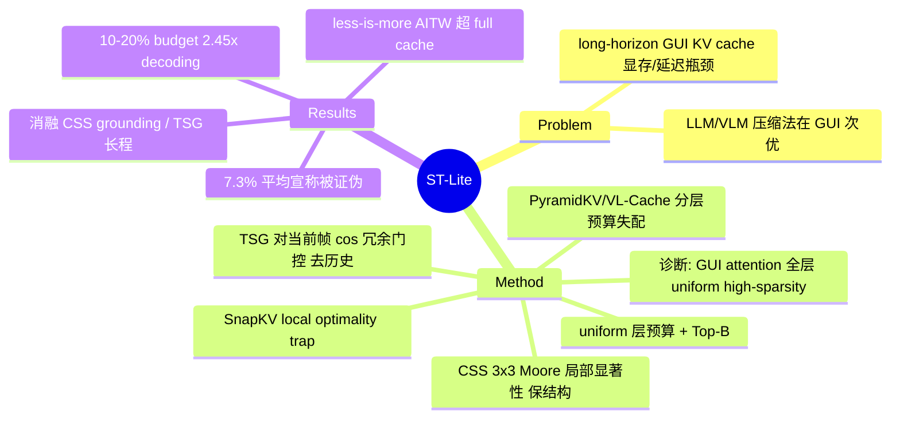

## Summary

ST-Lite 是一个 training-free 的 KV cache 压缩框架，针对 long-horizon GUI agent 的显存/延迟瓶颈：它先诊断出 GUI attention 在所有 transformer 层呈 uniform high-sparsity（导致 PyramidKV/VL-Cache 的分层预算假设失效），再用 Component-centric Spatial Saliency（CSS，保结构）+ Trajectory-aware Semantic Gating（TSG，去历史冗余）双分支打分，在 10-20% cache budget 下把 decoding 加速 2.45×，同时维持甚至略超 full-cache 精度。

## Problem & Motivation

GUI agent 用 VLM 处理高分辨率截图 + 长交互轨迹，KV cache 随序列线性增长，造成 GPU 显存饱和与推理延迟，限制在消费级硬件上的实时部署。已有的 training-free KV 压缩（LLM 的 SnapKV/PyramidKV、VLM 的 VL-Cache）在 GUI 场景表现次优。作者的核心论点是存在一个 **fundamental misalignment**：一般视觉任务的 attention sparsity 逐层变化（金字塔式），而 GUI 截图因"功能元素稀疏地分布在均匀背景上"，其 attention 在**所有层都呈均匀高稀疏**——这与分层预算分配的前提相冲突。

## Method

**诊断（§3.3，两种失败模式）**

- **Local Optimality Trap（SnapKV 等 window-based）**：因位置编码的 recency bias，当前 query 给近邻的原始分数比给远端关键 token `i*` 高，形成语义 gap Δ>0；Softmax 指数放大该 gap，使 `Attn(q,i*) ≤ 1/(1+e^Δ) → 0`，远端全局锚点被永久驱逐。
- **Hierarchical Allocation 不兼容（PyramidKV/VL-Cache）**：GUI 满足 `|∇_l S^(l)| < ε`（层间稀疏度差异可忽略，Figure 3 在 AITW / AgentNetBench 上验证）。分层方法按 `B^(l)=Norm(ΣAttn^(l))·B_total` 分配预算，当层间差异趋近 0 时，normalization 会放大随机数值噪声，产生**混乱的预算分布**。结论：应对 GUI 用 **uniform 层预算** + 显式挖掘 spatio-trajectory 依赖。

**ST-Lite 两个组件**

- **CSS（Component-centric Spatial Saliency）**：在 3×3 Moore Neighborhood（中心 + 8 邻居）上算 Local Uniformity Score `H_{u,v}=(1/8)Σ cos(h_{u,v},h_{p,q})`；空间显著性 `Φ_space=1−H`。高 H = 均匀背景（低价值），低 H = 语义边界（buttons/icons）。零超参、无训练。
- **TSG（Trajectory-aware Semantic Gating）**：每个历史 token 的冗余度 `ρ_i = max_{h_j∈H_cur} cos(h_i,h_j)`（与当前帧的最大相似度）；把 ρ 升序排序，取第 B 位作动态阈值 `τ_red=ρ̂_B`，硬门 `M_time∈{0,1}`，`ρ_i>τ_red` 即驱逐，保留 B 个最不冗余的历史 token，缓解 Context Poisoning。
- **Integrated policy（Eq.12）**：text token 用 base attention prior `A_base`；visual token 用 `M_time·(A_base+Φ_space)`；最后 Top-B 选择。压缩发生在 prefill 之后（post-prefill），故 prefill 几乎零开销。

Backbone 与设置：两个 training-free 部署的 backbone——UI-TARS-1.5-7B（Qwen2.5-VL，SFT+RLHF）与 OpenCUA-7B（Qwen2-VL，纯 SFT）；7 个 benchmark（主：ScreenSpot Pro / AITW / AgentNetBench；附：ScreenSpotV2 / AndroidControl / Multimodal-Mind2Web / OSWorld-Verified）。

## Key Results

- **极端预算下的鲁棒性**（Table 4，UI-TARS）：ScreenSpot Pro 上 ST-Lite 在 1% 预算 = 7.3，而 VL-Cache=1.1、PyramidKV=4.8（分层方法灾难性衰减）；ST-Lite 在 80% 预算 = 43.4 甚至超过 full cache 42.3。
- **Less-is-more（压缩历史 > 全历史）**：AITW 上 ST-Lite@20% = 20.1（Table 4）/ 20.7（Table 1）> full cache 18.2/18.7；@10% = 18.4 > full 18.2。作者归因于 TSG 过滤掉"视觉重复但语义冗余"的 stale 历史，抑制 Context Poisoning。
- **效率**（Table 2/3，AgentNetBench >15 帧样本）：decoding 加速 1.25×/1.68×/2.45×（3/5/10 帧），end-to-end 1.15×/1.33×/1.40×，prefill ≈0.98–0.99×（近零开销）。
- **消融**（Table 1，20% 预算）：CSS-only 在 ScreenSpot Pro grounding 最强（40.2）；TSG-only 在长程任务最强（AgentNetBench 19.5 > CSS-only 18.7）；full ST-Lite 全面最优（40.2 / 20.7 / 20.5）。
- **跨模型**：UI-TARS（含 RLHF）比 OpenCUA（纯 SFT）对激进压缩容忍度显著更高；作者推测 RLHF 隐式正则化出更稀疏、更抗驱逐的表示。
- **⚠️ 被证伪的宣称**：Intro 的"across all benchmarks 平均超 baseline 7.3%"经核查**并非平均值**——7.3 恰是 Table 4 中 AgentNetBench+OpenCUA 单个 Δ cell（最大的一格）；全部 Δ 的真实均值仅约 2.2–2.4%。见 Evidence Ledger C3。

## Evidence Ledger

| Claim ID | Claim | Type | Source locator | Evidence excerpt | Status |
|:--|:--|:--|:--|:--|:--|
| C1 | 10-20% cache budget 下 2.45× decoding 加速，性能可比/略超 full-cache | number | Abstract；Table 2/3（10 帧行） | "with only a 10-20% cache budget, ST-Lite achieves 2.45× decoding acceleration...comparable or even superior" | source-verified |
| C2 | AITW@20%（UI-TARS）ST-Lite 20.7% > Full Cache 18.7%（less-is-more） | comparison | §5.2 + Table 1 | Table1: ST-Lite 20.7 vs Full 18.7 | source-verified（但 Table 4 记为 20.1 vs 18.2，见 C-note） |
| C3 | "outperforms baselines by an average of 7.3% across all benchmarks" | number | §1 Intro vs Table 4 Δ 列 | +7.3 仅出现在 AgentNetBench+OpenCUA 一格 | contradicted（非平均；真实均值≈2.2–2.4%） |
| C4 | GUI attention 全层 uniform high-sparsity → 与 PyramidKV/VL-Cache 分层预算假设冲突，低预算下崩溃 | causal-mechanism | §3.3 + Fig.3 + Table 4 低预算列 | "uniform high-sparsity across all transformer layers...contradicts...VL-Cache" | source-verified |
| C5 | training-free；7 benchmark，2 backbone（UI-TARS-1.5-7B=Qwen2.5-VL SFT+RLHF；OpenCUA-7B=Qwen2-VL 纯SFT） | benchmark-setting | §5.1 + Appendix A/B | "seven representative GUI benchmarks...UI-TARS...SFT combined with RLHF; OpenCUA...exclusively via SFT" | source-verified |
| C6 | prefill≈0.98–0.99×；decoding 1.25/1.68/2.45×（3/5/10帧）；e2e 至多 1.40× | number | Table 2/Table 3 | Prefill 0.98/0.99/0.99, Decoding 1.25/1.68/2.45, E2E 1.15/1.33/1.40 | source-verified |
| C7 | 消融@20%：CSS-only 强于 grounding，TSG-only 强于长程（AgentNet 19.5>18.7），full 最优 | ablation | Table 1 + §5.3 | "TSG alone (19.5%) outperforms the CSS-only variant" | source-verified |
| C8 | training-free：CSS=1−3×3 Moore 邻域平均 cos；TSG=对当前帧 max cos + budget 阈值硬门 | mechanism | §4.1–4.3 + Algorithm 1 | "Moore Neighborhood...3×3 kernel"；"ρ=max cos...hard gate M∈{0,1} at τ_red=ρ̂_B" | source-verified |

**C-note（跨表不一致，独立 verifier 发现）**：Table 1（消融）与 Table 4（全量）在"20% 预算"下对不齐——Table 1 的 SnapKV AITW=8.0、CSS-only=14.1 更像 Table 4 的**低预算列**，而非其 20% 列（SnapKV 15.3、CSS-only 17.4）；§5.2 相邻两段对 AITW full-cache 分别用了 18.7 与 18.2。less-is-more 的定性结论在两表都成立，但精确数字（20.7/18.7）只见于 Table 1/§5.2，疑似 Table 1 标注错位或评测协议不清。

## Strengths & Weaknesses

**Strengths**
- **诊断洞察是真贡献**：GUI attention 全层均匀高稀疏 → 分层 KV 预算（PyramidKV/VL-Cache）用错了先验。这是干净的"why it breaks"分析，有 Figure 3 + Table 4 的崩溃曲线支撑，且可迁移到未来 GUI-specific token/KV 压缩，价值超出本文方法本身。
- **CSS 简单、零超参、可扩展**（3×3 Moore + cosine），契合 simple/scalable 取向；不引入训练。
- **less-is-more 现象有意义**：在长程任务上"压缩历史 > 全历史"，为"stale 视觉历史会污染 context"提供了直接证据。

**Weaknesses（批判）**
- **Honesty red flag**：Intro 把单格最优 Δ（AgentNetBench+OpenCUA=+7.3）包装成"跨所有 benchmark 平均 7.3%"，实际均值仅 ~2.2–2.4%。这是典型的 cherry-pick 表述。
- **内部数字不自洽**：Table 1 与 Table 4 在 20% 预算下无法对齐（见 C-note），削弱了对精确增益的可信度。
- **增益在噪声量级**：AITW 全部方法 success rate 都极低（~18–20%），"超过 full cache"的幅度（18.2→18.4、→20.1）落在很小区间，且全文无方差/置信区间，"beat full cache"可能在 run-to-run 噪声内。
- **效率提升有限且样本受限**：仅在 AgentNetBench >15 帧样本上测；prefill/vision-encoder 主导，end-to-end 仅 1.4×。
- **方法本质是启发式组合**：spatial saliency 启发式 + 冗余门控启发式的拼接；"cosine 局部均匀度 = UI 边界"等机制断言主要靠 qualitative heatmap，缺乏因果验证。TSG 以 hidden-state cosine 相似度作"stale"判据，可能误删"视觉相似但语义不冗余"的历史。

**潜在影响**：durable 的是诊断（uniform sparsity），可能指导后续 GUI-specific 压缩；方法本身是一个合格的 training-free baseline，但作为"important vs publishable"更偏 publishable。

## Mind Map

## Notes

- 与 thesis（"action 必须可追溯到某个 belief source—pixels/structure/memory/prior—并留下可验证的 state change；hybrid observation 会放大 stale evidence"）的关系：ST-Lite 为 thesis 的**后半句**提供经验支撑——TSG 显式剪掉视觉重复的 stale 历史 KV 以对抗 Context Poisoning，less-is-more 说明保留 stale 视觉证据会拉低 action 精度；但它只是 memory 上的 similarity 启发式，并不把每个 action 绑定到可验证的 belief source，也不涉及可验证的 state change。属于"stale 证据放大"这一轴的旁证，与"verifiable state change"一轴正交。
- 相关笔记（GUI/VLM 推理效率）：Papers/2500-GuiKvEfficientGui.md、Papers/2604-AgenticCache.md、Papers/2603-SecagentEfficientMobileGui.md，可做 KV/token 压缩路线的横向对比。
- 待查：Figure 3 的稀疏度定义与统计口径（哪个 metric、多少样本）；Table 1/Table 4 的评测子集是否一致（解释 C-note 的错位）。
