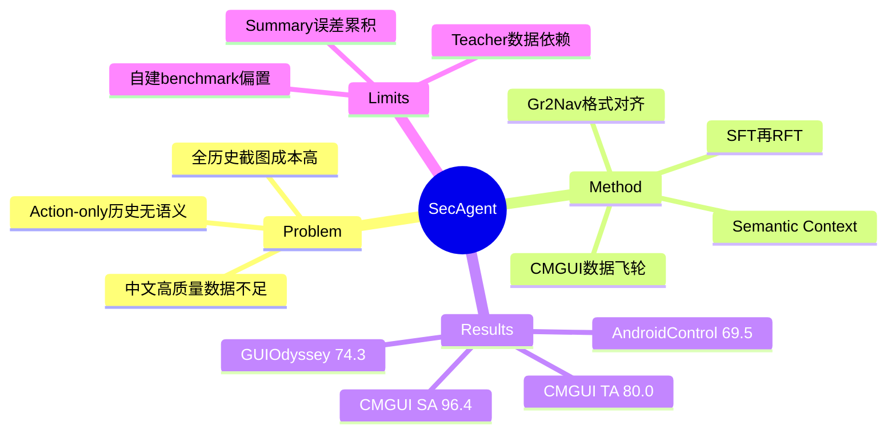

## Summary

SecAgent 是一个 Qwen2.5-VL-3B mobile GUI agent，用持续更新的自然语言 semantic context 压缩历史截图与动作，只保留一帧历史就兼顾长程信息和推理效率。论文同时发布中文 CMGUI 数据集（18K grounding、121,265 个已标注 navigation steps、44 apps）与 multi-choice CMGUI-Bench；SecAgent 在该 benchmark 达 96.4% Step Accuracy / 80.0% Task Accuracy，并在 AndroidControl、GUIOdyssey 达 69.5% / 74.3%。

## Problem & Motivation

移动 GUI agent 面临两个实际缺口：高质量非英语 trajectory 稀缺，以及历史表示成本高。只看最近若干步会丢失早期任务状态，只保留参数化 action 又缺少语义；把所有历史 screenshot 放进 MLLM 则让 vision tokens、TTFT 与训练成本随 trajectory 增长。

作者的假设是：历史真正需要保留的是“之前完成了什么、输入了什么、观察到什么结果”，而不是完整像素序列。若模型能把这些事件递归写成自然语言状态，就可以用语言预训练知识处理 history，并把视觉上下文压到当前帧加一帧历史。

## Method

**CMGUI data**：grounding 数据来自 random walk UI elements，由 MLLM 生成指令并人工核验；navigation 用 human-agent hybrid 收集，人工标 action correctness 与 bounding box，再由 GPT-4o 补 semantic context 和 thought。数据 flywheel 每轮用累计数据重训辅助 agent；首个错误动作之后的步骤全部丢弃。最终 29,711 trajectories 中有 121,265 个已标注 steps，覆盖 44 个中国常用 apps。

**CMGUI-Bench**：390 个成功 episodes、2,574 steps、平均长度 6.6。作者用 program-distance 去近重复，并为 click/type/swipe/terminate 标注多个合法 action，避免单一 canonical trajectory 错罚等价路径。

**Semantic Context Mechanism**：每步输入 instruction、当前 screenshot、上一 semantic context，以及仅一帧历史 screenshot/action；模型依次生成更新后的 semantic context、thought、action triplet。context 记录 clicked labels、typed inputs、search outcomes 等关键事件，以文本替代完整截图堆栈。

**Training**：先把 grounding bbox 转成 navigation-compatible center click，与 navigation 数据一起 LoRA SFT；再 full-parameter GRPO/RFT。reward 为 triplet 格式正确时 0.5，加上 action 正确时 1。base model 为 Qwen2.5-VL-3B。

## Key Results

- **CMGUI-Bench**：SecAgent-3B 的 Step Accuracy / Task Accuracy 为 96.4% / 80.0%，高于 Qwen3-VL-8B 的 91.1% / 59.7% 与 UI-Venus-Navi-7B 的 89.6% / 53.1%。click/type/swipe/terminate accuracy 分别为 96.1% / 99.1% / 87.6% / 99.2%。
- **English transfer**：AndroidControl Step Accuracy 69.5%，高于同规模 Qwen2.5-VL-3B 的 60.1%，但低于 UI-Venus-Navi-7B 的 76.1%；GUIOdyssey 为 74.3%，接近 AgentCPM-GUI-8B 的 79.2%，高于 UI-Venus-Navi-7B 的 71.1%。
- **History efficiency**：无历史 N=0 时 SA/TA 为 85.3/36.2；一帧历史 N=1 达 94.8/72.8，input tokens 2,239、TTFT 0.11s；五帧 N=5 仅增至 95.5/74.1，却需 3,642 tokens、TTFT 0.22s。N=1 去掉 semantic context 后降到 90.6/56.4，几乎没有效率收益。
- **Training ablation**：Navigation SFT 为 93.7/65.8；加入格式对齐后的 Gr2Nav 为 94.8/72.8；完整 SFT+RFT 达 96.4/80.0。直接在 base 上做 RFT 不收敛，需要至少 1K navigation steps 的轻量 SFT warm-up。

## Strengths & Weaknesses

**Strengths**

- 历史压缩设计简单且消融充分：N=1+semantic context 接近 N=5 的性能，却明显减少 tokens 和 TTFT。
- CMGUI-Bench 为多解 action 显式标注 alternatives，减少 GUI benchmark 常见的 false negative。
- 将 bbox grounding 先转成 navigation action 再混训，证明 action format alignment 是有效的数据复用手段。

**Weaknesses**

- semantic context 来自模型递归生成；一旦错误写入“已完成”或漏掉约束，之后步骤会持续受污染。论文没有单独评估 context factuality 或 error propagation。
- CMGUI 的 semantic context/thought 用 GPT-4o 标注，可能把强 teacher 的风格与知识蒸馏进模型；数据质量和方法贡献难完全分离。
- 自建 benchmark 与训练集共享 apps 和标注 pipeline，96.4/80.0 可能包含明显 in-domain 优势；英文 benchmark 才更能反映通用性。
- 论文报告 step/task accuracy，但没有在线动态执行、恢复或真实 latency 的端到端测量。

**已知**：一帧历史加 semantic context 明显优于只给一帧原始 history，且接近五帧性能。**推测**：收益主要来自显式任务状态，而不是自由形式 CoT；可进一步改成可验证的 structured state。**不知道**：当 context summarizer 连续出错、任务跨数十步或跨 app 时，压缩误差会以多快速度累积。

## Mind Map

## Notes

SecAgent 与 history-aware critic / state tracker 的共同问题是“压缩状态如何校验”。自然语言 summary 很省 token，却把可观察 screenshot 变成模型自述，容易出现 silent corruption。更稳健的方向可能是让 environment 提供 structured event log，再由 agent 只压缩真正无法由系统接口获得的视觉语义。
