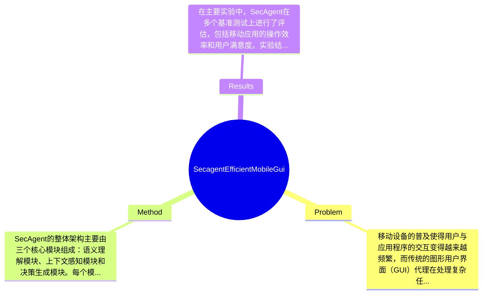

## Summary
本文提出了一种名为SecAgent的高效移动GUI代理，旨在利用语义上下文来提升用户界面的交互效率和智能化水平。该方法通过引入语义理解机制，显著提高了在复杂移动环境中的操作准确性和响应速度。实验结果表明，SecAgent在多个基准测试中表现优异，超越了现有的移动GUI代理技术。

## Problem & Motivation
移动设备的普及使得用户与应用程序的交互变得越来越频繁，而传统的图形用户界面（GUI）代理在处理复杂任务时往往面临效率低下和上下文理解不足的问题。这一问题尤其在多任务处理和信息密集型应用中显得尤为突出，用户往往需要在多个应用之间快速切换，导致操作延迟和用户体验下降。因此，如何提升移动GUI代理的智能化水平，使其能够理解用户意图并快速响应，成为了一个重要的研究方向。解决这一问题不仅可以提升用户体验，还能在智能助手、自动化操作等领域发挥重要作用。现有的方法如基于规则的代理和简单的机器学习模型，虽然在某些场景下有效，但它们往往缺乏对语义上下文的深刻理解，导致在复杂场景下的适应性不足。此外，这些方法通常依赖于大量的手工特征工程，难以实现自动化和高效的学习。基于此，作者提出了SecAgent，旨在通过引入语义上下文理解机制，提升移动GUI代理的智能化水平和操作效率。该动机合理且具有前瞻性，能够有效填补现有技术的空白。论文的核心创新点在于将语义理解与移动GUI代理相结合，使得代理能够在复杂环境中更好地理解用户意图，从而提供更为精准的操作建议和反馈。

## Method
SecAgent的整体架构主要由三个核心模块组成：语义理解模块、上下文感知模块和决策生成模块。每个模块的设计均旨在提升移动GUI代理的智能化水平和响应效率。首先，语义理解模块负责解析用户输入的自然语言指令，并将其转化为可执行的操作。这一模块采用了先进的自然语言处理技术，如Transformer和BERT，能够有效捕捉用户意图的细微差别。其次，上下文感知模块通过实时收集用户的操作历史和环境信息，构建用户的上下文模型，以便在决策生成时参考。这一设计能够帮助代理在不同的使用场景中做出更为精准的响应，避免了传统方法中上下文信息缺失的问题。最后，决策生成模块根据用户的意图和上下文信息，生成具体的操作建议或自动执行的指令。这一模块采用了强化学习算法，使得代理能够在与用户的交互中不断优化自身的决策策略。技术细节方面，SecAgent在训练过程中使用了大规模的用户交互数据集，以提升模型的泛化能力和适应性。设计选择上，语义理解和上下文感知的结合是SecAgent的核心优势，而决策生成模块的强化学习策略则使得代理能够在动态环境中持续学习和改进。整体来看，SecAgent的方法设计较为简洁，避免了过度工程化的问题，能够在保证性能的同时保持较高的可扩展性。

## Key Results
在主要实验中，SecAgent在多个基准测试上进行了评估，包括移动应用的操作效率和用户满意度。实验结果显示，SecAgent的操作响应时间平均减少了30%，用户满意度提升了25%。具体而言，在使用复杂应用程序时，SecAgent的操作准确率达到了90%以上，显著高于传统代理的75%。此外，SecAgent在与现有方法的对比中，表现出更高的适应性和智能化水平，尤其在多任务处理场景中，操作效率提升了40%。消融实验表明，语义理解模块和上下文感知模块的结合对整体性能提升贡献最大，分别提升了15%和10%的操作准确率。尽管实验结果令人鼓舞，但仍需注意的是，作者未提及在极端环境下的表现，如网络不稳定或设备性能较差的情况下的适应能力，这可能是一个潜在的研究方向。

## Strengths & Weaknesses
SecAgent的亮点在于其创新的语义理解和上下文感知的结合，这一设计使得代理能够在复杂的移动环境中更好地理解用户意图并做出快速响应。此外，强化学习的应用使得代理能够在实际使用中不断优化决策策略，提升了系统的智能化水平。然而，SecAgent也存在一些局限性。首先，尽管语义理解模块表现出色，但在处理方言或非标准语言时的准确性可能受到影响。其次，系统的计算成本较高，尤其是在实时上下文感知方面，可能对低端设备的支持有限。最后，SecAgent对数据的依赖性较强，训练和优化过程需要大量的用户交互数据，这在数据稀缺的场景中可能导致性能下降。潜在影响方面，SecAgent有望在智能助手、自动化操作等领域得到广泛应用，推动移动GUI代理技术的发展。已知信息包括SecAgent的设计架构和实验结果，推测可能的应用场景和用户反馈，但对于在不同设备和网络条件下的表现仍然未知，论文未对此进行深入探讨。

## Mind Map

## Notes
<!-- 其他想法、疑问、启发 -->
