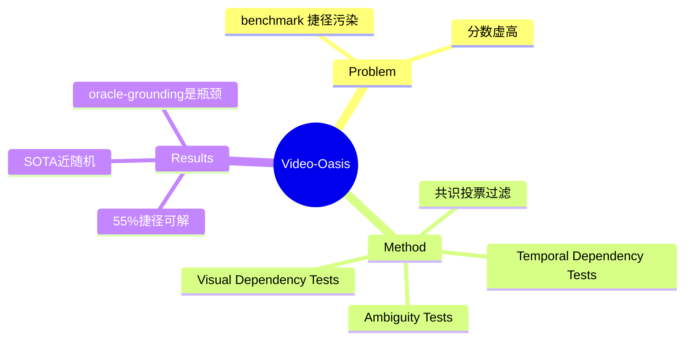

## Summary
提出 Video-Oasis 诊断套件，系统审计 14 个主流视频理解 benchmark，发现约 55%（严格共识）的样本无需视觉/时序即可答对；剔除这些捷径样本后重构出真正 video-native 的评测集，SOTA 模型只略高于随机水平。

## Problem & Motivation
现有 video-LLM benchmark 的高分被"捷径样本"污染：很多题目仅凭问题+选项、语音转录、或单帧静态信息就能答对，不依赖真正的时空推理。这让 benchmark 分数虚高、难以衡量 video-LLM 的真实进展。作者要回答的问题是：现有 benchmark 有多少题目是"假的视频题"，以及在剔除捷径后模型到底有多强。

## Method
Video-Oasis 是一个诊断+过滤框架，沿三条轴系统性地探测样本是否可被捷径攻破：

- **Visual Dependency Tests（去掉视觉证据）**：Blind test（仅问题+选项）、Audio test（仅语音转录）、Summary test（仅拼接的 caption）。若无视觉输入仍能答对，判为视觉无关。
- **Temporal Dependency Tests（破坏时序结构）**：Center-frame（仅取中间单帧）、Frame shuffling（打乱帧序）、Bag-of-frames（时序无关的 CLIP 匹配）。若打乱/单帧仍能答对，判为时序无关。
- **Ambiguity Tests（标注质量）**：Consistency（跨模型分歧）、Redundancy（任意片段都能解）、Sensitivity（人工核验）。

用 5 个诊断模型做共识投票（consensus threshold c），把被判定为捷径可解的样本剔除，保留下来的样本按挑战类型分为 Temporal Dynamics & Tracking、Spatial World Understanding、Causality & Logical Reasoning、Global Narrative、Fine-Grained Perception 五类。作者强调该套件是"可配置"的诊断工具，而非唯一裁定标准。

## Key Results
- **审计规模**：14 个 benchmark（EgoSchema、VSI-Bench、TVBench、Video-Holmes、VideoMME、MVBench、LVBench、MLVU 等），原始 24,416 QA / 4,938+ 视频，过滤后保留 11,033 对（45.2%），时长 15s 到 10min+。
- **捷径普遍性**：宽松共识（c≥1）下 92.7% 样本存在捷径；严格共识（c=3）下 55% 为捷径可解。benchmark 的捷径比例与其报告准确率强相关——分数越高越可能是捷径喂出来的。
- **过滤后 SOTA 掉到接近随机**（随机基线 25.6%）：Gemini-2.5-Pro 46.7%（最高）、VideoAuto-R1 36.8%、Qwen3-VL 33.8%、Video-R1 26.3%（近随机）。
- **Temporal grounding**：自动 grounding 只带来 1.4–2.3% 提升；但在 Video-Oasis 样本上 oracle grounding 从 35.0% 拉到 50.8%（15.8 分空间），而在捷径样本上 oracle 只从 78.0% 到 80.8%——说明真正难的是时序定位而非答案生成。
- **训练范式对比**：Eagle2.5(SFT) 34.5%、Video-R1(RLVR+QA reward) 26.3%、VideoAuto-R1(RLVR+grounding reward) 32.7%；Oracle voting ensemble 可达 46.2%，逼近前沿。

## Strengths & Weaknesses
**亮点**：问题选得准——video benchmark 捷径污染是行业公开的秘密，本文第一次用多轴诊断把它量化到"55% 捷径 / SOTA 近随机"这种触目惊心的数字；三轴（视觉/时序/歧义）设计正交且可复现；oracle grounding 的对照（Video-Oasis 样本 +15.8 vs 捷径样本 +2.8）干净地隔离出"时序定位"才是真瓶颈，这是比 main table 更有价值的诊断。

**局限**：(1) 捷径判定强依赖"5 个诊断模型共识"，本质是用一批当代模型的能力边界去定义"什么算捷径"，模型更强时判定会漂移，55% 这个数字并非绝对真值；(2) 作者自己承认 caption-based / shuffled-frame 测试会保留部分时序线索，带来假阳/假阴，靠多轴+人工缓解但未给出误判率；(3) 保留下来的样本高度偏向 Temporal Dynamics & Tracking（51%），"video-native"实际上被窄化为"时序密集题"，是否代表视频理解的全部仍存疑。总体是一篇 evaluation/diagnosis 类的扎实工作，对领域的价值在于提供可复用的过滤工具和一个更诚实的 leaderboard，而非方法创新。

## Mind Map

## Notes
- 与 [[2604-VideoMMEv2]]、[[2400-GuiWorldVideoBenchmark]] 同属"如何评测视频理解"这条线，可作为 video benchmark 质量批判的对照数据点。
- 可迁移问题：GUI/agent 类 video benchmark 是否也有类似的"单帧/无视觉即可解"捷径？Video-Oasis 的三轴诊断方法论值得借来审计具身/GUI 视频评测集。
