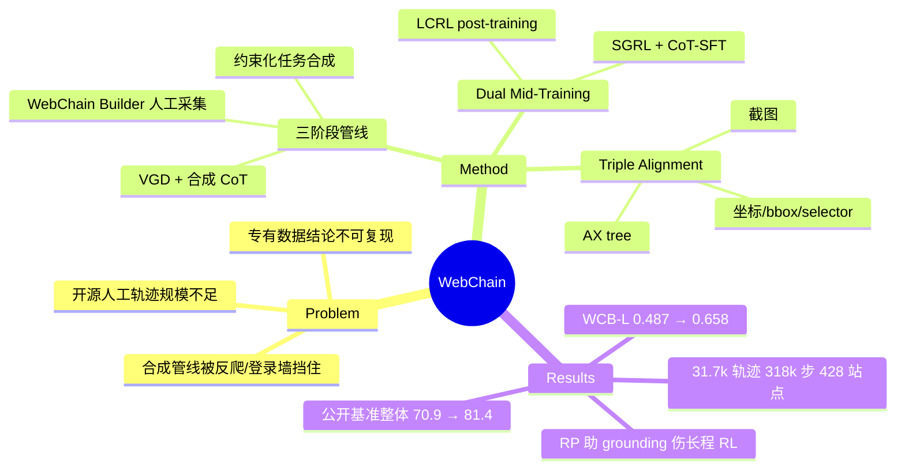

## Summary
WebChain 是目前最大的开源人工标注真实网站操作轨迹数据集（31,725 条轨迹 / 318k 步 / 428 个站点），每步同时对齐视觉（截图）、结构（AX tree）、动作（坐标 + bbox + CSS selector）三层信息，并配套提出 Dual Mid-Training 配方（SGRL 空间 grounding RL + CoT-SFT 解耦，再接长链 RL）与 WebChainBench 评测。

## Problem & Motivation
Web agent 训练数据存在三重困境：(1) 现有开源人工轨迹数据规模太小——Mind2Web 只有 2,350 条轨迹 / 17k 步、WebLINX 2,337 条，不足以验证 scaling 效应；(2) Explorer、OS-Genesis 等合成方法在真实网站上受反爬、CAPTCHA、登录墙限制，覆盖不了高价值任务；(3) 大厂 scaling GUI agent 的关键结论建立在专有数据上，社区无法复现。WebChain 以人工标注绕过反爬/登录限制，规模上比 Mind2Web 大 13.5×（轨迹）/ 19×（步数）。

## Method
**数据管线三阶段**：
1. **Constraint-Based Task Synthesis**：先对站点做结构化功能抽取（域语义、交互逻辑如 faceted filter / 条件依赖），生成带 grounding 约束的任务，按复杂度分层（单步检索 / 多约束导航 / 条件依赖任务）；
2. **Human-in-the-Loop 采集**：自研 WebChain Builder 记录每步的前后 DOM 快照、动作类型、viewport 坐标 + bounding box、元素元数据（XPath/CSS/inner text）；
3. **后处理增强**：Visual Grounding Densification（VGD，把屏幕上所有可交互元素的 bbox/类型/文本都标出来，提供 negative sampling）+ VLM 合成每步 CoT rationale。

**Triple Alignment**：每步同步三层上下文——视觉（viewport + 全页截图）、结构（Accessibility tree）、动作（像素坐标 + bbox + CSS selector）。

**Dual Mid-Training 训练配方**（基座 Qwen2.5-VL 3B/7B）：
- Mid-training 阶段把空间 grounding 和规划解耦：SGRL（在 WCB-S 上做 RL，reward = α·动作类型 + (1-α)·动作内容）+ CoT-SFT（约 5k 合成 CoT 样本）；
- Post-training 阶段 LCRL（Long-Chain RL）从最优 mid-trained checkpoint 出发优化长程任务成功率。

**WebChainBench**：从 held-out 数据抽 1.2k 交互步，分 WCB-S（空间 grounding）与 WCB-L（长程规划）两个变体，按轨迹长度（<6 / 6-10 / >10 步）均衡；判对标准是动作类型与动作行为同时匹配。

## Key Results
- **数据规模**（Table 1/2）：31,725 轨迹、317,993 步、428 域名，平均轨迹长 10.02 步；vs Mind2Web 2,350 轨迹 / 137 站点、GUIAct(multi) 5,696 轨迹；同时带 AX tree + bbox（Mind2Web 无 AX tree，WebArena 无 bbox）。
- **WCB-L（3B）**：直接 LCRL 0.487 → +CoT-SFT 0.603 → +SGRL 0.629 → 两者兼用 0.658（相对 +35.1%），mid-training 解耦的必要性有干净的消融支撑。
- **公开 benchmark（7B, Table 3）**：整体 70.9%（zero-shot Qwen2.5-VL-7B）→ 81.4%；长程任务提升最大——AC-High Type 64.4→86.2、GUI-Odyssey Type 50.1→88.7；GUI-Act-Web 83.9→87.6、OmniAct-Web 70.3→78.9。
- **Scaling（Fig 3）**：4k → 20k → 150k 步训练数据，WCB-L 成功率持续上涨，未见饱和。
- **反直觉消融（Fig 5）**：Reasoner Prompting (RP) 在 WCB-S 上有效，但用 RP checkpoint 初始化 LCRL 后 WCB-L 反而一致变差——针对 grounding 的推理正则化会限制长程任务的泛化，Non-RP + VGD 才是最强初始化。

## Strengths & Weaknesses
**Strengths**：
- 填的是真空位：Mind2Web 之后开源社区一直没有上规模的人工真实网站轨迹，31.7k 轨迹 + Triple Alignment（截图/AX tree/bbox 三模态齐全）让 grounding、planning、DOM-based 三条路线都能用同一份数据；CC BY 4.0 + GitHub 开源。
- 人工采集绕过反爬/登录墙，覆盖合成管线拿不到的任务分布——这是它与 Explorer/OS-Genesis 一类合成数据的本质区别。
- 消融有信息量：RP 帮 grounding 却伤长程 RL 的负迁移发现，以及 mid-training 决定 RL ceiling 的结论，对训练配方设计有直接参考价值。

**Weaknesses**：
- **全部评测是离线 step matching**：WCB-L 的"长程规划成功率"是逐步与人类轨迹比对，不是 WebArena/Mind2Web-Live 式的在线端到端执行——离线步准确率与真实任务完成率的鸿沟是这个领域的老问题，论文完全没碰在线评测。
- **baseline 选得软**：公开 benchmark 上主要对比 zero-shot Qwen2.5-VL 和 GUI-R1，没有与 UI-TARS、Aguvis 等吃了大规模（专有）数据的强 GUI 模型正面交锋，"SOTA" claim 的参照系很窄。
- CoT rationale 是 VLM 合成的，质量无消融；reward 的动作内容判定是 bbox 重叠 / 词面匹配，语义等价的不同操作路径会被误判。
- 自建 benchmark 自己刷分的循环论证风险：WCB 与训练数据同分布（held-out 但同站点采集协议），跨分布泛化只有 mobile benchmark 的 Type/GR 指标背书。
- 428 个站点的选择偏差、标注者协议、质检通过率等数据质量细节在正文中披露有限。

## Mind Map

## Notes
- RP checkpoint 伤 LCRL 的负迁移与 GRPO-Null（[[2607-GRPONullWebAgent]]）的 LR 门控发现可以对照读：两者都在提示 GUI agent 的 RL 阶段对初始化状态极其敏感，"mid-training 决定 RL ceiling" 可能是普适 pattern。
- 数据本身可能比训练配方更有生命力——Triple Alignment 的 AX tree + bbox 双结构标注正好覆盖 DOM-based 与 pixel-based 两派方法的需求。
- 待验证：在线评测（WebArena / Mind2Web-Live）上这套配方还剩多少优势。
