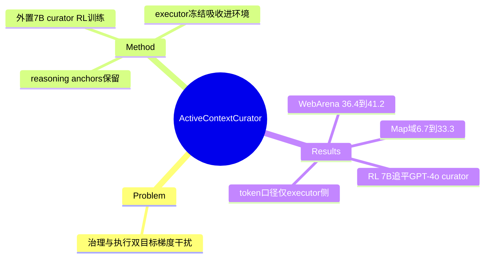

## Summary

把 context 管理外置为独立可训练模型的解耦方案：7B ContextCurator（RL 训练）自回归重写 workspace 为精炼 memory，配**冻结的** TaskExecutor（吸收进环境转移动态）。WebArena 上 Gemini-3.0-flash 36.4→41.2%、GPT-4o-mini 12.7→21.8%（+72% 相对）；RL 后的 7B curator 追平 GPT-4o 作 curator。是"固定执行权重、只改 context"的干净因果对照——但 **token 计数只含 executor 侧 context，curator 自身推理开销未入账**（verifier 核实），节省数字不能读作端到端成本下降。

## Problem & Motivation

单模型同时做记忆治理（激进熵削减）与任务执行（保留深层逻辑依赖）是两个正交认知目标，共用参数会梯度干扰——这是本文对 [[Papers/2510-MemAct]] 式"context 管理内化进同一 policy"路线的隐式反题：解法不是统一动作空间，而是**分工**。冻结 executor 的额外收益：curator 可搭配任何闭源 API 模型（MemAct/FoldGRPO 路线做不到）。

## Method

- **架构**：ContextCurator（Qwen-2.5-7B-Instruct 初始化）每 turn 把当前 workspace 自回归重写为精炼 textual memory；TaskExecutor（Gemini/GPT 系闭源模型）严格冻结，其 policy 被吸收进环境转移动态。
- **Reasoning anchors**：与当前 query 无文本相似性但全局因果的稀疏信息（如导航中的空间坐标）——curator 要学会"看似无关也要留"。
- **训练**：Multi-Turn GRPO；稀疏二元任务完成 reward；组内归一 advantage；梯度只作用于 curator 生成的 token。

## Key Results

- **WebArena**（Table 1）：Gemini-3.0-flash 36.4→41.2%（executor 侧 token 47.4K→43.3K，−8.8%）；GPT-4o-mini 12.7→21.8%；Map 域（空间推理）No Memory 6.7% vs 本方法 33.3%（anchor 保留的直接证据）。
- **DeepSearch**（Table 2）：Gemini-3.0-flash 53.9→57.1%（46.7K→6.6K，实算 7.1×，摘要写"8×"）；Gemini-2.5-flash 33.4→41.5%（34.4K→7.3K，4.7×）。
- **Curator 对照**（GPT-4o-mini 执行器）：RL 7B curator 21.8%（32.5K）> GPT-4o 作 curator 21.2%（42.2K）> base Qwen-7B 13.9% > GPT-4o-mini 作 curator 14.6%（44.4K）——**RL 是关键**（13.9→21.8），且"用更强的通用模型当 curator"不划算。
- **边界**：单跳 NQ 增益小（30.0→32.0%）——主动治理在推理链脆弱时最有价值；Synapse 在 QA 上也有效但 context 膨胀。

## Evidence Ledger

| Claim ID | Claim | Type | Source locator | Evidence excerpt | Status |
|:--|:--|:--|:--|:--|:--|
| C1 | 解耦架构 + 梯度干扰动机；curator 自回归重写 workspace | causal-mechanism | §3/§4.1 | "orthogonal cognitive objectives" | source-verified |
| C2 | MT-GRPO 稀疏二元 reward；冻结 executor 吸收进环境；只训 curator token | benchmark-setting | §3.3 | "gradients are applied only to the tokens generated by the ContextCurator" | source-verified |
| C3 | WebArena：36.4→41.2%（47.4K→43.3K）；GPT-4o-mini 12.7→21.8% | number | Abstract; Table 1 | "from 36.4% to 41.2%" | source-verified |
| C4 | DeepSearch：53.9→57.1%（46.7K→6.6K）；33.4→41.5%（34.4K→7.3K） | number | Table 2 | "46.7K→6.6K" | source-verified（实算 7.1×/4.7×，摘要"8×"为约数） |
| C5 | Curator 对照：RL 7B 21.8%/32.5K > GPT-4o curator 21.2%/**42.2K** > GPT-4o-mini curator 14.6%/44.4K；base 13.9% | comparison | Table 1 | "21.2% \| 42.2K" | source-verified（初稿把 44.4K 误记到 GPT-4o 行，verifier 纠正） |
| C6 | Map 域 No Memory 6.7% vs 33.3%——anchor 保留证据 | number | §5; Table 1 | "fails near-completely (e.g., 6.7% SR)" | source-verified |
| C7 | 同一 curator 配 4 种 executor 均工作 | benchmark-setting | Tables 1-2 | four executor blocks | source-verified（跨 executor 迁移是断言，无专门 transfer 实验隔离） |
| C8 | 单跳 NQ 增益小（30.0→32.0）；无专门 limitation 章节 | benchmark-setting | §5 | "smaller gains (30.0% → 32.0%)" | source-verified |
| C9 | WebArena 域数与 DeepSearch 构成 | benchmark-setting | §4.1; Tables | 正文写四域，Table 1 报五域（Shopping/Admin/Gitlab/Reddit/Map）；DeepSearch 实为 7 个子集 | unsupported（论文内部不一致；每域 ~50 实例之说无出处） |
| C10 | Token 计数口径：仅 executor 每 turn 输入 context（system+observation+objective+memory），**curator 自身生成/推理开销不在内** | benchmark-setting | Appendix A | "C_t^Active = len(S)+len(O)+len(U)+len(M)" | source-verified（verifier 主动核出，关键边界） |

## Strengths & Weaknesses

**Strengths**：
- 因果对照干净：执行权重全程冻结，成功率变化只能归因于 context 内容——这正是 07-27 报告需要的"固定权重、只改 context"数据点；GPT-4o-mini +72% 相对增益说明弱 executor 从治理中获益最大（与 [[Papers/2605-MaskingRegimeMap]] 的"中等能力模型是 CM 最优点"regime 判断一致）。
- Curator 对照矩阵（RL 7B vs 零样本大模型 curator）证明 curation 是**可训练的专门技能**而非通用能力的子集。
- 外置 curator 天然规避 [[Papers/2512-FoldAct]] 指出的部分问题：executor 冻结 → 不存在"policy 更新改变自身 observation 分布"的 self-conditioning 循环（curator 训练时其输出仍进自身未来输入，非平稳性仅存在于 curator 侧）。

**Weaknesses / 边界**：
- **Token 记账缺陷（最重要）**：报告的"节省"只算 executor 侧 context，7B curator 每 turn 的推理成本完全未入账——按 [[Papers/2606-SkillMemoryBudget]] 的标准这正是"模块开销不报"的评测惯例问题；端到端成本是否真降未知（尤其 WebArena 上仅 −8.8% 的口径内节省）。
- 论文内部不一致（正文四域 vs 表五域）+ 无 limitation 章节 + 无多 run 方差——工程质量低于同线其他论文。
- 跨 executor 泛化是四块结果的并列展示，无"训练于 A、测试于 B"的专门迁移实验。
- 与 [[Papers/2510-MemAct]]/[[Papers/2510-ContextFolding]] 无同 benchmark 对照（WebArena vs BC-Plus），"外置 vs 内化"哪条路线更优仍无直接证据。

**对领域**：context 管理的第三种 formulation（外置专门模型），与内化路线（MemAct/ContextFolding）构成架构分岔；对闭源 executor 场景是唯一可行的 learned 路线。

## Mind Map

## Notes

- 入队来源：[[Reports/2026-07-27-WebAgent-RL-and-Context-Landscape]] 交叉轴主线 top-10 第 4（"固定权重对照"）。
- Context 管理三种 formulation 至此齐全：内化-编辑（MemAct）、内化-折叠（ContextFolding）、**外置-专门模型**（本篇）；FoldAct 的非平稳性批评对三者命中面不同（外置方案 executor 侧免疫、curator 侧仍在）。加上 heuristic 端的 regime map，[[Topics/WebAgent-Survey]] §4 的路线图完整。
- 本篇的 token 口径问题是 [[Papers/2606-SkillMemoryBudget]] 批评的活案例——两篇对照阅读可作"如何正确报告 context 管理成本"的正反教材。
