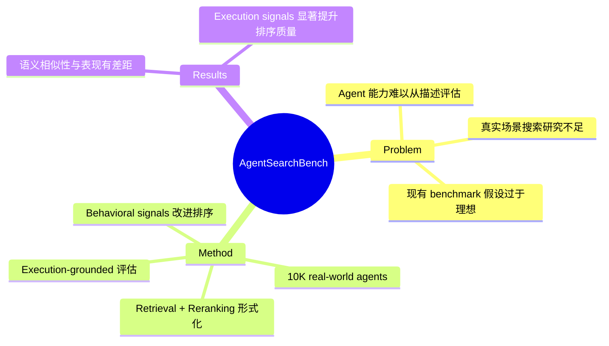

## Summary
%% 一句话概括：解决了什么问题、怎么解决的 %%
提出了 AgentSearchBench，首个大规模 Agent 搜索 benchmark，基于近 10,000 个真实 world agents，揭示了语义相似性与实际 agent 表现之间的差距，并提出基于执行信号改进排序的方法。

## Problem & Motivation
%% 问题背景与动机，2-5 句话。为什么重要？现有方法有什么局限？ %%
AI agent 生态快速增长，但如何为给定任务找到合适的 agent 成为新挑战。与传统工具不同，agent 能力往往是组合式的、执行依赖的，仅从文本描述难以评估。现有研究和 benchmark 通常假设功能明确、候选池可控、或仅支持可执行任务查询，对真实场景下的 agent 搜索研究不足。

## Method
%% 核心方法/架构。中文撰写，保留英文技术术语。可分段，鼓励列出关键组件。 %%
> [未获取全文，仅基于 abstract]

**Benchmark 设计**：
- 基于近 10,000 个真实 world agents，来自多个 provider
- 将 agent search 形式化为 retrieval 和 reranking 问题
- 支持两种查询类型：executable task queries 和 high-level task descriptions
- 使用 execution-grounded performance signals 评估相关性

**核心发现**：
- 语义相似性与实际 agent 表现存在一致差距
- 基于 description 的 retrieval 和 reranking 方法有局限性

**改进方法**：
- 提出轻量级 behavioral signals 改进排序质量
- 包括 execution-aware probing
- 强调将 execution signals 纳入 agent discovery 的重要性

## Key Results
%% 主要实验结果，包含具体数字和 benchmark 名称。 %%
> [未获取全文，仅基于 abstract]

- 构建了 AgentSearchBench，包含近 10,000 个真实 agents
- 实验揭示了 semantic similarity 与 actual agent performance 之间的差距
- Lightweight behavioral signals（包括 execution-aware probing）可显著提升 ranking quality

## Strengths & Weaknesses
%% 方法亮点与局限的个人评价，以及对领域的潜在影响。 %%
**Strengths**：
- 首个大规模 agent 搜索 benchmark，填补了真实场景研究的空白
- 提出了执行信号优于语义相似性的重要洞察
- 支持两种查询类型，更贴近实际应用

**Weaknesses**：
- [未获取全文，待补充]

**潜在影响**：
- 可能推动 agent ecosystem 的发现与匹配机制研究
- 为 agent marketplace/platform 提供评估基准

## Mind Map
%% root 节点用论文 ShortTitle，子节点覆盖 Problem / Method / Results 三个维度 %%

## Notes
%% 其他想法、疑问、启发。留空供后续填写。 %%
- 与 GUI Agent 的关联：agent search/discovery 可能是未来 agent platform 的核心能力
- Rating 2 的原因：方法论上贡献有限，更多是 benchmark 构建；与当前 GUI Agent 研究方向关联度一般