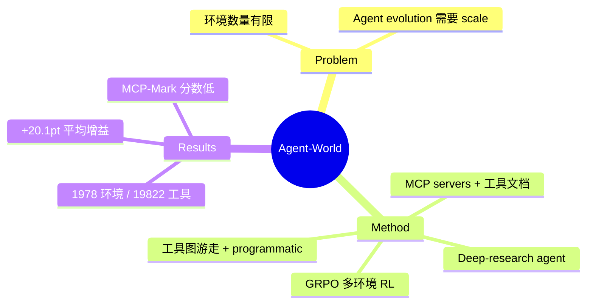

## Summary

从 MCP servers、工具文档、工业 PRD 采集数千主题，用 deep-research agent 自主挖掘数据库和工具接口，构建 1,978 个环境 / 19,822 个工具。通过工具图游走 + programmatic 双轨合成可验证任务，再用 GRPO 多环境 RL 训练。在 23 个 benchmark 上超过 EnvScaler、AWM 等 environment scaling 基线。

## Problem & Motivation

Environment synthesis 对于 agent 训练的重要性：
- 现有环境数量有限
- 需要大规模环境来支持 agent evolution

## Method

**环境构建**：
- 从 MCP servers、工具文档、工业 PRD 采集数千主题
- Deep-research agent 自主挖掘数据库和工具接口
- 构建 1,978 个环境 / 19,822 个工具

**任务合成**：
- 工具图游走 + programmatic 双轨合成可验证任务
- GRPO 多环境 RL 训练

## Key Results

- 环境数从 10 到 2000 的 scaling 曲线清晰
- +20.1pt 的平均增益有说服力
- MCP-Mark 绝对分数：8B 8.9%，14B 13.3%

## Strengths & Weaknesses

**亮点**：
- 规模确实大——1,978 个环境 + 19,822 个工具
- 环境数从 10 到 2000 的 scaling 曲线清晰
- +20.1pt 的平均增益有说服力

**局限**：
- "Real-World"水分很大——所有环境本质都是 JSON/CSV 文件的本地读写
- MCP-Mark 绝对分数低得离谱
- Self-evolving 的"self"要打引号——diagnosis agent 用的是 GPT-OSS-120B

## Mind Map

## Notes

> [基于月度总结的点评，未获取全文]

工程量大、scaling 曲线扎实，但 MCP-Mark 绝对分数低得离谱。