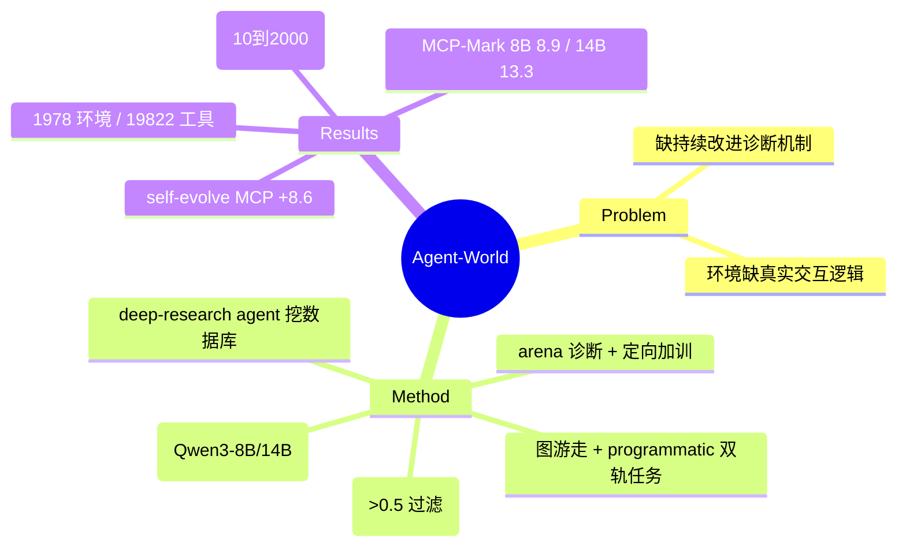

## Summary

Agent-World 把"环境合成"做成可扩展流水线：用 deep-research agent 从 MCP servers / 工具文档 / 工业 PRD 三类来源挖掘数据库并合成工具接口，构建 **1,978 个有状态环境 / 19,822 个工具**；再用图游走 + programmatic 双轨合成可验证任务，配 GRPO 多环境 RL 训练 Qwen3-8B/14B；最后引入 **arena-based self-evolving** 闭环——诊断 agent 找出薄弱环境并定向加训。在 23 个 benchmark 上，Agent-World-8B/14B 超过 EnvScaler、AWM 等 environment scaling 基线，并在部分指标接近/超过专有模型。

## Problem & Motivation

LLM agent 越来越被要求作为与**外部有状态工具环境**交互的通用 agent。两个瓶颈：

1. **Scalable realism（可扩展的真实性）**：现有环境要么纯 LLM 生成、要么来自有限开源工具链，常常与真实交互逻辑不匹配，缺乏支撑 long-horizon、state-intensive 任务的复杂度。
2. **Continuous improvement（持续改进机制）**：以往工作偏重环境构建，但缺少用这些环境**诊断 agent 弱点并驱动持续自我改进**的原则性机制。

核心论点：agent 必须在组合式、有状态的环境里编排多工具并跟踪状态转移，而静态工具环境不足以支撑真实应用。

## Method

**A. 环境构建**：从三类来源（Smithery 的 MCP servers、开源工具文档、工业 PRD）采集主题。对每个主题 m，一个 deep-research agent 𝒢（policy πθ + 工具集：search/browser/code compiler/OS 工具）迭代挖掘出数据库 𝒟(m)，再用函数 ϕ 做 N 轮 database complexification 逐步加难。一个 coding agent ψ 生成候选工具 + 测试用例，过滤掉测试准确率 ≤0.5 的工具。最终 **1,978 个环境、19,822 个工具**，涵盖 JSON/CSV/SQL/HTML/YAML/TEX 多种文件类型，平均每环境 >10 个工具（部分 40+）；并用 Ward 聚类 + LLM 总结 + 人工标注构建 20 个一级 / 50 个二级 / 2K+ 三级的层级 taxonomy。

**B. 任务合成（双轨）**：
- **图游走（Graph-based）**：把工具建成全连接加权有向图（强依赖权重 3 / 弱依赖 2 / 独立 1），随机游走得原始工具序列，LLM 精炼为逻辑一致序列，sandbox 执行收集 trace 与 ground truth，再生成任务描述 + 结构化 rubric。
- **Programmatic**：LLM 生成复杂任务 + 端到端 Python 解，用 ReAct loop 调试，并生成带多级断言的可执行验证脚本 Vcode。
- 两轨都做 **5 次运行一致性检查**（ReAct agent 至少 2/5 解出才保留），并各有难度提升策略。任务统计：全部 ≥7 轮交互，平均 >20 轮，相当部分 >40 轮；programmatic 任务更难（Doubao-Seed-2.0-pro 在 Pass@10 下多数只解出 1 次或解不出）。

**C. 多环境 RL**：闭环交互——policy 生成动作，工具执行修改 sandbox 内数据库状态。可验证奖励：图任务用 rubric-conditioned LLM judge，programmatic 任务直接执行验证脚本。用 **GRPO** 更新（clip ε_low=0.2 / ε_high=0.28，轨迹最长 80K token，单步生成上限 32K）。冷启动用 Doubao-Seed-1.8 SFT 40K 轨迹，RL 阶段 5K 样本、每步 32 任务、每任务 8 rollouts。backbone 为 Qwen3-8B / Qwen3-14B。

**D. Self-Evolving Arena 闭环**：每一级类目分层采样 K=5 个环境组成 arena，每轮合成新的可验证任务；诊断 agent δ 分析失败 trace / 错误分布 / 环境元数据，输出排序后的薄弱环境 𝒲 和环境专属的任务生成指南 𝒢guide；对薄弱环境做 database complexification + 定向任务合成，RL 从 πθ^(r) 续训到 πθ^(r+1)。

## Key Results

**主表（Table 1，准确率%）**：
- MCP-Mark：Agent-World-8B **8.9** / 14B **13.3**（Qwen3-8B 2.4，EnvScaler-8B 5.6，AWM-8B 2.4）。
- BFCL-V4：8B **51.4** / 14B **55.8**（Qwen3-8B 40.4，EnvScaler 47.6）。
- τ²-Bench：8B **61.8** / 14B **65.4**（Qwen3-8B 26.2，EnvScaler 31.8）——τ² 上对基线优势巨大。
- 对照专有模型：GPT-5.2 High（MCP 53.1 / τ² 80.2）、Gemini-3 Pro（50.8 / 85.4）、Seed 2.0（54.7 / 83.0）——MCP-Mark 上仍远落后专有模型。

**环境 scaling 曲线（Fig. 8）**：环境数 10→100→500→1000→2000(1978)，平均从 18.4%（0 环境）升到 38.5%，10→1978 累计 **+20.1 点**（翻倍以上）。10→100、100→500 跳变大，500→2000 边际递减但仍正向。

**Self-Evolution（Table 2，2 轮）**：Agent-World-14B 在 MCP +6.8/+1.8（合 +8.6）、τ² +3.3/+1.9、BFCL +2.5/+0.9；EnvScaler 跑同样闭环也有提升（MCP +5.6），证明 arena 机制本身有效、非 Agent-World 专属。最大增益集中在 MCP-Mark，说明诊断正确识别了 state-tracking 弱点。

**泛化（Fig. 6/7，17+ benchmark）**：在通用推理（MATH500/GSM8K/AIME/OlympiadBench）、agentic search & coding（WebWalkerQA/SWE-Bench/Terminal/GAIA/HLE）、knowledge & MCP（MMLU/SuperGPQA/MCP-Universe）三轴全面提升且无退化；进阶助手 benchmark 上 SkillsBench（8B 9.2 / 14B 12.6）、ARC-AGI-2（6.5 / 8.5）、ClawEval（30.5 / 31.5）8B→14B 稳定提升，而 EnvScaler 在 SWE/Terminal 上反而低于基线。

## Strengths & Weaknesses

**Strengths**：
- 规模与 scaling 曲线扎实——1,978 环境 / 19,822 工具，环境数 10→2000 的 +20.1 点曲线把"环境数量"作为独立变量验证得很干净。
- 双轨任务合成 + 双重可验证奖励（rubric LLM-judge / 可执行脚本）让 RL 信号可靠，5-run 一致性过滤保证任务质量。
- self-evolving arena 是真正的增量贡献：诊断→定向加训闭环在两个模型上都复现有效，且增益集中在被诊断为弱的维度。
- 8B→14B 稳定 scaling、跨域无退化，比 EnvScaler 在 SWE/Terminal 上倒退更可信。

**Weaknesses**：
- **"Real-World" 水分大**：环境本质是 LLM agent "挖掘"出的本地数据库（JSON/CSV/SQL 文件读写），数据新鲜度/准确性 vs 真实 live API 未验证，也无实时 MCP server 评测——所有测试都在 sandbox。
- MCP-Mark 绝对分数低（14B 仅 13.3% vs GPT-5.2 High 53.1%），有状态数据库交互仍是硬骨头；File/GitHub 子项更低（8B 13.3% / 4.4%）。
- **"Self"-evolving 的 self 要打引号**：诊断 agent 依赖 GPT-OSS-120B，且无诊断模型选择的消融。
- 缺独立 ablation（去掉图游走 / 去掉可执行奖励 / 去掉自进化），主要靠 scaling 与 self-evolution 两条曲线间接论证；算力成本（GPU 小时）、工具幻觉/安全、2000+ 环境的 scaling 上限均未讨论。

## Mind Map

```mermaid
mindmap
  root((Agent-World))
    Problem
      环境缺真实交互逻辑
      缺持续改进诊断机制
    Method
      deep-research agent 挖数据库
      coding agent 合成工具(>0.5 过滤)
      图游走 + programmatic 双轨任务
      GRPO 多环境 RL (Qwen3-8B/14B)
      arena 诊断 + 定向加训
    Results
      1978 环境 / 19822 工具
      scaling +20.1pt (10到2000)
      MCP-Mark 8B 8.9 / 14B 13.3
      self-evolve MCP +8.6
```

## Notes

- 与 Externalization survey 互补：Agent-World 实质是大规模"environment / protocol externalization"——把工具接口和有状态环境做成外部可验证 artifact 再用 RL 训练 agent；可作为该 survey "shared infrastructure / self-evolving harness" 主张的一个具体实例。
- 与 MultiWorld / HY-World 的 "world model" 是两种含义：这里的"world"是符号化工具环境（数据库 + tool API），不是视觉/物理世界模型。三篇被一起 redigest 但 world 概念正交，标注时注意区分。
- 最有价值的可迁移点是 **arena-based diagnosis 闭环**：用诊断 agent 定位薄弱子分布 → 定向合成更难任务 → 续训，且在基线模型上也复现，说明这是方法级而非模型级收益。
- 批判性疑问：MCP-Mark 绝对分数这么低，+20.1 点的"翻倍"是不是建立在极低基线上的虚高？需要看真实 live MCP 部署而非 sandbox 复现才能定论环境的"real-world"成色。
