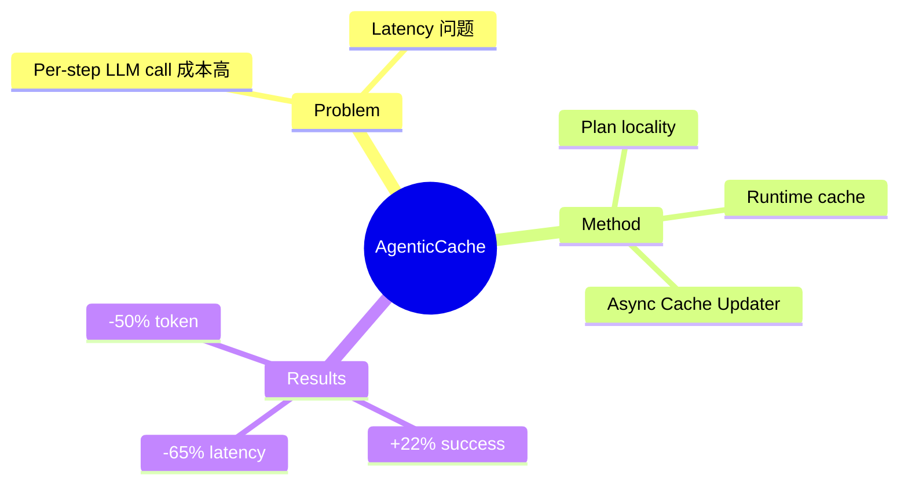

## Summary

AgenticCache 利用 embodied tasks 的 plan locality（下一个 plan 可从当前 plan 预测），用 cached plans 替代 per-step LLM calls。Runtime cache 查询频繁 plan transitions，background Cache Updater 异步调用 LLM 验证和更新 cache。

## Problem & Motivation

Embodied AI agents planning 问题：
- Per-step LLM calls latency 和成本极高
- 现有方法每次规划都需要调用 LLM

**核心洞察**: Embodied tasks 有强 plan locality

## Method

**核心设计**：
1. **Runtime Cache**: 查询频繁 plan transitions
2. **Cache Updater**: 异步调用 LLM 验证和更新 cache
3. **Plan Locality**: 下一个 plan 可从当前 plan 预测

**架构**: Cache-based plan reuse

## Key Results

- Task success rate: +22% (12 configurations)
- Simulation latency: -65%
- Token usage: -50%

## Strengths & Weaknesses

**亮点**：
- Plan locality observation 有价值
- 异步 cache + runtime 查询设计合理
- 显著降低 latency 和 token usage

**局限**：
- Plan locality 是否适用于所有 embodied tasks？
- Cache 验证如何保证正确性？
- 与 World Model 的关联：这是 planning efficiency，而非环境建模本身

## Mind Map

## Notes

> [基于 arXiv abstract]

与 World Model planning component 相关，但核心是 efficiency optimization，而非环境建模本身。Plan locality observation 有参考价值。