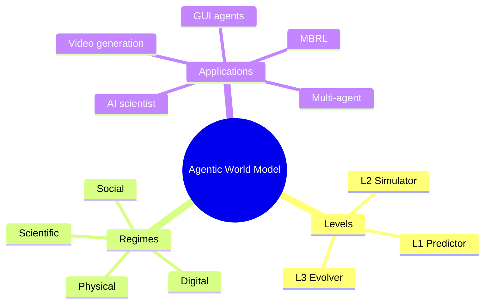

## Summary

这是一篇关于 World Model 的系统性 Survey，提出了 "levels x laws" taxonomy：三个能力层级（L1 Predictor → L2 Simulator → L3 Evolver）和四个约束域（physical/digital/social/scientific），综合 400+ 工作，给出方法、failure mode、评测和架构指导。

## Problem & Motivation

AI 系统从生成文本转向通过持续交互完成目标，环境动态建模成为核心瓶颈。不同研究社区对 "world model" 有不同理解：
- Model-based RL：transition model
- Video generation：action-conditioned video prediction
- Web/GUI agents：environment simulator
- Multi-agent：social simulation
- AI Scientist：experiment design

领域碎片化，缺乏统一框架。需要一个 taxonomy 来连接不同社区，明确各层级的挑战和 failure mode。

## Method

**Taxonomy 设计**：

1. **Capability Levels（能力层级）**：
   - **L1 Predictor**：学习单步局部转移算子
   - **L2 Simulator**：组合成多步、action-conditioned rollout，遵守域定律
   - **L3 Evolver**：当预测失败时自主修正模型

2. **Governing-Law Regimes（约束域）**：
   - **Physical**：物理定律（机器人、物理环境）
   - **Digital**：软件逻辑（Web/GUI、软件环境）
   - **Social**：社会规则（multi-agent、人机协作）
   - **Scientific**：科学规律（AI scientist、实验设计）

每个 level-regime pair 有不同的约束和典型 failure mode。

**Survey 覆盖**：
- 400+ 工作综合，100+ 代表系统总结
- 覆盖 MBRL、video generation、Web/GUI agents、multi-agent simulation、AI scientist
- 分析方法、failure mode、评测实践

## Key Results

作为 Survey，结果是：
- 统一的 "levels x laws" taxonomy
- 各 level-regime pair 的方法总结和 failure mode 分析
- Decision-centric evaluation 原则和 minimal reproducible evaluation package
- 架构指导和开放问题

## Strengths & Weaknesses

**亮点**：
- Taxonomy 设计精巧：能力层级和约束域正交，覆盖了不同社区的核心差异
- 连接了碎片化社区（MBRL、video、GUI agent、multi-agent、AI scientist）
- 提出了 L3 Evolver 的概念——自主修正模型，这是最 ambitious 的层级
- 181 HF upvotes 说明社区认可度很高

**局限**：
- 作者列表极长（40+ 人），可能有 coordination overhead
- Survey 类工作，需要看全文才能判断 taxonomy 是否真的有用
- L3 Evolver 可能过于理想化，实际系统难以实现

## Mind Map

## Notes

> [未获取全文，仅基于 abstract]

这篇 Survey 的 taxonomy 可能成为 World Model 研究的标准框架，值得精读全文。重点关注：
- 各 level-regime pair 的具体 failure mode 分析
- Decision-centric evaluation 的设计
- L3 Evolver 的实现路径