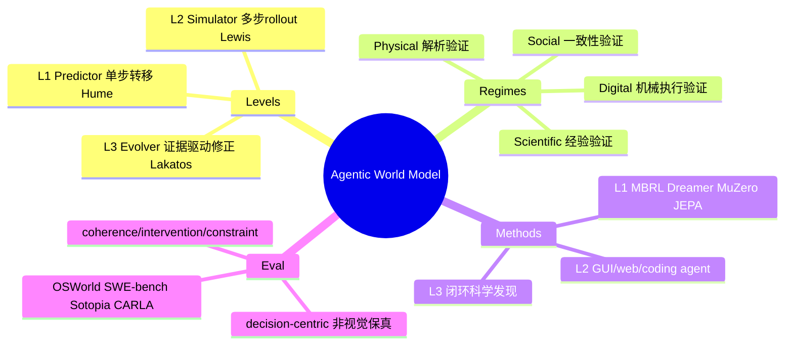

## Summary

关于 World Model 的系统性 Survey，提出 "levels × laws" taxonomy：三个能力层级（L1 Predictor → L2 Simulator → L3 Evolver）× 四个 governing-law regime（physical / digital / social / scientific），综合 400+ 工作，分析各 level-regime pair 的方法、failure mode、评测实践，并给出 decision-centric evaluation 原则与架构指导。核心论点：随着 AI 从生成文本转向通过持续交互完成目标，应以"能力层级 × 约束域"统一组织碎片化的 world model 研究。

## Problem & Motivation

"world model" 一词在 vision、RL、robotics、NLP、AI-for-science 各社区含义不同，造成概念碎片化——某系统在一种解释下的进展在另一种解释下无法比较。现有 domain-centric / modality-centric survey 无法捕捉**横切模态的能力递进**，也低估了 world model 在 agentic 应用（web agent、tool-use、multi-agent）中的角色。中心问题：当 AI 从 text generation 转向 sustained interaction 完成目标，如何概念化地组织支撑明智决策的 world-modeling 能力层级？

## Method

**Taxonomy = 三能力层级 × 四约束域。**

**三能力层级**：

- **L1 Predictor（local Markov prediction）**：提供单步局部转移算子——state inference、forward dynamics、observation decoding、inverse dynamics；从数据学规律但不保证多步一致。哲学锚点：Hume 的 constant conjunction（共现得来的经验规律）。
- **L2 Simulator（decision-usable multi-step simulation）**：把 L1 算子组合成多步、action-conditioned rollout。三个边界条件——long-horizon coherence（H 步内 rollout 可用）、intervention sensitivity（动作/前提改变诱发稳定轨迹变化）、constraint consistency（未来遵守目标域定律）。哲学锚点：Lewis 的 closest possible worlds（反事实推理）。
- **L3 Evolver（evidence-driven model revision）**：从固定 rollout 扩展到自主修正模型。三个边界条件——evidence-grounded diagnosis（用可回放证据归因失败）、persistent asset update（修正成为可复用资产而非临时补丁）、governed validation（更新需通过 regression/robustness gate）。哲学锚点：Lakatos 的 hard core / protective belt（模型结构 vs 参数）。

**四约束域**（按"约束如何被访问与验证"区分）：

- **Physical**：感知、接触力学、重力摩擦、运动学；可解析刻画，物理引擎可验证（closed-form / 数值精确参考）。
- **Digital**：程序语义、API、UI 状态机、文件系统、协议；确定但高度分支，可规约且可机械执行比对。
- **Social**：信念、目标、规范、制度规则；reflexive（信念改变状态）且 normative（"应当发生什么"），通过 mutual expectation 的一致性验证。
- **Scientific**：经验发现的潜在因果机制；governing equation 未知，须从数据学，靠 lab/observational data 经验验证。

## Key Results

作为 Survey，产出为统一框架 + 系统综述：

**L1 方法**（Sec 3.2）：表示学习（VAE/β-VAE/VQ-VAE、CPC、SimCLR/MoCo、I-JEPA/V-JEPA、DINOv2）；MBRL（PILCO、PETS、World Models、Dreamer 系列、MuZero/EfficientZero、TD-MPC2、MBPO）；token/diffusion-based（IRIS、TransDreamer、STORM、DIAMOND、Delta-IRIS）。四个局部算子：state inference、forward dynamics（核心）、observation decoding、inverse dynamics。

**L2 应用**（Sec 4.2）按四域展开：physical（物理仿真、video generation、sim-to-real、spatial reasoning）、digital（coding/web/GUI/game/tool-calling agent）、social（theory-of-mind、strategic interaction、sandbox simulation）、scientific（forward/decision simulation，如 Fourier Neural Operator surrogate）。

**Failure modes**（Sec 4.3）：long rollout 的 compounding error、distribution shift、action insensitivity、constraint violation、epistemic drift（连贯但错误的 latent 轨迹）。

**L3 evidence-driven revision**（Sec 5）：physical（从抓取失败修正 dynamics）、digital（从安装失败修正策略、发现 API contract）、social（从交互失败更新 mental model）、scientific（闭环材料发现、hypothesis-driven 实验）。与 L2 关键区别：模型结构（hard core）可修正，而非仅调参。

**Evaluation**（Sec 6）：核心主张是从 prediction-centric 转向 **decision-centric**——评测模型是否支持更好决策，而非视觉保真度/perplexity。三边界条件评测（long-horizon coherence、intervention sensitivity、constraint consistency）。代表 benchmark：physical（RoboCasa、CARLA）、digital（OSWorld、SWE-bench）、social（Sotopia）、scientific（ScienceWorld、DiscoveryBench）。评测空白：多数 benchmark 仍聚焦 L1/L2 预测精度，L3 真正模型修正的评测尚处萌芽。

**架构指导**（Sec 7）：building block = representation（geometry/semantics/affordance）+ dynamics（forward transition）+ control interface（合适抽象层级的动作规约）；按域权衡（physical：解析引擎 vs learned latent dynamics；digital：符号验证 vs learned semantic；social：显式 belief tracking vs emergent reasoning；scientific：theory-informed vs flexible neural）；实现路线含 few-step distillation、模型压缩、KV cache 优化、end-to-end vs modular。还讨论 VLA vs native world model 的取舍。

**历史脉络 + open problems**（Sec 8）：四阶段（数学原理→符号智能→联结主义复兴→生成革命）；跨层 open problem（L1 task-relevant latent、L2 epistemic drift/action sensitivity、L3 blame assignment 即 Duhem-Quine holism、何时 revise vs re-plan、无 ground-truth 时如何验证更新）；安全（learned world model 的对抗鲁棒、certified constraint satisfaction）；Beyond L3 的 meta-world modeling（学 governing law 本身、自动发现状态表示、组合/切换多个 world model）。提出一个根本问题：world modeling 的终点是 symbolic discovery（neural latent 作脚手架，如 Newton 定律/Maxwell 方程是成功的人类 L3），还是 latent dynamics 本身即目标？

## Strengths & Weaknesses

**亮点**：

- Taxonomy 设计精巧——能力层级（L1/L2/L3）与约束域（physical/digital/social/scientific）正交，覆盖了不同社区的核心差异；尤其用"约束如何被验证"区分四域，是有洞察的切法（physical 解析、digital 机械执行、social 一致性、scientific 经验）；
- 连接了碎片化社区（MBRL、video generation、GUI agent、multi-agent、AI scientist），400+ 工作综合，L1 方法表与 benchmark 梳理实用；
- L3 Evolver 概念 + decision-centric evaluation 原则有前瞻性，把"world model 该被怎样评"从视觉保真转向决策效用，是对领域的正确推动；用 Hume/Lewis/Lakatos 哲学锚点为三层级提供了非 ad-hoc 的论证。

**局限**：

- 作者列表极长（40+ 人），coordination 与深度的权衡存疑，部分 regime（scientific）的覆盖明显薄于 physical/digital；
- L3 Evolver 与 meta-world modeling 偏理想化，现有系统鲜有真正满足 evidence-grounded diagnosis + persistent update + governed validation 三条件者，更多是 aspirational；
- taxonomy 的判别力待检验——L1/L2/L3 边界在实际系统中常模糊（多步 rollout 与"修正"难截然分开），decision-centric evaluation 缺统一可操作指标。

潜在影响：很可能成为 World Model 研究的标准参照框架，尤其 decision-centric evaluation 与 governing-law regime 两个概念有望被广泛引用。

## Mind Map

```mermaid
mindmap
  root((Agentic World Model))
    Levels
      L1 Predictor 单步转移 Hume
      L2 Simulator 多步rollout Lewis
      L3 Evolver 证据驱动修正 Lakatos
    Regimes
      Physical 解析验证
      Digital 机械执行验证
      Social 一致性验证
      Scientific 经验验证
    Methods
      L1 MBRL Dreamer MuZero JEPA
      L2 GUI/web/coding agent
      L3 闭环科学发现
    Eval
      decision-centric 非视觉保真
      coherence/intervention/constraint
      OSWorld SWE-bench Sotopia CARLA
```

## Notes

- 最有价值的两个概念：(1) governing-law regime 按"约束如何被验证"切分，直接关联到 SpatialEvo 那种 verifiable-oracle 思路（physical/digital 可机械验证 → 适合 self-evolving RL）；(2) decision-centric evaluation——video world model（如 HybridMemory）若只比 PSNR/SSIM 就停在 L1/L2 预测精度，未触及"是否支持更好决策"。
- L3 Evolver 的三条件（evidence-grounded diagnosis / persistent update / governed validation）可作为评判任何"self-improving agent"是否真自进化的 checklist，比"self-evolving"这个被滥用的词更有判别力。
- digital regime 直接对应 GUI/web agent 的 environment simulator——值得追踪该 regime 下 L2→L3 的具体系统，作为 GUI agent world model 的入口。
- blame assignment（Duhem-Quine holism）是 L3 的核心难点：失败时该改 representation、dynamics 还是 control？这与 SpatialEvo 把噪声从 reward 端转移到 perception 端是同一类归因问题。
