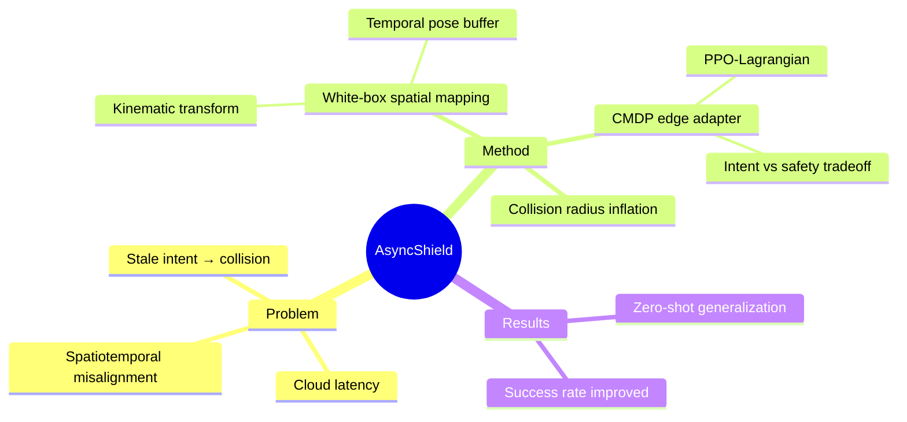

## Summary

解决 cloud-based VLA navigation 的 latency 问题：网络抖动 + 推理延迟导致 stale intent（过去 ego frame 的指令在当前 frame 已 spatially incorrect）→ 碰撞。提出 plug-and-play edge adapter：temporal pose buffer + kinematic transformations（白盒空间映射）+ CMDP edge adapter（PPO-Lagrangian）+ Collision Radius Inflation。Zero-shot generalization，无需 fine-tune cloud model。

> [未获取全文，仅基于 abstract]

## Problem & Motivation

**问题**：VLA models 参数量大需云端部署，但云端推理带来 latency（网络抖动 + 推理时间）。在 mobile navigation 场景下，continuous displacement + latency = **spatiotemporal misalignment**：
- VLA 在 t₀ 时刻基于 ego frame 生成 intent（如"前进 1 米"）
- 实际执行时已是 t₁ 时刻，robot 已移动了 Δd
- intent 在当前 frame 下 spatially incorrect → 可能导致碰撞

**为什么重要**：cloud-based VLA deployment 是必然趋势（模型规模），但 latency 问题限制了实际部署安全性。

**洞察**：传统解决方案是 black-box time-series prediction（预测 future intent），但作者选择 white-box spatial mapping——将 temporal lag 显式转换为 spatial offset。物理确定性优于 ML prediction。

## Method

**AsyncShield 框架**：

1. **White-Box Spatial Mapping**（核心设计）
   - 维护 temporal pose buffer（历史位姿）
   - Kinematic transformations：将 temporal lag Δt 转换为 spatial pose offset Δs
   - 恢复 VLA 的 original geometric intent（而非预测 intent）
   - **关键理念**：deterministic physical mapping > black-box ML prediction

2. **CMDP Edge Adapter**
   - 将 edge adaptation 建模为 Constrained MDP
   - 目标：intent restoration fidelity vs physical safety 的 trade-off
   - Solution：PPO-Lagrangian algorithm
   - RL adapter 在"跟踪 VLA intent"和"LiDAR obstacle avoidance"之间动态权衡

3. **Collision Radius Inflation**
   - Perception-level adaptation：膨胀 collision radius
   - 安全 margin，应对 latency uncertainty

4. **Plug-and-Play Design**
   - Standardized universal sub-goal interface
   - Domain randomization
   - 无需 fine-tune cloud-based foundation model

**技术亮点**：CMDP + PPO-Lagrangian 处理 safety constraint——这是 RL 中经典的 constrained optimization 问题。

## Key Results

> [未获取全文，仅基于 abstract]

- **Zero-shot generalization**：无需 fine-tune cloud model
- **Success rate + physical safety improvement**：simulation + real-world experiments（具体数字未披露）

**缺失信息**：具体的 success rate 数字、baseline 选择、latency 范围、CMDP constraint 设置——需全文获取。

## Strengths & Weaknesses

**Strengths**:
- **问题精准**：spatiotemporal misalignment 是 cloud-based VLA 的真实痛点，定位清晰
- **White-box vs Black-box 思辨**：选择确定性物理映射而非 ML prediction——这是 engineering philosophy 的选择，值得尊重
- **Plug-and-Play design**：无需 fine-tune foundation model，部署友好

**Weaknesses**:
- **Latency range 未披露**：abstract 未给出具体 latency 数值——这直接影响方法适用性（如果是 100ms 级别 vs 1s 级别，设计完全不同）
- **CMDP constraint 设置**：obstacle avoidance hard constraint 的具体形式未说明——是 distance threshold？collision probability？
- **Success rate 数字缺失**："improving success rate"但无具体数字——无法判断实际效果
- **与 GUI Agent 关联度低**：这是 Embodied/VLA navigation 问题，GUI Agent 暂无 latency constraint（local inference）

**与 Agenda 关联**：非直接贡献——是 VLA deployment infrastructure 而非 GUI Agent RL。但 CMDP + PPO-Lagrangian 的 constrained RL 设计可启发 GUI Agent safety-aware action selection。

## Mind Map

## Notes

- White-box vs Black-box 的 design choice 值得深思：ML prediction 可能更 accurate 但 deterministic mapping 更 reliable——在 safety-critical 场景，reliability > accuracy
- CMDP formulation 可借鉴：GUI Agent 的 action selection 可建模为 constrained RL（如"完成任务"objective + "不破坏 UI"constraint）
- Temporal pose buffer 设计：类似于 trajectory memory，可启发 GUI Agent 的 action history utilization