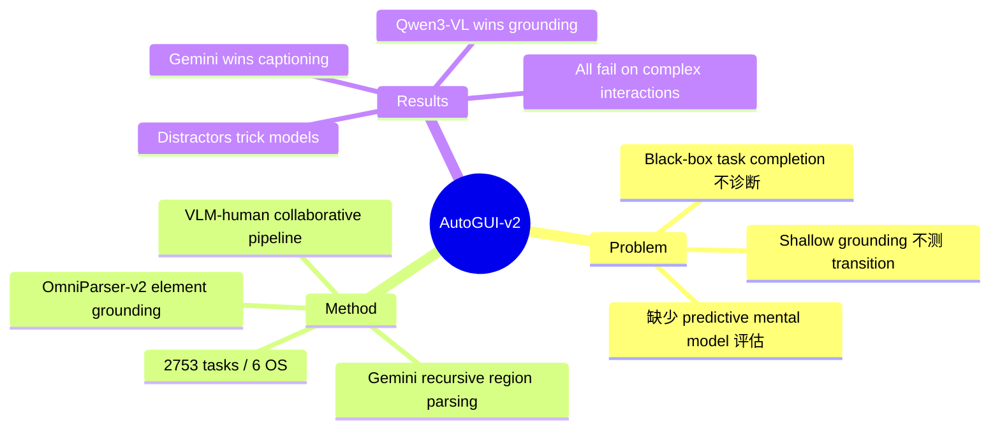

## Summary

AutoGUI-v2 提出一个 GUI 功能理解 benchmark，评估 VLM-based GUI agent 的"深度功能理解"能力——不仅是定位元素，还要理解区域功能语义和预测交互结果。关键发现：开源模型（Qwen3-VL）在功能性 grounding 上超越商业模型，但商业模型（Gemini-2.5-Pro-Thinking）在功能性 captioning 上更强；所有模型在复杂交互逻辑和不常见 action 上表现惨淡。

## Problem & Motivation

现有 GUI Agent benchmark 存在两类局限：
1. **Task-completion benchmarks**（AndroidWorld、OSWorld）：只看 black-box 成功率，不诊断 agent 如何理解 GUI 功能
2. **Grounding benchmarks**（SeeClick、ScreenSpot）：只测 simplistic element localization，依赖 brief appearance descriptions 或 alt-texts，不测 transition logic 或 GUI context

核心 gap：缺少评估 agent 是否真正理解 GUI 功能性和交互结果的 benchmark。真正的 digital autonomy 需要 **predictive mental model of interface dynamics**——预测 action 后的 "digital world state"，这是人类 competence 的 hallmark。

## Method

**VLM-human collaborative pipeline** 构建层次化功能区域标注：

1. **Region-Level 功能理解**
   - 用 Gemini-2.5-Pro-Thinking 递归分割 screenshot 为 hierarchical functional regions
   - VLM-based scorer 验证 + manual annotation 精修
   - 生成两类任务：
     - **Functionality Grounding**: 给功能描述，定位对应区域
     - **Interaction Outcome Prediction**: 预测 action 后的 state change

2. **Element-Level 功能理解**
   - 用 OmniParser-v2 辅助 grounding 和 captioning task 生成

3. **数据集规模**: 2,753 tasks，覆盖 6 个操作系统

## Key Results

**核心发现：VLM 能力 dichotomy**

| Task Type | Winner | 具体表现 |
|:----------|:-------|:--------|
| Functionality Grounding (定位"where") | **Qwen3-VL** (开源) | open-source fine-tuned on agent data 超越 commercial |
| Functionality Captioning (推理"what") | **Gemini-2.5-Pro-Thinking** (商业) | 商业模型在功能语义描述上更强 |

**Failure Mode 分析**：
- **Irregular region types**: 性能暴跌——模型依赖 overt cues，无法 grasp implicit functionality
- **Complex interactions**: 所有模型 struggle with uncommon action 的交互逻辑
- **Hard distractors**: 模型被"plausible distractors"（visual similar but functionally distinct）系统性 tricked——说明失败源于缺乏 context-aware functionality understanding，不是 random error

## Strengths & Weaknesses

**亮点**：
- 问题定位精准——指出现有 benchmark 只测 surface-level grounding，不测 deep functional understanding
- Dichotomy 发现有洞察——"where" vs "what" 能力分离说明 fine-tuning 的 value proposition
- Failure mode 分析深入——plausible distractors 设计揭示模型真正短板

**局限**：
- 2,753 tasks 规模偏小（vs AndroidWorld 等）
- VLM-human pipeline 的 scalability 未验证——Gemini 分割 + manual 精修成本如何？
- 未给出具体 accuracy numbers（HTML 获取受限）
- "predict interaction outcome" 的评估标准未明确——如何判断预测正确？

**对 GUI Agent 方向的启示**：
- Fine-tuning on agent data 对 grounding 有显著价值（开源超越商业）
- Deep functional understanding 是下一个瓶颈——transition logic / implicit functionality
- 与 AutoGUI-v1 相比，增加了 region-level 和 state prediction，evaluation granularity 提升

## Mind Map

## Notes

- 与 [[2604-ClawGUI]]、[[2604-StepLevelOptimization]] 形成 GUI Agent evaluation 范式 shift 的三角证据：从 binary success → multi-dimensional capability diagnosis
- Dichotomy 发现与 [[Workbench/memory/patterns.md]] 中 "VLM capabilities fragmented across sub-tasks" pattern 一致
- Region-level functionality understanding 可能是 grounding robustness 的关键——scale-invariant grounding 需要理解 region context，不只是 pixel-level matching