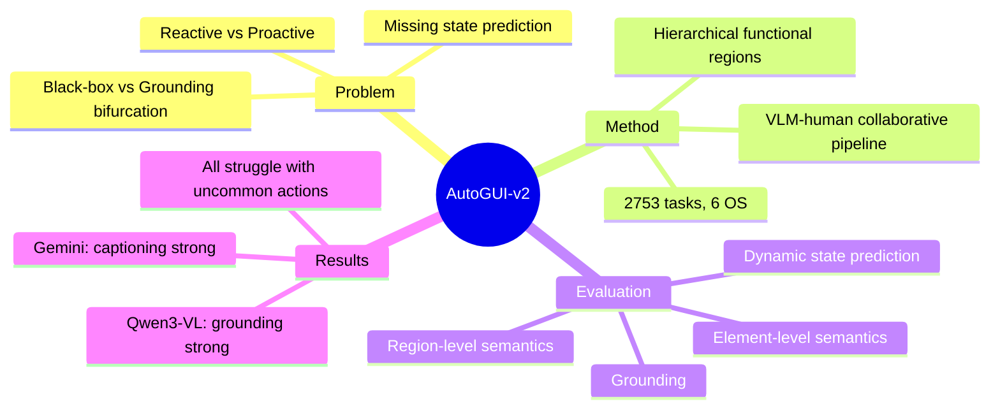

## Summary

AutoGUI-v2 是一个评估 GUI Agent 深度功能理解和交互结果预测的 benchmark，覆盖 2,753 个任务跨 6 个操作系统，测试 region/element-level semantics、grounding 和 dynamic state prediction。

## Problem & Motivation

现有 GUI Agent benchmark 的核心局限：
- **能力评估不完整**：要么关注 black-box task completion，要么关注 static shallow grounding，缺乏对 GUI 隐式功能和转换逻辑的理解评估
- **Reactive vs Proactive**：现有 benchmark 只关注 reactive element matching，忽略了 agent 是否具备预测界面动态变化的能力
- **缺少 state prediction**：未能评估 agent 是否真正理解交互后的 "digital world state" 变化

真正的 digital autonomy 不仅需要知道"点击哪里"，还需要预测"点击后会发生什么"。

## Method

> [未获取全文，仅基于 abstract]

**数据构建**：VLM-human collaborative pipeline，递归解析 multi-platform screenshots 为 hierarchical functional regions

**评估维度**：
1. **Region-level semantics**：理解界面区域的功能语义
2. **Element-level semantics**：理解单个元素的功能
3. **Grounding**：定位界面元素
4. **Dynamic state prediction**：预测交互后的状态变化

**规模**：2,753 tasks across six operating systems

## Key Results

> [未获取全文，仅基于 abstract]

**关键发现 - VLM 能力的二分性**：
- **Open-source models (e.g., Qwen3-VL)**：在 functional grounding 上表现优异
- **Commercial models (e.g., Gemini-2.5-Pro-Thinking)**：在 functionality captioning 上占主导

**共同弱点**：所有模型在 uncommon actions 的复杂交互逻辑上表现挣扎，说明 deep functional understanding 仍是显著挑战。

## Strengths & Weaknesses

**亮点**：
- 问题定义精准：从 reactive grounding 到 proactive functionality understanding + state prediction
- 数据构建方法有创新：VLM-human collaborative pipeline，递归解析 hierarchical functional regions
- 评估维度全面：region/element-level semantics + grounding + dynamic state prediction
- 揭示了 VLM 能力的二分性（grounding vs captioning）

**局限**：
- 2,753 tasks 的规模相对其他 benchmark 偏小
- 六个操作系统的具体分布和跨平台泛化能力待验证
- 未获取全文，数据和实验细节待补充

## Mind Map

## Notes

> [未获取全文，仅基于 abstract]

待追踪：
- 六个操作系统的具体分布
- VLM-human collaborative pipeline 的详细设计
- 与现有 benchmark（AndroidWorld、Mind2Web、GUIAct 等）的对比
- Uncommon actions 的定义和分布
- Full paper 的实验细节和 ablation