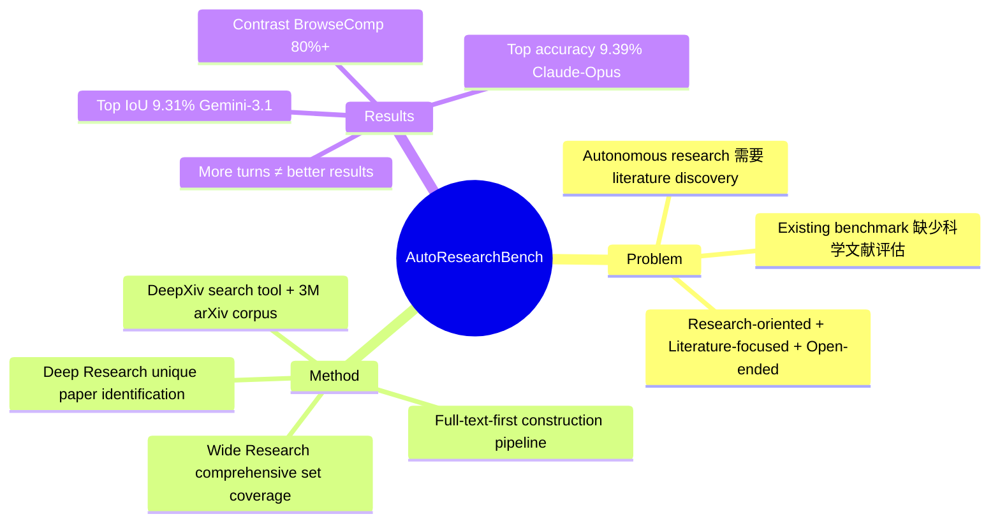

## Summary
提出 AutoResearchBench benchmark，评估 AI agents 在科学文献发现上的能力。包含 Deep Research（找特定目标论文）和 Wide Research（收集满足条件的一组论文）两种任务类型，基于 3M+ arXiv 论文 corpus。最强模型仅达到 9.39% Deep Research accuracy 和 9.31% Wide Research IoU，暴露出当前 frontier models 在科学文献搜索上的严重能力缺口。

## Problem & Motivation
科学文献发现是 autonomous research 的核心能力——需要探索已知知识、验证假设、支撑 claim。现有 agent benchmark（GAIA、BrowseComp）聚焦通用 web browsing，缺少对科学文献搜索的专门评估。科学文献搜索的独特挑战：
- **Research-oriented**：需要深度理解科学概念而非浅层匹配
- **Literature-focused**：关键证据隐藏在 full-text（方法细节、ablation table、figure caption、appendix），而非 title/abstract
- **Open-ended**：答案数量未知（可能 0、1 或多个），需要 deliberate reasoning 和 stopping decision

## Method
### Benchmark 设计
- **Deep Research**：|Y*(q)| ∈ {0,1}，agent 必须找到唯一目标论文或确认不存在。Constraint 通过 full-text mining + citation multi-hop + fuzzification 构建，遵循 minimal-sufficiency 原则
- **Wide Research**：找到所有满足条件的论文集合，使用 IoU 评估 precision + coverage

### Construction Pipeline
- 基于 DeepXiv 平台的 3M+ arXiv corpus
- Full-text-first construction：避免 shallow metadata matching
- Human-machine collaborative verification：LLM ensemble voting + expert audit
- 1000 queries（600 Deep + 400 Wide），覆盖 8 个 CS domain

### Evaluation Framework
- ReAct-based agent + DeepXiv search tool
- 测试 12 个 frontier models（Claude-Opus-4.6、GPT-5.4、Gemini-3.1-pro 等）+ 3 个 end-to-end systems

## Key Results
- **Deep Research Accuracy**：Claude-Opus-4.6 最高 9.39%，GPT-5.4 7.44%，多数模型 <5%
- **Wide Research IoU**：Gemini-3.1-Pro 最高 9.31%，Claude-Opus-4.6 6.56%
- **对比 BrowseComp**：frontier models 在通用 web benchmark 可达 80%+，但在此 benchmark <10%，暴露 distinct capability gap
- **Key findings**：
  1. 更多 interaction turns 不等于更好结果（GPT-5.4 仅 6.1 turns 达 7.44%，Deepseek-V3.2 28.8 turns 仅 4.2%）
  2. Scientific reasoning over complex constraints 是主要瓶颈
  3. Agents 缺乏 comprehensiveness 和 reflection（过度扩展或过早终止）
  4. Thinking mode 和 test-time scaling 收益有限

## Strengths & Weaknesses
### Strengths
- **问题定义精准**：直击 autonomous research 的核心痛点——科学文献发现
- **任务设计有深度**：Deep/Wide dual paradigm 捕捉真实研究 workflow 的两种需求
- **Construction pipeline 严谨**：full-text-first + minimal-sufficiency + human verification 避免 contamination
- **数字够"毒"**：<10% 的 performance 一刀砍穿 frontier models 的假象 saturation

### Weaknesses
- **18 人作者团队**：贡献分工不明，auto-research tag 的高分 candidate 但作者列表膨胀
- **依赖 DeepXiv 平台**：自建平台 + 自建 benchmark，闭环程度高，独立复现难度大
- **End-to-end systems 仅测 50 queries**：样本量偏小，statistical significance 存疑
- **No method innovation**：纯 benchmark 论文，无提出新方法或架构改进
- **Error analysis 偏定性**：Appendix F 的 error type 分类有价值但缺乏 quantitative breakdown

## Mind Map

## Notes
- 与 [[auto-research]] tag 下其他论文（The AI Scientist、Agent Laboratory）形成呼应——benchmark 为 downstream application 提供评估基础设施
- 可思考：如何提升 agent 的 constraint decomposition + full-text comprehension 能力？是否需要 specialized retrieval model 而非 general web agent？