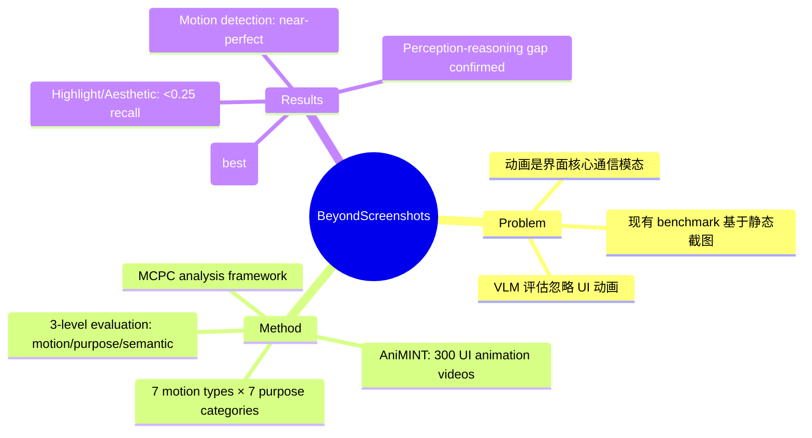

## Summary
提出 AniMINT benchmark（300 个 UI 动画视频），首次系统评估 VLM 对 UI 动画的理解能力，发现 VLM 在基础运动检测上表现良好但在功能意图理解上远逊于人类，存在显著的 perception-reasoning gap。

## Problem & Motivation
AI Agent 操作用户界面时必须理解界面如何通过动画传达状态和反馈。动画在现代 UI 中承担关键功能角色（引导注意力、反馈操作结果、演示交互方式），而非仅是装饰。现有 VLM 评估主要基于静态截图，忽略了动画这一核心交互模态，导致对 Agent 在真实动态 UI 环境中的能力评估不完整。

现有 benchmark 的局限：(1) 关注静态 UI 理解（ScreenQA、WidgetCaptioning 等），(2) 动态 GUI benchmark（如 DynamicGUI）关注 POMDP 下的决策问题而非动画语义理解，(3) 无专门评估 VLM UI 动画理解能力的系统性 benchmark。

## Method

### AniMINT Benchmark
- **数据集**：300 个 UI 动画视频片段，来自 desktop、web、mobile 环境，中位时长 3.59 秒
- **标注体系**：
  - **7 种基础运动类型**：move, rotate, size, color, fade, blur, morph
  - **7 种功能目的类别**：Transition, Demonstration, Guidance, Feedback, Visualization, Highlight, Aesthetic
  - 专家标注功能类别，300 名众包用户生成 3,000 条开放式语义描述
- **评估框架**：三个层次的能力测试
  - **Motion Detection**：识别基础运动模式
  - **Purpose Categorization**：分类功能意图
  - **Semantic Interpretation**：生成语义解释，与人类参考答案做语义相似度比较

### 评估设置
- 零样本评估，无微调
- 视频下采样至 10fps，绿色 bounding box 标注关注区域
- 评估 9 个 VLM：GPT-5, GPT-5-mini, GPT-o4-mini, GPT-o3, Gemini-2.5-Pro, Gemini-2.5-Flash, Claude-Sonnet-4, Qwen-2.5-VL-72B, GLM-4.5V

### MCPC 分析框架
提出 Motion, Context, Perceptual Cues (MCPC) 三因素分析：
- **Motion**：时序融合（前帧与淡出透明度混合），提供运动信息
- **Context**：用户交互历史等情境数据
- **Perceptual Cues**：可见运动的文字描述

> [未获取全文，仅基于 abstract 和 HTML 摘要] 用户 abstract 提到两种 mitigation strategies（multi-view prompting 和 animation-to-description transformation），但 HTML 全文中未找到详细描述，可能位于 PDF 版本中。

## Key Results

### 运动检测
- 5 个模型达到近乎完美的基础运动分类，但存在幻觉错误

### 功能目的分类
- 最佳模型（Gemini-2.5-Pro）：accuracy 0.64, macro F1 0.55
- **按类别差异显著**：
  - 表现较好：Feedback (0.69), Visualization (0.69), Demonstration (0.63), Guidance (0.59), Transition (0.54)
  - 表现极差：Highlight (0.24), Aesthetic (0.16)

### 语义解释
- 最佳模型得分 3.47±0.91（评分尺度未确认），多数输出仅捕获大意但遗漏关键细节

### MCPC Ablation
- Motion 单独有助于分类
- 三因素结合效果最优：accuracy 提升至 0.61, interpretation mean 提升至 3.52
- 存在明显的协同效应

### 诊断发现
- 模型倾向于关注静态帧而非动画本身
- 小 ROI 区域造成识别困难
- 模型经常忽略用户手势等上下文信息
- 专家标注一致性：Krippendorff's α=0.78

## Strengths & Weaknesses

**Strengths**：
- **问题定义有价值**：首次将 UI 动画理解作为独立能力维度评估，填补了 VLM 评估的重要空白
- **标注体系设计合理**：从基础运动到功能意图的分层评估框架，7 种运动类型 × 7 种目的类别的组合覆盖全面
- **分析深入**：MCPC 框架为理解 VLM 动画理解的瓶颈提供了结构化视角，诊断分析（静态帧偏置、ROI 大小影响）有实用价值
- **开放资源**：benchmark、评估工具、代码全部公开

**Weaknesses**：
- **数据规模有限**：300 个视频片段对于系统性评估偏少，尤其在 Highlight 和 Aesthetic 类别上样本可能更少
- **Mitigation 策略初步**：MCPC 更多是分析框架而非端到端解决方案，multi-view prompting 和 animation-to-description 在 HTML 版本中缺乏细节
- **评估模型数量**：HTML 版本显示评估了 9 个模型（非 abstract 中的 15 个），可能版本间有差异
- **时序建模瓶颈未解**：论文诊断了 temporal aliasing 和 visual token limitation 问题，但未提出根本性的架构层面解决方案
- **静态帧偏置问题**：这是当前 VLM 架构的内在局限，单靠 prompting 编辑难以根本解决

## Mind Map

## Notes
- 与 DynamicGUI 的关系：DynamicGUI 关注 POMDP 下的动态环境决策（video input for hidden state），本文关注动画本身的语义理解。两者互补——DynamicGUI 解决"看不到"的问题，本文解决"看不懂"的问题。
- Perception-reasoning gap 是一个重要发现：VLM 能描述动画外观但无法解释其交互含义，这对 GUI Agent 的可靠性有直接影响。
- 对 GUI Agent 研究的启示：当前 GUI Agent 依赖截图理解 UI 状态，但动画承载的状态转换信息在截图中完全丢失。可能需要 (1) 视频输入能力，(2) 动画语义先验知识，或 (3) 动画描述生成模块。
- Highlight 和 Aesthetic 类别的极低召回率（0.24/0.16）暗示 VLM 对"隐性"UI 意图的理解能力远弱于对"显性"功能反馈的理解。
- 评分 4：方向重要（GUI Agent 动态理解），benchmark 设计有价值，但方法层面贡献偏诊断性。
