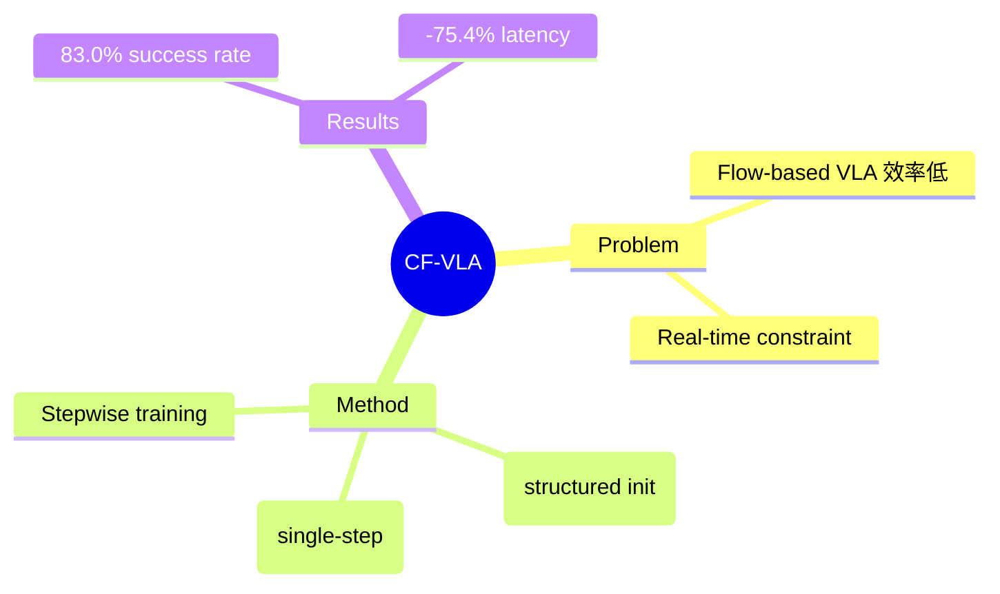

## Summary

CF-VLA 用 coarse-to-fine 两阶段重构 action generation：coarse stage 构建 action-aware starting point，fine stage 单步修正残余误差。解决 flow-based VLA 的 efficiency-quality trade-off 问题。

## Problem & Motivation

Flow-based VLA 问题：
- Multi-step inference 从 Gaussian noise 恢复 action structure 效率低
- Real-time constraints 下 efficiency-quality trade-off 差

## Method

**核心设计**：
1. **Coarse stage**: 学习 conditional posterior over endpoint velocity，构建 structured initialization
2. **Fine stage**: 单步 refinement
3. **Stepwise training strategy**: 先学 controlled coarse predictor，再 joint optimization

**优势**: NFE=2 优于现有方法，NFE=10 匹配 π₀.₅ baseline

## Key Results

- CALVIN 和 LIBERO 验证
- Action sampling latency -75.4%
- Real-robot success rate 83.0%（超过 MIP 19.5pt，π₀.₅ 4.0pt）
- Score 6

## Strengths & Weaknesses

**亮点**：
- Coarse-to-fine 设计合理
- 83.0% real-robot success rate 数字亮眼
- -75.4% latency 显著

**局限**：
- 与 World Model 关联：这是 action generation efficiency，而非环境建模
- Flow-based VLA 特定优化

## Mind Map

## Notes

> [基于 arXiv abstract]

VLA action generation efficiency 优化。83.0% real-robot success rate 是有价值的数据点。与 World Model 关联较弱。