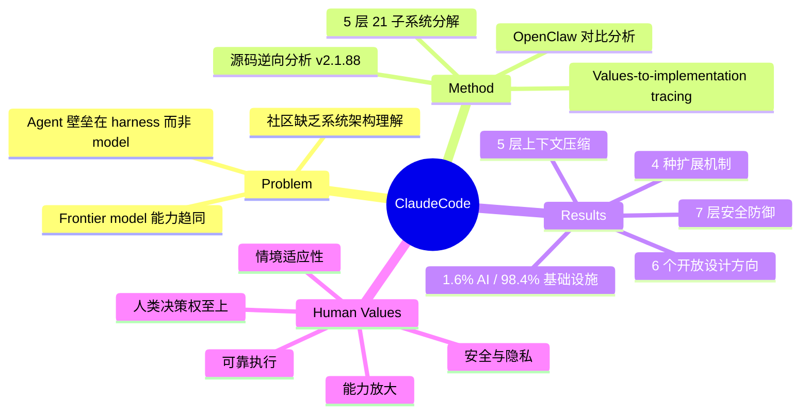

## Summary

通过逆向分析 Claude Code 公开的 TypeScript 源码（v2.1.88, ~512K LOC），系统还原了生产级 AI Agent 的完整架构设计。核心发现：仅 1.6% 的代码是 AI 决策逻辑，其余 98.4% 是确定性基础设施（权限门控、上下文管理、工具路由、恢复机制）。论文将 5 项 human value 追溯至 13 条 design principle 再映射到具体实现，并与 OpenClaw 对比展示了相同设计问题在不同部署场景下的不同架构答案，最后提出 6 个开放设计方向。

## Problem & Motivation

随着 frontier model 能力趋同，AI Agent 系统的竞争壁垒正从模型本身转移到周围的基础设施（harness）。然而，社区对生产级 Agent 的完整架构缺乏系统理解——大多数 agent framework 只关注 scaffolding 复杂度，忽略了安全、上下文管理、可扩展性等确定性工程问题。本文通过拆解 Claude Code（目前最成熟的 agentic coding tool 之一），回答一个核心问题：**一个真正可用的 AI Agent 系统到底需要哪些非 AI 组件，以及这些组件的设计空间是什么样的？**

## Method

研究方法为四步：

1. **源码级逆向分析**：Claude Code v2.1.88 的 npm 包意外泄露了 ~59.8MB 的 source map，暴露了完整 TypeScript 源码（~1,902 文件，~512K 行）。研究团队据此进行系统性架构还原。

2. **架构分解**：将系统分解为 5 层 21 个子系统：
   - **Surface Layer**：CLI、headless mode、Agent SDK、IDE 集成
   - **Core Layer**：`queryLoop()` agent 循环 + 5 级压缩管道
   - **Safety/Action Layer**：7 种权限模式、ML 分类器、27 种 hook 事件、沙盒
   - **State Layer**：append-only JSONL 会话记录、4 级 CLAUDE.md 层级
   - **Backend Layer**：Shell 执行、MCP 服务器（8+ 传输协议）

3. **Values-to-implementation tracing**：从 5 项 human value 出发，通过 13 条 design principle 向下追溯至具体实现选择。这是一个在软件架构文献中罕见的"价值观到代码"的完整映射。

4. **对比分析**：与 OpenClaw（独立开源 multi-channel personal assistant gateway）进行 6 维度对比，展示相同设计问题在不同部署上下文中的不同架构答案。

## Key Results

论文不涉及传统 benchmark 实验，核心发现为架构层面的 insight：

- **1.6% / 98.4% 代码比例**：核心 `queryLoop()` 仅包含调用模型和执行工具的简单 while 循环（ReAct pattern），真正的工程复杂度全在循环外围。
- **7 层纵深防御安全模型**：工具预过滤 → deny-first 规则评估 → 7 种权限模式 → ML 自动分类器 (`yoloClassifier.ts`) → shell 沙盒 → 恢复时不还原权限 → Hook 拦截。两个已披露 CVE（CVE-2025-59536、CVE-2026-21822）共享同一根因：扩展在用户确认前已开始执行（"预信任执行窗口"）。
- **5 层渐进式上下文压缩**：Budget Reduction → Snip → Microcompact → Context Collapse → Auto-Compact，从轻到重逐级降级，优先尝试 cache-aware 的轻量压缩，最后才使用 LLM 摘要。
- **4 种扩展机制**（按上下文代价分层）：Hooks（零成本，27 种事件）→ Skills（极低成本，按需注入）→ Plugins（中等成本，主要分发渠道）→ MCP Servers（高成本，远程工具墙）。
- **Subagent 委托**：6 种内置 agent 类型 + 自定义 Markdown agent，通过 git worktree 隔离，仅摘要返回父上下文。
- **93% 的权限请求被用户直接批准**（approval fatigue），自动批准率从 20% 经 750 次会话后升至 40%+，表明信任是随时间共建的轨迹。
- **27% 的用户完成了原本不敢尝试的任务**，Claude Code 被定位为"Unix 工具"而非"传统产品"。
- **OpenClaw 对比**：Claude Code 采用 per-action deny-first，OpenClaw 采用 perimeter-level access control；前者是绑定项目的临时 CLI 进程，后者是常驻守护进程/网关控制平面。

## Strengths & Weaknesses

**Strengths：**
- 提供了生产级 Agent 系统的完整架构蓝图，是构建 agent 系统的重要参考。Values-to-implementation 的追溯链在软件架构文献中罕见，具有方法论价值。
- 1.6%/98.4% 的比例具有极强的说服力，有力论证了"harness 而非 model 是 agent 系统的核心壁垒"这一论点。
- 安全分析深入（7 层防御 + CVE 分析），揭示了 agent 系统特有的安全挑战（预信任执行窗口），对 agent 安全研究有直接启发。
- 与 OpenClaw 的对比不是简单的 feature 比较，而是从设计哲学层面展示了 trade-off，增加了分析的深度和 generalization。
- 提出的 6 个开放方向（特别是 silent failure、cross-session persistence、human skill preservation）具有实际研究价值。

**Weaknesses：**
- 分析基于单一系统的单一版本快照（v2.1.88），无法捕捉架构演进动态。设计原则的提取也是基于静态代码的反向推断，而非设计文档或设计者访谈，存在推测成分。
- 对"1.6% AI decision logic"的定义不够精确——基础设施代码中也包含大量与 AI 行为耦合的逻辑（如 prompting、tool description、context assembly），严格区分 AI/non-AI 的边界本身是 fuzzy 的。
- 缺少对替代设计方案的实验性比较。例如，5 层压缩管道与简单的 sliding window + summarization 究竟差多少，论文没有提供定量证据。
- 对比对象 OpenClaw 与 Claude Code 的成熟度差异巨大（商业产品 vs 开源项目），对比的公平性存疑。
- 四个作者均来自同一机构（MBZUAI），且 Analyzer 角色与研究团队重叠，缺少外部视角的交叉验证。

**对领域的潜在影响：**
- 这篇论文可能成为 Agent 系统工程化的标志性文献，类似于 MapReduce/GFS 之于分布式系统。"Harness-driven agent design" 这个 framing 可能成为一个新的研究方向。
- 6 个开放方向中有几个（特别是 silent failure 和 cross-session persistence）与我们的 GUI Agent 研究直接相关——GUI Agent 同样面临执行正确性难以自动验证和跨会话知识积累的问题。

## Mind Map

## Notes

- **与自身研究的连接点**：我们正在构建 GUI Agent 基础设施，这篇论文的"harness-first"哲学直接适用——GUI Agent 同样需要 permission system、context management、recovery logic 等非 AI 组件。
- **Silent failure 问题**：论文指出 ~78% 的 AI Agent 失败是"不可见的"（无报错但结果错误），GUI Agent 中这个问题可能更严重（点击了错误的按钮但页面仍正常加载）。AdversarialVerification idea 正是针对此问题。论文暗示需要 built-in evaluation hooks，这是架构层面的需求。
- **Cross-session persistence**：论文认为当前架构在无状态会话与静态 CLAUDE.md 之间缺少"累积知识层"。GUI Agent 同样面临这个问题——每次任务从零开始，无法复用过去的操作经验。
- **质疑 1.6% 数字**：基础设施代码中也包含大量 prompt engineering、tool description、context assembly 等与 AI 行为高度耦合的代码。将"AI logic"窄化为模型调用本身，可能低估了 harness 中与 AI 协同设计的部分。这个 framing 可能有战术性的传播目的（制造记忆点），需要批判性看待。
- **阅读建议**：如果时间有限，重点读 Sections 3（Architecture）、4（Design Principles）、6（Open Directions）。Section 5（OpenClaw 对比）虽然有趣但相对次要。
