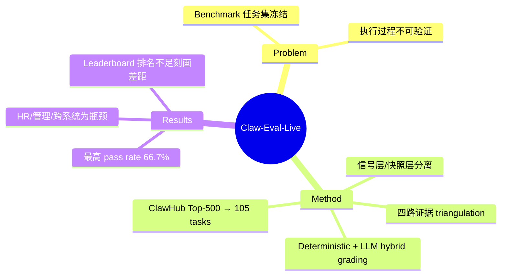

## Summary

> [!summary] Claw-Eval-Live: A Live Agent Benchmark for Evolving Real-World Workflows
> - **核心**: 一个"活"的 workflow agent benchmark，核心创新是分离可刷新的信号层（从公开 workflow-demand 信号更新）与可复现的时间戳发布快照，解决传统 benchmark 任务集冻结、无法追踪执行过程的痛点。
> - **方法**: ClawHub Top-500 skills → 105 controlled tasks + fixtures/services/workspaces/graders；四路证据（execution traces + audit logs + service state + workspace artifacts）；deterministic check 优先，LLM judge 仅用于语义维度。
> - **结果**: 13 个 frontier 模型评测，最高 pass rate 仅 66.7%，无一超过 70%；HR/management/多系统 business workflow 是持续瓶颈，local workspace repair 相对简单但未饱和；相似 pass rate 的模型在整体完成度上可分化。
> - **Sources**: [paper](https://arxiv.org/abs/2604.28139) | HuggingFace Daily (28 upvotes)
> - **Rating**: 3 - 有参考价值（live benchmark 设计范式新颖，实证揭示 workflow automation 远未解决，但作为新出 benchmark 社区采纳度待观察）

**Key Takeaways:**
1. **Benchmark 会"过期"**: 传统 benchmark 在发布时冻结任务集，但真实 workflow 需求持续演化——Claw-Eval-Live 通过可刷新信号层 + 时间戳快照分离，让评测能跟上外部需求变化，同时保持可复现性。
2. **Workflow automation 远未解决**: 最强模型仅 66.7% pass rate，HR/管理/跨系统业务流程是顽固瓶颈——这比单纯报一个 aggregate number 更有诊断价值。
3. **Pass rate 相似不代表能力等效**: 论文发现相似 pass rate 的模型在整体完成度上可分化，leaderboard 排名不足以刻画真实差距——task-level discrimination 集中在中间难度带。

---

## Problem & Motivation

现有 agent benchmark 的两个核心问题：

1. **任务集冻结**: 大多数 benchmark 在发布时固定任务集合，无法反映真实 workflow 需求的演化。Agent 需要完成的 end-to-end 工作单元（跨软件工具、业务服务、本地工作空间）随时间变化，但评测任务集静态不变。

2. **执行过程不可验证**: 多数 benchmark 只 grading 最终输出（final response），无法验证任务是否真正被执行、执行轨迹是否合规。这对于需要操作真实服务/文件的 workflow agent 尤其关键——最终输出看起来正确，但可能跳过了关键步骤或伪造了结果。

**为什么重要**: Workflow agent 的部署可靠性取决于两个条件：(a) 能跟上外部需求变化；(b) 执行过程可审计、可复现。现有 benchmark 无法同时满足这两个条件。

---

## Method

### 架构：双层分离

Claw-Eval-Live 的核心设计是 **信号层与快照层分离**：

| Layer | 功能 | 特性 |
|:------|:-----|:-----|
| **信号层** | 从公开 workflow-demand 信号抓取任务需求 | 可刷新，随外部需求演化 |
| **快照层** | 每次发布时 freeze 任务集、fixtures、services、workspaces、graders | 时间戳标记，可复现 |

这种设计让 benchmark 能：
- 跟上外部 workflow 需求变化（通过信号层刷新）
- 保持评测可复现性（通过快照层固定）

### 任务来源：ClawHub Top-500 Skills

当前 release 从 ClawHub（一个公开的 workflow-demand 信号源）的 Top-500 skills 抽取：
- 105 tasks 覆盖 controlled business services + local workspace repair
- 每个任务有固定 fixtures、services、workspaces、graders

### 评测证据：四路独立

| Evidence | 来源 | Agent 可见性 |
|:--------|:-----|:------------|
| **Execution traces** | Agent 的 tool calls + reasoning | Agent 产生，不可篡改（沙箱外记录） |
| **Audit logs** | Mock services 的内部日志 | Service 自记，Agent 无法访问 |
| **Service state** | 服务运行时的状态快照 | Agent 终止后采集 |
| **Workspace artifacts** | 文件系统最终态 | Agent 终止后采集 |

这四路证据形成 triangulation——agent 无法同时伪造所有证据链。

### Grading 策略：Hybrid

- **Deterministic checks 优先**: 当证据足够（如 audit log 参数匹配、workspace 文件存在）时使用规则检查
- **LLM judge 仅用于语义维度**: 如文本质量、意图对齐等无法用规则判定的维度

---

## Key Results

### 主结果：Workflow automation 远未解决

13 个 frontier 模型评测结果：

| Metric | 最佳模型 | 数值 |
|:-------|:---------|:-----|
| Pass rate | Leading model | 66.7% |
| 70% threshold | None achieved | — |

**结论**: 可靠的 workflow automation 仍是未解决的问题——最强模型也只通过了约 2/3 的任务。

### 失败模式诊断

按 task family 和 execution surface 分析失败分布：

| Task Family | 难度 |
|:------------|:-----|
| HR workflows | 瓶颈 |
| Management workflows | 瓶颈 |
| Multi-system business workflows | 瓶颈 |
| Local workspace repair | 相对简单，但未饱和 |

**观察**: HR/管理/跨系统业务流程是持续瓶颈，而本地工作空间修复相对简单但仍未达到高 pass rate。

### Leaderboard 排名的局限

论文发现：
1. **相似 pass rate ≠ 能力等效**: 相似 pass rate 的模型在整体完成度上可分化
2. **Task-level discrimination 集中在中间带**: 过简单/过难的任务对模型区分度低，中等难度任务才是真正的 discriminative band

---

## Strengths & Weaknesses

### Strengths

1. **"Live benchmark" 范式新颖**: 信号层/快照层分离的设计解决了一个真实痛点——benchmark 过期问题。这个范式理论上可以推广到其他需要跟上外部需求演化的评测场景。

2. **四路证据 triangulation**: execution traces + audit logs + service state + workspace artifacts 的组合比单纯看 final output 更能捕捉执行过程的真实性。

3. **诊断性报告**: 不仅报 aggregate pass rate，还按 task family 分析瓶颈分布，揭示"workflow automation 在哪些领域最难"——这种细粒度分析对社区有指导价值。

4. **实证揭示差距**: "最强模型 66.7%，无一超过 70%"是一个清晰的 signal——workflow automation 远未 solved，不是被 benchmark saturate 的问题。

### Weaknesses

1. **任务量偏小**: 105 tasks 覆盖 controlled business services + local workspace repair，但对于"workflow automation"这个宏大命题，任务覆盖面可能不足。特别是信号层从 ClawHub Top-500 抽取，但最终只有 105 tasks 落地——筛选过程是否引入偏差？

2. **信号层 fidelity 未验证**: ClawHub 作为 workflow-demand 信号源，其 Top-500 skills 是否真正反映真实 workflow 需求？论文未讨论信号源本身的可靠性。

3. **与 Claw-Eval 关系未明确**: Claw-Eval-Live 与已有的 Claw-Eval (2604.06132) 是什么关系？是 extension、替代还是互补？论文没有清晰定位两者关系。

4. **缺少 baseline 对比**: 未见与 OSWorld、WebArena、τ-bench 等主流 agent benchmark 的 head-to-head 对比——无法判断 Claw-Eval-Live 的 discriminative power 是否优于已有 benchmark。

5. **Grading 的 LLM judge 未 ablate**: 使用 LLM judge 评估语义维度，但未说明使用哪个模型、是否对 judge 本身做 reliability 分析。

---

## Mind Map

---

## Notes

- **对 Claw-Eval-Live 与 Claw-Eval 关系的猜测**: 从作者名单看（Bowen Ye, Rang Li, Lei Li 同时出现在两篇），两篇论文来自同一团队。Claw-Eval 聚焦于"可信评测框架"（trajectory auditing + Pass^k + safety gate），Claw-Eval-Live 聚焦于"活 benchmark"范式。两者可能是互补关系：Claw-Eval 提供评测方法论，Claw-Eval-Live 提供任务演化机制。

- **对 workflow agent 研究的启发**: 如果要做 workflow agent 研究，Claw-Eval-Live 的失败模式分析（HR/管理/跨系统瓶颈）可以直接指导任务选择——避开已饱和的简单任务，聚焦在瓶颈区域。

- **潜在的研究问题**: 信号层刷新频率如何设计？太快会导致快照层难以复现，太慢又跟不上需求演化。论文未讨论这个 trade-off。

- **开源状态**: 论文未明确代码/数据是否开源，需跟踪后续 release。