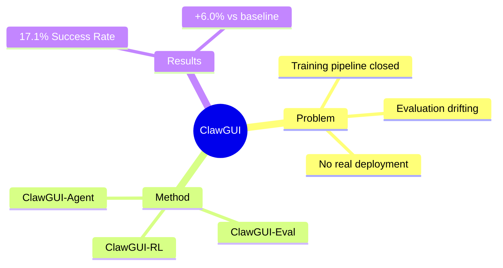

## Summary

ClawGUI 是一个开源的 GUI Agent 全栈框架，解决了训练、评测、部署三大基础设施缺口：RL 训练基础设施、标准化评测管道、多平台部署能力。

## Problem & Motivation

GUI Agent 领域的核心瓶颈不是建模能力，而是缺乏统一的基础设施：
- **训练侧**：在线 RL 训练受环境不稳定和闭源管道制约
- **评测侧**：评测协议跨工作漂移，难以复现
- **部署侧**：训练好的 agent 很难触达真实用户和真实设备

这三个缺口导致 GUI Agent 研究碎片化，进展难以累积。

## Method

ClawGUI 包含三个模块：

1. **ClawGUI-RL**：首个开源 GUI agent RL 基础设施
   - 支持并行虚拟环境和真实物理设备
   - 集成 GiGPO + Process Reward Model 提供密集 step-level supervision

2. **ClawGUI-Eval**：标准化评测管道
   - 覆盖 6 benchmarks + 11+ models
   - 对官方 baseline 复现率达 95.8%

3. **ClawGUI-Agent**：多平台部署
   - 支持 Android、HarmonyOS、iOS
   - 通过 12+ 聊天平台接入
   - 混合 CLI-GUI 控制 + 持久化个性化记忆

## Key Results

- **ClawGUI-2B** 在 MobileWorld GUI-Only 上达到 17.1% Success Rate
- 比同规模 MAI-UI-2B baseline 高 6.0%
- 评测管道对官方 baseline 复现率达 95.8%

## Strengths & Weaknesses

**亮点**：
- 全栈基础设施设计，填补了训练-评测-部署的完整闭环
- 开源（第一个开源 GUI agent RL infrastructure）
- 支持真实物理设备训练（不是纯模拟器）

**局限**：
- 17.1% Success Rate 绝对值不高，说明任务难度或方法还有很大改进空间
- 6.0% 的提升幅度有限，需要更强的基线对比
- 缺少 failure case 分析，不知道在什么场景下会崩溃

## Mind Map

## Notes

> [未获取全文，仅基于 abstract]

值得追踪的点：
- GiGPO 的具体设计
- Process Reward Model 的 reward 设计
- 真实设备训练的 engineering challenge