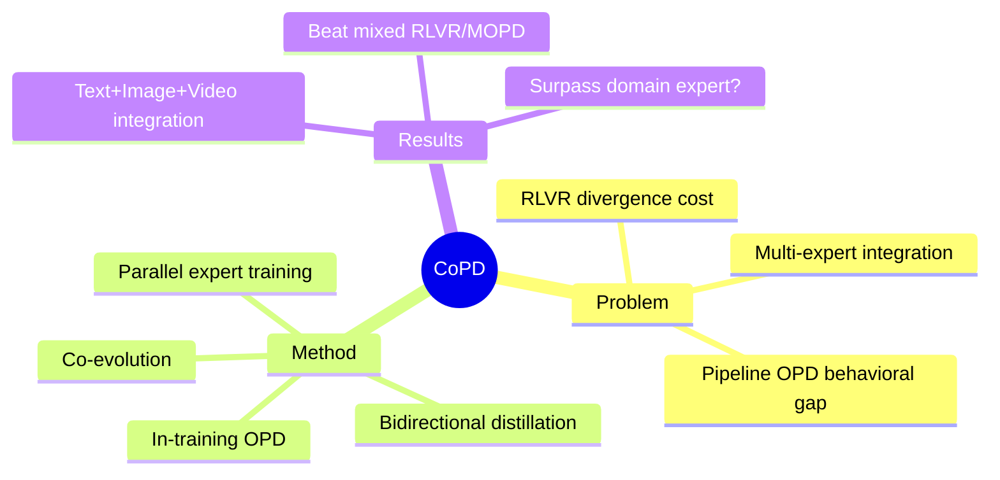

## Summary
提出 Co-Evolving Policy Distillation (CoPD)，解决多专家能力整合到单一模型时的能力损失问题：mixed RLVR 存在 inter-capability divergence cost，而传统 pipeline（先训 expert 再做 OPD）因 teacher-student 行为模式差异大导致知识吸收不充分。CoPD 让多个 expert 并行训练，在每个 expert 的 RLVR 过程中穿插 OPD（而非训练完成后），expert 互为 teacher（bidirectional distillation），实现 co-evolve。

> [未获取全文，仅基于 abstract]

## Problem & Motivation
> [未获取全文，仅基于 abstract]

**问题背景**：RLVR (Reinforcement Learning from Verifiable Rewards) 和 OPD (Online Policy Distillation) 是 post-training 的标准范式。当需要将多个 domain expert 的能力整合到一个模型时，两种范式都存在能力损失：

1. **Mixed RLVR 的问题**：inter-capability divergence cost——多个能力混合训练时会产生能力间的冲突/发散
2. **Pipeline OPD 的问题**：先训练 expert 再 distill 的 pipeline，虽然避免了 divergence，但 teacher 和 student 之间 behavioral pattern gap 太大，导致 student 无法充分吸收 teacher 的能力

**核心洞察**：capability loss 的根源在于两种范式下 expert 的行为模式不一致或知识互补性不足。

## Method
> [未获取全文，仅基于 abstract]

**CoPD (Co-Evolving Policy Distillation)** 的核心设计：

1. **Parallel Expert Training**：多个 expert 并行训练，而非 sequential
2. **In-training OPD**：在每个 expert 的 RLVR 过程中穿插 OPD，而非等 expert 完全训练完再 distill
3. **Bidirectional Distillation**：expert 互为 teacher，实现 co-evolve

**关键优势**：
- 行为模式在训练过程中持续对齐，避免 teacher-student gap
- 各 expert 仍能保持互补知识，而非被单一目标稀释
- 形成 "model parallel training" 的新 scaling paradigm

## Key Results
> [未获取全文，仅基于 abstract]

- CoPD 实现 text、image、video reasoning 能力的 all-in-one integration
- 显著超越 mixed RLVR 和 MOPD baseline
- 甚至 surpass domain-specific expert（这是一个有趣的 claim）

## Strengths & Weaknesses
> [未获取全文，仅基于 abstract]

**亮点**：
- 问题分析清晰：统一分析了 RLVR 和 OPD 两种范式的能力损失机制
- 方法设计有 insight：核心是 behavioral pattern alignment + knowledge complementarity 的平衡

**疑问**：
- "surpass domain-specific expert" 这个 claim 很强——集成模型能超越专精模型？需要看具体数字和 task
- 未获取全文，无法评估实验细节和 ablation
- "Work in progress" 标注说明可能还在迭代

**潜在影响**：
- 如果有效，可能开启 "model parallel training" 作为新的 scaling 方向
- 对 multi-capability integration 问题有方法论贡献

## Mind Map

## Notes
- 与 [[Papers/2604-RAGEN2]] 的 multi-agent RL 有潜在联系？
- CoPD 的 "bidirectional" 设计是否可以扩展到更多 expert (>2)？
- 如果 behavioral pattern alignment 是关键，是否可以用更显式的 representation alignment？