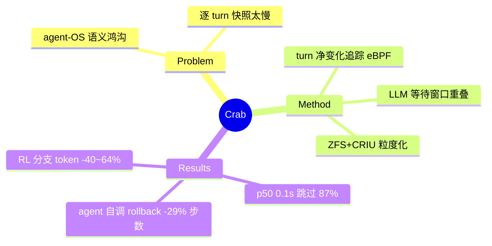

## Summary
面向 agent sandbox 的语义感知 checkpoint/restore runtime：用 eBPF 追踪 turn 级"净变化"跳过 ~75-87% 不必要的检查点、把检查点执行重叠进 LLM 等待窗口，p50 0.1s / p95 0.7s；**把 rollback 暴露为 agent 可调用工具 `sbx.rollback(ckpt)`**，并实证支撑 proactive recovery、speculative execution、spot 迁移、RL 树分支四类场景。

## Problem & Motivation
核心诊断是 **agent–OS 语义鸿沟**：agent 框架看得见 tool call 看不见其 OS 效果；OS 看得见状态变化但没有 turn 级上下文判断恢复相关性。四个需要 C/R 的场景：(1) 长程任务容错（数百 turn 崩溃即全部重跑）；(2) spot/可抢占实例执行；(3) **RL 树分支**（Tree-GRPO 类算法从中间状态 fork，免重放共享前缀）；(4) **安全回滚**（恢复到已知良好状态）。通用工具（CRIU/容器 commit）逐 turn 全量快照太慢（参见 [[Papers/2510-AgenticExplorationSystems]] 的六机制实测）。

## Method
三组件架构：
- **Coordinator**（控制面）：HTTP 反向代理拦截 agent↔LLM 通信，识别 turn 边界，**把检查点工作异步调度进 LLM 推理等待窗口**，检查点未完成时 gate agent 进度。
- **Inspector**（状态追踪）：eBPF 内核监控 + 用户态 daemon，"净变化"语义——瞬态效果忽略，只报告持久状态：文件系统（syscall tracepoint）、进程（cgroups）、内存（soft-dirty page）。
- **C/R Engine**（数据面）：双优先级队列；文件系统走 ZFS snapshot、进程走 CRIU；versioned manifest 配对最新进程/文件系统 artifact。按 Inspector 分类做**粒度化检查点**：跳过 / 仅文件系统 / 仅进程 / 全量。

快于 CRIU 的来源不是单次 dump 优化，而是**跳过 ~75% 的 turn + 与 LLM 推理重叠**。

## Key Results
- **延迟**：checkpoint p50/p95/p99 = 0.1/0.7/1.0s（文件系统-only 20-100ms）；Coordinator 开销 18-40μs/turn @96 沙盒密度；p95 暴露延迟 0.44%。
- **恢复正确性**：Terminal-Bench 100%（chat-only/chat+FS baseline 仅 8-28%）；SWE-Bench 100% vs 9%。
- **稀疏性**：多达 87% 的 turn 无需检查点（Claude-code on Terminal-Bench：仅 5% 需 FS、8% 需全量）。
- **Agent-facing 案例**：
  - **Proactive rollback**（agent 自调 `sbx.rollback`）：QEMU 启动任务 wall-clock -29%（52→36 步）；金融文档分类省 36% rollback token。
  - **Speculative execution**：10× 快的 draft model ~50% 接受率，SWE-Bench 任务时间中位数 -7.9%；58% fork 请求复用先前检查点。
  - **RL 树分支**：branching factor 1-5 下免前缀重放，**token 消耗 -40~64%**。
  - **Spot 迁移**：迁移 <1s，每任务 1-5 次抢占下开销 <1.9%。

## Strengths & Weaknesses
**亮点**：(1) **第一个把 rollback 做成 agent 可自主调用 API 并给出端到端收益数字的系统**——"agent-facing 暴露"从设想变成已实现的先例；(2) 语义感知稀疏化是对"逐 turn 全量快照"的正确否定，思路可直接迁移到浏览器（DOM diff 决定是否快照）；(3) 四场景统一在一个 runtime 上，推理/训练两侧通吃。

**局限**：(1) **域是 shell/代码沙盒**（Terminal-Bench/SWE-Bench），不含浏览器/GUI——web 的状态在 browser session + 后端 DB，超出其 FS+process 捕获范围；(2) agent-facing 案例测的是**效率**（步数/token/时间），**没有测 task success rate 的因果增益**，也无 prompt-only 对照；(3) 评估用录制轨迹确定性重放，去除了模型随机性；(4) agent 进程本身不在追踪范围（需 fast-forward 调和）。

对本方向的意义：AFE 假设的最强先例 + 最清晰的差异化边界——Crab 证明了 agent-facing rollback 在 sandbox 域的工程可行与效率收益，留下的正是 (a) web/browser 全栈状态域、(b) success/recovery 因果增益与 prompt-only 强对照、(c) affordance 组合（observe/verify/fork 协同）三块空白，与 [[Ideas/AgentFacing-WebRuntime]] 的 C0-C7 设计精确互补。

## Mind Map

## Notes
- 四场景中 speculative execution 与 [[Papers/2606-SRC]] 的 speculative branch review 是同名异物：Crab 是 draft model 抢跑执行，SRC 是学生策略试探分支——但都依赖"可廉价撤销"这一底座能力。
- Crab + WebServ 拼起来 ≈ AFE 需要的引擎全栈（进程/FS + 容器/网络），缺的只是浏览器语义层（DOM/session/后端 DB）与 agent 侧接口协议。
