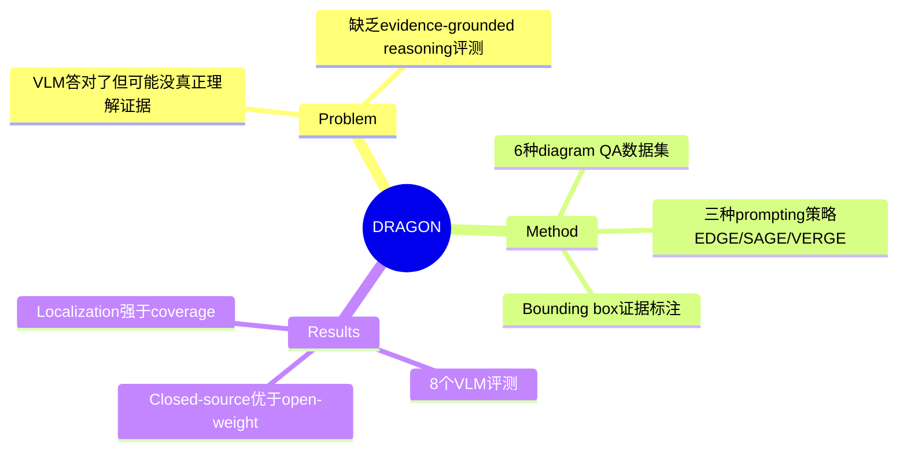

## Summary

DRAGON 提出了一个 evidence-grounded diagram reasoning benchmark，核心洞察是 VLM 在 diagram QA 上答对了不代表真正理解了图中证据。给定 diagram、question、answer，模型需要预测支持答案的 bounding boxes（证据区域），而非仅输出答案。收集 11,664 个标注实例，其中 2,445 个 human-verified benchmark test set。

> [未获取全文，仅基于 abstract 和部分 HTML 内容]

## Problem & Motivation

Diagram QA（DQA）要求模型理解结构化视觉表示（图表、地图、电路图、科学图示等）。现有 VLM 在这类任务上答对率高，但正确答案不代表模型真正 ground 在支持推理的 diagram 区域——模型可能依赖文本关联或数据集 artifact，而非视觉证据。这限制了 diagram reasoning 的可靠评测和可解释性。

**核心问题**：如何验证 VLM 是否真正从 diagram 中找到了支持答案的视觉证据？

## Method

**任务定义**：给定 (diagram, question, correct_answer)，模型需要预测 bounding boxes 对应支持答案的视觉元素（答案组件、文本标签、legend、axes、连接器等）。

**数据收集**：
- 从 6 个 diagram QA 数据集收集：ChartQA, Circuit-VQA, InfographicsVQA, MapIQ, MapWise, AI2D
- 总共 11,664 个标注 question instances
- 2,445 个 human-verified benchmark test set
- 使用 template-based region transfer 和人工验证

**Prompting 策略**：
- EDGE: Evidence Detection via Grounding
- SAGE: Select and Ground Evidence
- VERGE: Verify and Refine Grounded Evidence

**评测指标**：
- Max Pairwise IoU (MPIoU)：预测框与标注框的最大匹配 IoU
- Grounding IoU (GIoU)：覆盖度指标
- Precision, Recall, F1：box-level 指标
- Threshold hit rates

## Key Results

> [未获取全文，具体数值待补充]

评估了 8 个近期 VLM（包括 GPT-4o、Claude Opus 4.6、Claude Sonnet 4.6、Gemini 3 Pro、InternVL3.5-38B 等）。

核心发现：
- Closed-source models 优于 open-weight models
- 不同 diagram domains 难度差异显著
- Prompting 策略对 grounding performance 有影响
- Models 更擅长 localization（定位相关区域）而非 complete evidence coverage（覆盖完整证据）

## Strengths & Weaknesses

**Strengths**：
- 问题定义清晰：从"答对"转向"答对且有证据"，揭示 VLM 的真实 reasoning 能力
- 数据来源多样化（6 种 diagram 类型），覆盖面广
- 提供标准化评测框架和多种指标

**Weaknesses**：
- 仅评测 VLM 的 evidence grounding，不评测 answer accuracy——假设 answer 已给定，这可能无法反映 real-world scenario
- Bounding box 作为 evidence 表示可能过于粗粒度，无法捕捉复杂推理链
- 标注依赖 template-based transfer + 人工验证，可能存在主观偏差

**潜在影响**：推动 VLM evaluation 从 accuracy 转向 evidence-grounded reasoning，可能影响 future diagram QA 系统的设计。

## Mind Map

## Notes

- 与 GUI Agent/grounding 相关：diagram evidence grounding 可视为一种 visual grounding 任务
- 思考：能否将 evidence grounding 与 answer prediction 结合，形成端到端评测？