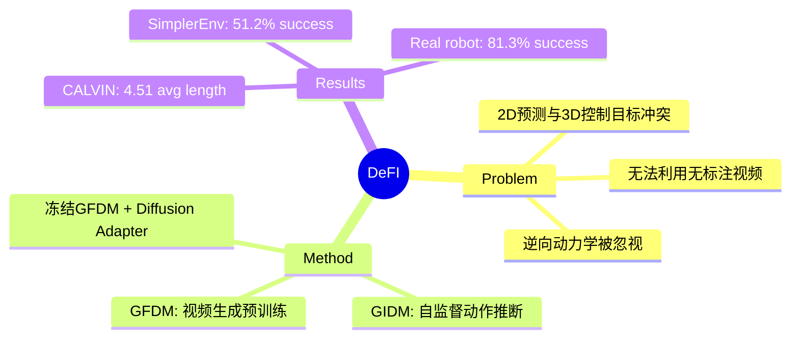

## Summary
提出 DeFI 框架，将视觉前向动力学和逆向动力学的预训练解耦，解决了传统 VLA 模型中 2D 图像预测与 3D 动作预测的冲突问题，使模型能够分别利用大规模无标注视频数据学习视觉预测和动作推断，在 CALVIN、SimplerEnv 和真实机器人任务上取得 SOTA。

## Problem & Motivation
现有 VLA 模型存在核心矛盾：2D 图像预测与 3D 动作预测目标不一致，导致训练不稳定。传统端到端方法将视觉和动作紧密耦合，限制了模型从大规模无动作标注的网络视频数据中学习的能力。逆向动力学（从帧转移推断动作）常被忽视或作为次要点，成为性能瓶颈。

## Method
DeFI 框架核心思想：**解耦前向动力学（视觉预测）和逆向动力学（动作推断）的预训练，各自利用最适合的数据源**。

### GFDM (Generative Forward Dynamics Model)
- 基于视频生成的预训练模型，在人类和机器人混合视频上训练
- 通过单步去噪预测未来潜在状态，高效捕获运动动态
- 学习视觉层面的"世界模型"，预测下一帧的 latent representation

### GIDM (Generative Inverse Dynamics Model)
- 自监督 Transformer，学习将帧转移映射到离散潜在动作
- 通过 VQ-VAE codebook 将动作空间离散化，无需显式动作标签
- 从无标注视频中提取"隐式动作"表示

### 下游融合机制
- 下游微调时，GFDM 冻结（保留预训练的视觉预测能力）
- MLP 对齐 GFDM 预测特征与 GIDM 输入空间
- Diffusion-based adapter 将推断的潜在动作解码为可执行机器人指令

## Key Results

### CALVIN ABC-D 基准
- 平均任务长度 4.51，显著超越 prior methods
- 长程任务规划能力突出

### SimplerEnv-Fractal 基准
- Google Robot visual matching 任务成功率达 51.2%

### 真实世界 Franka 机器人
- 8 个多样化操作任务平均成功率 81.3%

### 数据效率
- 仅用 60% 训练数据即可超越之前 SOTA
- 展示了预训练带来的强迁移能力

## Strengths & Weaknesses

### Strengths
1. **问题本质深刻**：准确识别了 VLA 训练中 2D 视觉预测与 3D 动作控制目标冲突这一核心矛盾
2. **数据利用高效**：解耦设计使模型能够分别利用无标注人类视频（训练 GFDM）和机器人数据（训练 GIDM）
3. **验证充分**：仿真和真实机器人实验全面，结果扎实

### Weaknesses
1. **Domain Shift 问题**：真实世界预训练的 GFDM 在仿真环境中冻结会导致特征不匹配，影响动作推断
2. **接触密集任务瓶颈**：62% 的失败发生在接触密集或杂乱场景，说明精细控制仍有不足
3. **缺少 LLM 集成**：当前 pipeline 未整合 LLM，无法处理复杂指令跟随或交互式反馈
4. **误差传播**：微小视觉预测误差会通过动作解码器传播放大，影响精细操作

## Mind Map

## Notes
- 核心洞察：前向动力学预测和逆向动力学推断需要不同的训练目标和数据源
- 与 World Model 范式的关系：GFDM 本质是在学习视觉世界模型，但与动作空间解耦
- 未来方向：如何更好地处理 domain shift？是否需要 adversarial alignment 或 domain-adaptive freezing？