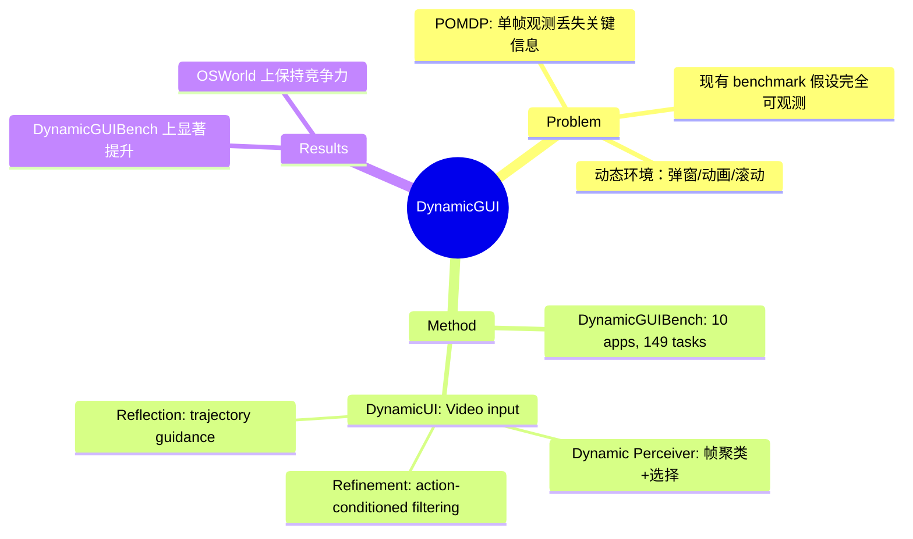

## Summary
提出了 DynamicGUIBench 和 DynamicUI，首次系统性地研究 GUI Agent 在高动态环境下的部分可观测问题（POMDP），通过视频输入和三模块框架提升动态场景性能。

## Problem & Motivation
现有 GUI Agent 研究主要关注训练范式（SFT/RL），但忽略了高动态 GUI 环境的挑战。现有 Agent 依赖单一截图做决策，导致部分可观测的 MDP 问题——关键的界面状态信息（如瞬态弹窗、动画、滚动内容）在两次观测之间可能丢失。这与真实桌面/移动交互场景严重不符，Agent 缺失了决策所需的关键上下文。

D-GARA 和 GUI-Robust 等工作虽然考虑了"动态"任务，但将动态建模为可观测的异常/扰动，本质上仍是完全可观测的 MDP 假设，忽略了两次观测之间的隐藏动态。

## Method
### DynamicGUIBench
- 10 个应用、149 个任务的在线 GUI benchmark
- 四类动态挑战：(1) 中断性 UI 状态（如弹窗）、(2) 瞬态参考信息、(3) 动态列表选择、(4) 内容触发交互
- 提供 offline HTML 文件以保证可复现性
- 明确建模 POMDP，而非假设完全可观测

### DynamicUI 框架
1. **Dynamic Perceiver**：对交互视频进行帧聚类，生成 centroid captions，迭代选择信息量最大的帧作为动态上下文
2. **Refinement Strategy**：action-conditioned filtering，缓解 thought-action 不一致和冗余
3. **Reflection Module**：基于 refined trajectory 提供后续行动指导

核心思想：用视频而非单一截图作为输入，通过帧选择和信息提取捕捉隐藏动态。

## Key Results
- DynamicGUIBench 上 DynamicUI 显著优于 baseline
- OSWorld benchmark 上保持竞争力（静态场景）
- ablation study 验证三个模块的必要性

## Strengths & Weaknesses
**Strengths**：
- 问题定义有价值：POMDP 视角比已有"动态"benchmark 更真实
- training-free 框架，可集成到现有 VLM-based Agent
- 提供可复现的 offline assets

**Weaknesses**：
- 方法较为工程化（frame clustering + captioning），缺乏更深层的理论支撑
- Dynamic Perceiver 的帧选择策略可能引入额外噪声
- Reflection Module 的设计与其他 GUI Agent 的反思机制大同小异
- benchmark 规模较小（149 tasks），覆盖场景有限

## Mind Map

## Notes
- POMDP 视角对 GUI Agent 研究有启发性，但需要更多理论工作
- frame clustering 的效率问题如何解决？实时场景下的延迟？
- 与 World Model 的结合可能更有价值——预测隐藏动态而非事后分析