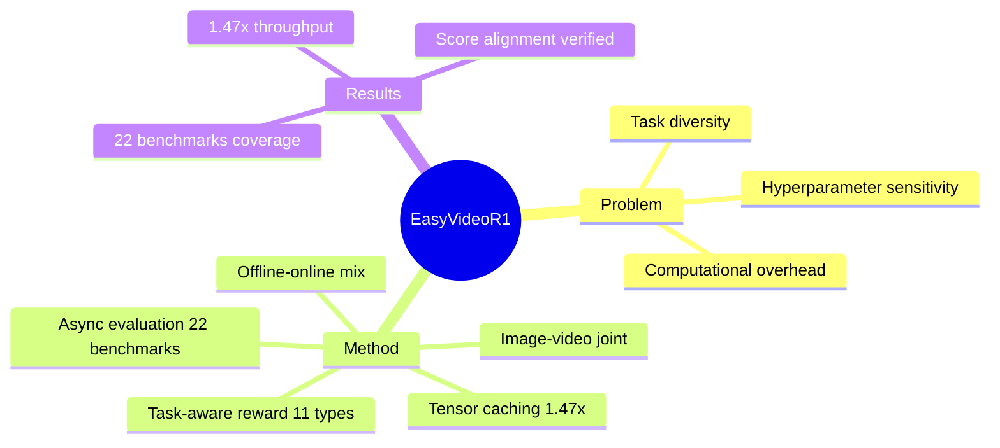

## Summary

首个专门针对 Video VLM 的 RLVR（Reinforcement Learning from Verifiable Rewards）训练框架。五大贡献：offline preprocessing + tensor caching（1.47× throughput）、task-aware reward system（11 task types）、mixed offline-online training、joint image-video training、asynchronous multi-benchmark evaluation（22 benchmarks）。系统性解决 video RL 的三个挑战：task diversity、computational overhead、hyperparameter reproducibility。

> [未获取全文，仅基于 abstract]

## Problem & Motivation

**问题**：RLVR 在 LLM reasoning 上效果显著，但扩展到 video understanding 仍 largely unexplored。三个瓶颈：
1. **Task diversity**：video task 类型多样（QA、captioning、temporal localization 等），难以统一 reward design
2. **Computational overhead**：video decoding 和 preprocessing 开销大，on-policy RL 需重复解码
3. **Hyperparameter reproducibility**：RL 训练敏感，不同配置结果差异大，benchmark evaluation 难复现

**为什么重要**：VLM 正向 natively multimodal architectures 演进，video RL 是必经之路。现有 text/image RL framework 缺 video-specific optimizations。

**洞察**：video RL 的关键在于 efficiency + reward design + evaluation infrastructure——这是一个系统工程问题而非单一算法问题。

## Method

**EasyVideoR1 框架**：

1. **Offline Preprocessing + Tensor Caching**
   - 视频预先解码为 tensor cache，避免 training 时重复解码
   - 1.47× throughput improvement

2. **Task-Aware Reward System**
   - 覆盖 11 种 video + image problem types
   - Unified routing + modular extension——新增 task type 只需添加 reward module

3. **Mixed Offline-Online Training**
   - Offline：curated high-quality trajectories
   - Online：on-policy exploration
   - 互补：offline 提供稳定基础，online 学习 challenging tasks

4. **Joint Image-Video Training**
   - 独立 pixel budgets：image 和 video 可配置不同分辨率
   - Mutually reinforce：image 提供 fine-grained perception，video 提供 temporal reasoning

5. **Asynchronous Multi-Benchmark Evaluation**
   - 覆盖 22 个主流 video understanding benchmarks
   - Reproduced accuracy 与 official scores 对齐（验证框架可靠性）

**关键设计理念**：将 RLVR 从 text→image→video 逐步扩展，每一步都需要 modality-specific engineering——这不是"apply text RL to video"而是"re-design RL for video"。

## Key Results

> [未获取全文，仅基于 abstract]

- **Throughput**: 1.47× improvement（tensor caching）
- **Evaluation coverage**: 22 benchmarks
- **Reproducibility**: reproduced accuracy 与官方 scores 对齐

**缺失信息**：具体 benchmark 上的 accuracy 数字、baseline 选择、reward system 的 11 task types 定义、offline vs online 的具体比例——需全文获取。

## Strengths & Weaknesses

**Strengths**:
- **系统性工程贡献**：不是单一 algorithm tweak，而是 full-stack RL training infrastructure——从 preprocessing 到 reward design 到 evaluation
- **Efficiency 重点**：tensor caching 解决 video RL 的核心瓶颈（解码开销）
- **Reproducibility commitment**：asynchronous evaluation + 22 benchmarks + score alignment——这是 RL 论文最容易被忽视但最重要的部分

**Weaknesses**:
- **Novelty 有限**：每个组件都是已有技术的组合（tensor caching、task-aware reward、offline-online mixing），无 breakthrough algorithm
- **Video-specificity vs Generalization**：框架声称 video RL 专用，但 joint image-video training 暗示 image 方法仍有效——video 的独特性在哪里？
- **Reward system 的 task coverage**：11 task types 是否覆盖所有 video tasks？未列具体类型——需全文确认

**与 Agenda 关联**：
- RL direction：展示了 RLVR 在 multimodal domain 的工程化实践，可启发 GUI Agent RL 的 reward system design（task-aware + modular extension）
- 但非直接贡献——是 RL 基础设施而非 GUI-specific RL

## Mind Map

## Notes

- 与 [[Papers/2604-SOLAR-RL]] 的对比：SOLAR-RL 是 GUI Agent RL（rule-based + failure point detection），EasyVideoR1 是 Video VLM RL（RLVR + tensor caching）——两个 modality-specific RL 方案
- Task-aware reward system 的 modular extension 设计可借鉴：GUI Agent 的 action reward 可按 task type（navigation/click/input/scroll）分类
- Joint image-video training 的 pixel budget 设计启发：GUI Agent 可考虑 screenshot vs video input 的不同 resolution budgets