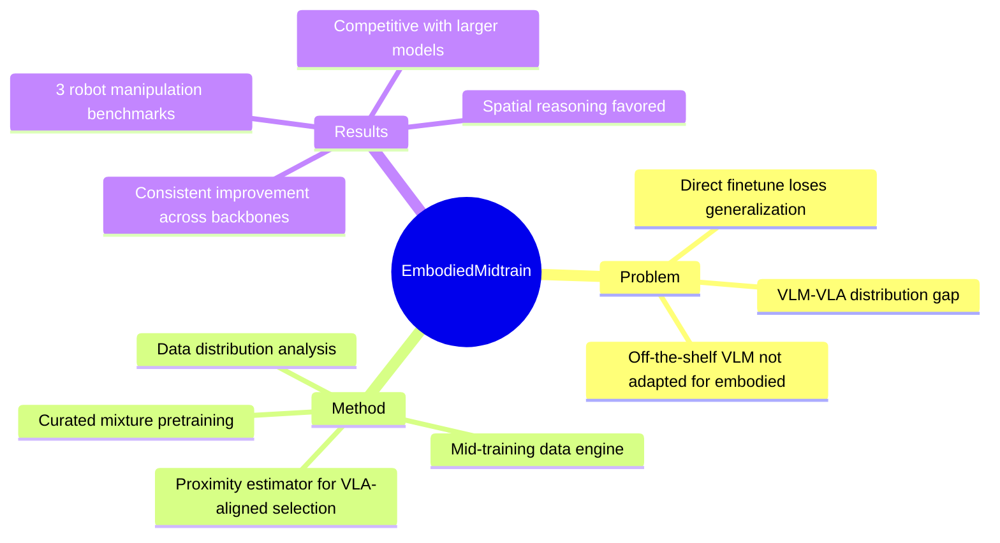

## Summary
> [未获取全文，仅基于 abstract]

提出 VLM→VLA 的 mid-training 桥接阶段，通过数据分布对齐分析筛选最 VLA-aligned 的 VLM 数据进行中间训练，解决 off-the-shelf VLM 直接 finetune 成 VLA 时泛化能力损失的问题。

## Problem & Motivation
> [未获取全文，仅基于 abstract]

**核心问题**：VLA 继承 VLM 的视觉语言能力，但大多数 VLA 直接使用未经 embodied domain 适配的 off-the-shelf VLM，限制了下游性能。

**关键发现**：
- VLA 数据分布与更广泛的 VLM 分布之间存在显著 gap
- VLA 数据占据紧凑区域，与 VLM 分布大部分分离
- 对齐程度在不同 VLM 数据源之间和内部都有很大差异

**为什么重要**：直接 finetune VLM → VLA 会损失 generalization，需要中间桥接阶段来保持 VLM 的泛化能力同时适配 embodied 场景。

## Method
> [未获取全文，仅基于 abstract]

**EmbodiedMidtrain 框架**：

1. **数据分布分析**：表征 VLM 和 VLA 数据之间的分布 gap，发现 VLA 数据占据与 VLM 分布大部分分离的紧凑区域

2. **Mid-training Data Engine**：
   - 轻量级可学习的 proximity estimator
   - 从大型 VLM pool 中筛选最 VLA-aligned 的候选
   - 在 curated mixture 上进行 mid-training

3. **下游 VLA Fine-tuning**：在 mid-training 后进行 VLA 特定的 fine-tuning

**数据选择机制**：Data engine 同时捕获 dataset-level 和 sample-level 的对齐信号，偏向 spatial reasoning 任务而非 text-centric 任务，同时保持 VLM 数据的多样性。

## Key Results
> [未获取全文，仅基于 abstract]

- 在三个 robot manipulation benchmarks 上验证
- Mid-training 在不同 VLM backbone 上一致提升性能
- 达到与更大模型规模和训练预算的 expert VLAs 和 off-the-shelf VLMs 相当的结果
- Mid-training 为 VLA fine-tuning 提供更强的初始化，收益从训练最早步骤就出现并在整个训练过程中扩大
- 代码、数据和模型将开源

## Strengths & Weaknesses
> [未获取全文，仅基于 abstract]

**Strengths**：
- 问题定义精准：识别出 VLM→VLA 直接迁移的性能 gap
- 方法思路清晰：通过数据分布分析和数据选择解决对齐问题
- 跨 backbone 验证：在不同 VLM backbone 上都有一致提升
- 开源承诺：代码、数据、模型将发布

**Weaknesses**：
- 缺少具体的 benchmark 数值和提升幅度（abstract 未量化）
- Proximity estimator 的设计细节和训练方式未知
- 与其他 mid-training/continual learning 方法的对比未知
- Data engine 的计算开销和筛选效率未说明

**潜在影响**：VLA 训练范式的重要改进，可能成为 VLM→VLA 迁移的标准 pipeline 组件。

## Mind Map
> [未获取全文，仅基于 abstract]

## Notes
> [未获取全文，仅基于 abstract]

- 与 M²-VLA（同期论文）形成对比：两者都关注 VLM→VLA 的 gap，但 EmbodiedMidtrain 侧重数据选择和 mid-training，M²-VLA 侧重架构设计（MoL + MSM）
- 关键问题：proximity estimator 如何训练？监督信号是什么？
- 数据选择偏向 spatial reasoning 而非 text-centric 的发现很有价值，暗示 embodied 任务需要的能力与 VLM 预训练任务有偏移
- 需要看全文确认与直接 finetune 的消融对比、以及与更多 baseline 的比较