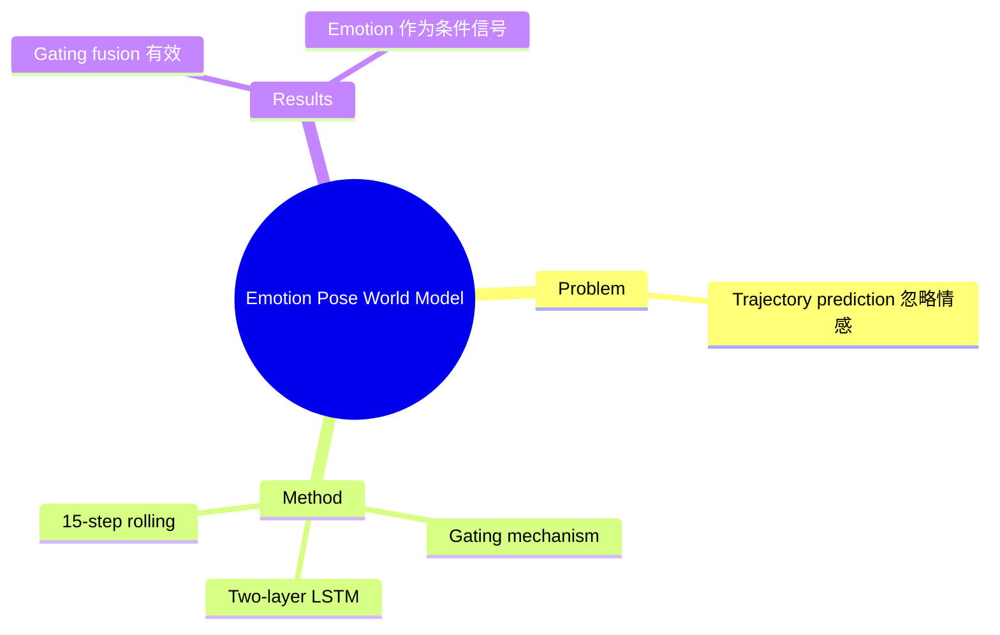

## Summary

研究面部表情 emotion embeddings 能否作为 short-term pose prediction 的辅助条件信号。提出轻量级自回归预测 world model（15步滚动姿态预测），用 learnable gating mechanism 融合 pose keypoints + emotion embeddings，基于 two-layer LSTM 架构。

## Problem & Motivation

现有轨迹预测模型局限：
- 主要依赖几何运动线索
- 忽略影响人类运动动力学的情感信号

## Method

**架构**：
1. **Learnable gating mechanism**: 融合 pose keypoints + emotion embeddings
2. **Two-layer LSTM**: 自回归序列建模
3. **15-step rolling prediction**: 短期预测

**验证**: 两个小规模 pose-emotion 视频数据集

## Key Results

- 简单多模态融合不总是提升精度
- Normalized gating fusion 显著提升 emotion-driven motion sequences
- Counterfactual perturbation 显示 emotion embeddings 是辅助条件而非冗余特征

## Strengths & Weaknesses

**亮点**：
- 验证了 emotion 作为 pose prediction 条件信号的可行性
- Counterfactual perturbation 实验设计合理

**局限**：
- 应用场景窄（human pose forecasting），与 AI Agent world model 关联度低
- Two-layer LSTM 架构老旧
- 小规模数据集验证
- Rating 1——非核心研究方向

## Mind Map

## Notes

> [基于 arXiv abstract]

非 AI Agent 核心研究方向。Human pose forecasting 属 HCI/robotics 子领域，与 GUI/Embodied Agent 的 world model 定义不同。