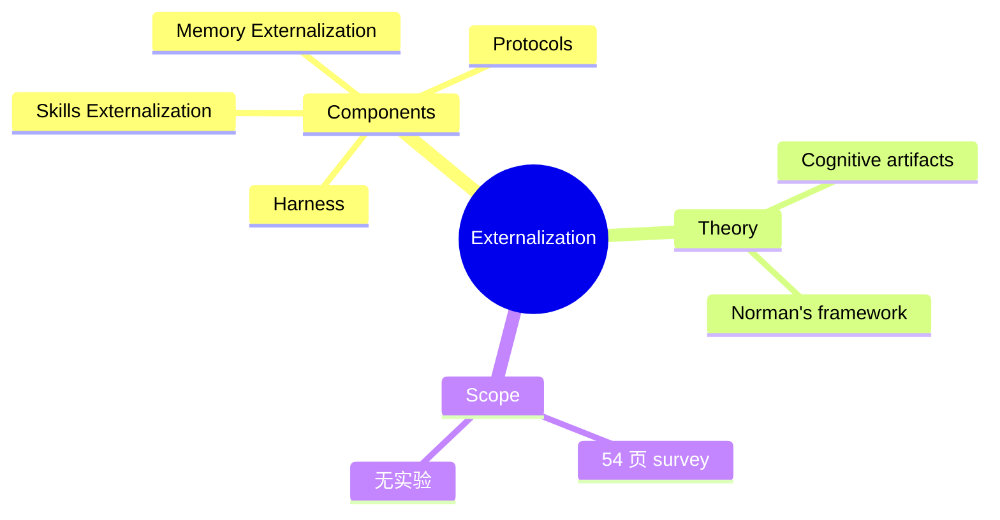

## Summary

提出"Externalization"作为统一框架，解释 LLM Agent 的能力演进路径：从模型内部权重 → 上下文 → 外部运行时基础设施。将 Memory、Skills、Protocols、Harness 四大组件分别对应"认知外包"的不同维度，借用 Donald Norman 的 cognitive artifacts 理论做概念包装。54 页，纯综述。

## Problem & Motivation

LLM Agent 的能力演进需要统一框架：
- Memory、Skills、Protocols、Harness 各组件独立发展
- 缺少统一视角理解 agent evolution

## Method

**框架设计**：
- "Externalization"作为统一概念
- 四大组件：Memory、Skills、Protocols、Harness
- 借用 Donald Norman 的 cognitive artifacts 理论

**Survey 覆盖**：
- 54 页
- 纯综述，无实验

## Key Results

作为 Survey：
- 提供了统一框架视角
- 对已有工程实践的重新命名和分类

## Strengths & Weaknesses

**亮点**：
- 框架整理有参考价值
- 54 页覆盖面广

**局限**：
- 本质上做的是对已有工程实践的重新命名和分类
- RAG 叫"Memory Externalization"，tool-use 叫"Skill Externalization"——换马甲不等于发现新原理
- 54 页对于一个没有 falsifiable claim 的纯概念框架来说，信息密度值得怀疑
- 没有 Ablation、没有 benchmark、没有 comparative analysis

## Mind Map

## Notes

> [基于月度总结的点评，未获取全文]

框架整理有参考价值，但 54 页讲一句话的事。本质上是对已有工程实践的重新命名。