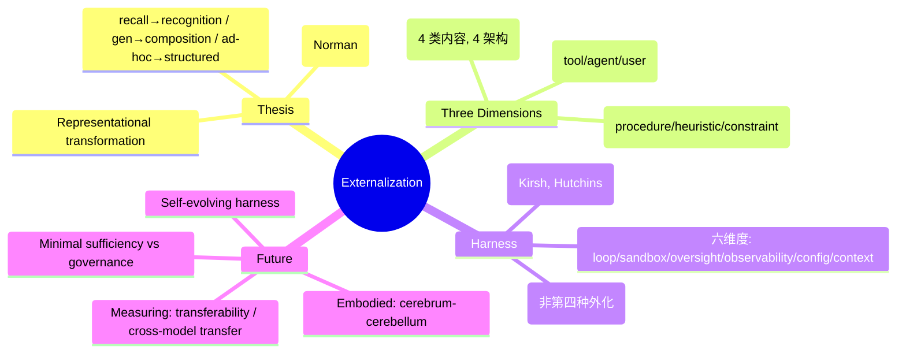

## Summary

这是一篇 systems-level survey，提出 **Externalization（外化）** 作为统一逻辑来解释 LLM Agent 的演进：能力逐步从模型权重 → 上下文 → 外部 runtime infrastructure 迁移。借用 Donald Norman 的 **cognitive artifacts** 理论，核心论点是外化的价值不在"增加组件"，而在 **representational transformation（表征变换）**——把模型难处理的认知负担重构成它能可靠求解的形式（recall→recognition、generation→composition、ad-hoc→structured）。三个外化维度（Memory / Skills / Protocols）+ 统一协调它们的 Harness，构成一个分布式认知系统。

## Problem & Motivation

作者观察到当前 agent 进步的叙事过度聚焦"更大更强的模型"，但实践中许多可靠性提升根本不来自改动 base model，而来自改造模型周围的环境——加持久记忆、组织可复用 skill、标准化 tool 接口、约束执行、instrument 行为。一个无外援的 LLM 面临三类反复出现的 mismatch，正好对应三个外化维度：(1) 上下文窗口有限、session 记忆弱 → **continuity 问题**，由 memory 外化解决；(2) 长 multi-step 流程被反复重新推导而非稳定执行 → **variance 问题**，由 skill 外化解决；(3) 与工具/服务/协作者的交互在 free-form prompting 下脆弱 → **coordination 问题**，由 protocol 外化解决。

作者明确区分了本文与已有 survey（RAG、tool learning、agent architectures、protocol interoperability、最接近的 CoALA）的不同：不是再做一个 component-level 综述，而是论证为什么这些发展正在收敛为"外化"这一共同逻辑，以及这种收敛如何重新定义了"agent"。核心立场是 **pragmatic** 的——把"agent 与环境"的边界视为有性能后果的设计选择，而非承诺 distributed cognition 的强本体论主张。

## Method

**理论锚点（Norman cognitive artifacts）**：外部工具不只是放大固有能力，而是**改变任务本身**——购物清单把"回忆"问题变成"识别"问题，地图把隐藏的空间关系变成可见结构。作者把这一逻辑递归地套到 LLM agent，并贯穿全文用三个 transformation 串联三个维度。

**Background: From Weights to Context to Harness（§2）** 把社区重心迁移描述为三个分层（非互斥）：Weights 层（capability = 参数，scaling law 驱动，但知识/流程/policy 耦合进静态 artifact，难选择性更新、组合、治理）→ Context 层（prompt engineering / CoT / ReAct / RAG，recall→recognition，但 context 有限、易 "lost in the middle"、session 间失忆）→ Harness 层（持久 infrastructure：memory store、tool registry、protocol、sandbox、sub-agent orchestration、compression、evaluator、approval loop）。

**三个外化维度**：
- **Memory（§3，externalized state）**：分四类内容——working context、episodic experience、semantic knowledge、personalized memory；四种架构范式（沿 Du 2026 的 taxonomy）——Monolithic Context → Context + Retrieval Store（GraphRAG、ENGRAM、SYNAPSE）→ Hierarchical Memory & Orchestration（MemGPT/MemoryOS 的 OS 式 hot/cold tier 分离；MemoryBank/MIRIX/MemOS 的功能语义分离）→ Adaptive Memory（MemEvolve 动态模块、MemRL 用 RL 优化检索 policy）。关键 takeaway："从 storage 到 control"——memory 成为 harness 控制面的一部分，决定模型能有效作用于哪段历史；**检索质量比存储容量更重要**。
- **Skills（§4，externalized expertise）**：外化的是 procedural expertise，由三耦合成分构成——operational procedure（任务骨架、防 skipped/misordered/premature termination）、decision heuristics（分支处的经验法则）、normative constraints（合规/安全边界，使 skill 成为治理载体）。三阶段演进：atomic primitive（Toolformer）→ large-scale selection（Gorilla/ToolLLM）→ skill as packaged expertise（program-based skill induction、SOP-guided agent）。外化机制涵盖 specification、discovery、progressive disclosure、execution binding、composition；获取途径四种：authored / distilled / discovered / composed。
- **Protocols（§5，externalized interaction）**：把交互结构外化为机器可读契约（invocation grammar、lifecycle semantics、permission/trust boundary、discovery metadata），调研 agent-tool / agent-agent / agent-user 三类协议（MCP、A2A 等），ad-hoc→structured。

**Harness Engineering（§6，统一层）**：明确 harness **不是第四种外化**，而是托管前三者的 runtime 协调结构。六个分析维度：(1) agent loop & control flow（含 termination/recursion/cost 治理，定义"操作 envelope"）、(2) sandboxing（既是安全边界也是简化模型推理的 cognitive boundary）、(3) human oversight & approval gate（pre-execution / post-execution / escalation / hook，autonomy 是可配置参数而非二元）、(4) observability & structured feedback（harness 从自身运行中学习的机制）、(5) configuration/permission/policy（user/project/org 分层，externalized governance）、(6) context budget management（summarization、priority eviction、staged loading）。作者强调 Codex 与 Claude Code 等独立系统**收敛到相同的六维度**，是"外化 agency 的结构性需求"的证据。最后把 harness 解读为 **cognitive environment**（Kirsh "intelligent use of space" + Hutchins distributed cognition）。

**Cross-Cutting Analysis（§7）**：六条模块间耦合（memory→skill 经验蒸馏、skill→memory 执行记录、skill↔protocol 能力调用/生成、memory↔protocol 策略选择/结果同化）；并提出 **parametric vs externalized 的 trade-off 空间**——按 update frequency、reusability/portability、auditability/governance、latency/context burden 四维决定某个负担应放在哪里，结论是这是 systems-partitioning 问题而非零和竞争，最优划分随模型与 infra 成熟而动态移动。

## Key Results

作为纯综述无实验，其"结果"是若干 forward-looking 的论断与研究议程（§8）：

1. **The Expanding Frontier**：parametric/externalized 边界双向移动——模型变强会把能力拉回内部（更强结构化输出 → 更少 format validation），更丰富的 harness 又对模型提出新要求。Planning、evaluation/verification、orchestration logic 本身、multi-modal 都是下一批外化候选。
2. **Embodied Externalization（最有价值的类比）**：把数字 agent 的外化逻辑映射到具身——VLA 从 monolithic "brain" 分解为 **cerebrum（高层 LLM agent 做规划/状态/异常恢复）+ cerebellum（VLA 作为可调用 skill module 负责单一原子操作，低延迟传感运动控制）**。这一分解直接对应本文三维度：planning→externalized plan object、VLA skill→skill artifact、agent-skill 通信→protocol。
3. **Self-Evolving Harness**：自演化可发生在 module / system / boundary 三个层级，技术路径含 RL（优化 search depth、compression ratio、retry）、program synthesis（把 harness 适配当作 code repair）、evolutionary（搜索 harness topology）、imitation learning。
4. **Costs & Governance**：警告"最大化外化"是反模式——over-retrieval、verbose skill、tool sprawl 都增加 cognitive overhead；应追求 **minimal sufficiency + lazy loading + budget-aware routing**。安全风险（memory poisoning、malicious skill injection、protocol spoofing）映射到三维度，self-evolving 会放大；governance（review gate、provenance、rollback、regression test）须 co-design 进 harness。
5. **Measuring Externalization（最尖锐的批评）**：现有 benchmark 只测 fixed-prompt/fixed-model 下的 task completion，**系统性低估了外化 infrastructure 的贡献**——应增加 transferability（换 backbone 后 harness 是否仍有效）、maintainability、recovery robustness、context efficiency、governance quality 等维度，配合 ablation、cross-model transfer、long-horizon reliability 等策略。

## Strengths & Weaknesses

**亮点**

- **概念框架是有内容的，不是单纯重命名**：与"RAG 叫 Memory、tool-use 叫 Skill 的换马甲"的肤浅印象不同，本文的真正贡献是用 Norman 的 representational transformation 给出了一个**可解释失败模式的视角**——stale/over-abstracted/poisoned memory 都被重述为"未能把历史变换成可用的当下"的表征设计失败，而非实现 bug。这种诊断框架有迁移价值。
- **Harness 的六维度 + 独立系统收敛论证**：把 Codex/Claude Code 的工程实践抽象成 loop/sandbox/oversight/observability/config/context 六维，并以"独立系统收敛"作为结构性需求的证据，是有说服力的归纳，对设计自己的 agent harness 是实用 checklist。
- **Cerebrum-cerebellum 具身类比**：把数字 agent 外化逻辑迁移到 VLA 分解，是全文最 insight 的跨域连接，对 Embodied 方向有直接启发。
- **Measuring Externalization 的批评一针见血**：指出 model-centric benchmark 把外化的功劳记到模型头上，并提出 transferability/cross-model transfer 作为归因手段，是对当前 agent 评测范式的有效 critique。

**局限**

- **零 falsifiable claim、零实验**：54 页全部建立在概念归纳与文献映射上，没有 ablation、benchmark 或对比分析来验证"外化"框架本身的预测力。它解释力强但预测力弱——给出的几乎都是事后合理化的叙事，难以证伪。
- **框架的"统一"有过度概括风险**：把 memory/skill/protocol/harness 全部塞进一个外化叙事，部分耦合关系（如 §7 的六条箭头）更像是把已有现象重新贴标签，而非揭示新的因果机制。Norman 类比虽优雅，但"购物清单"与"分层 memory 系统"之间的同构是隐喻而非论证。
- **信息密度**：核心论点（三 transformation + harness 协调）其实可以更紧凑地表达，54 页很大比例是对每个子方向的文献罗列，对已熟悉这些工作的读者增量有限。
- **与 GenericAgent 等 position paper 的张力**：本文主张"externalize everything that benefits"，但 §8.4 又承认"最大化外化"是反模式、要 minimal sufficiency——这与 GenericAgent "context information density maximization、工具/记忆都要最小化"的立场在精神上一致，但本文未能把"何时该外化、何时该回撤"形式化，停留在定性。

**对领域的影响**：作为 taxonomy 与共同词汇（harness、externalization、cerebrum-cerebellum）的提供者有参考价值，尤其 measuring/transferability 部分可能影响后续 agent 评测设计。但它是 organizing framework 而非 discovery，价值取决于读者能否用它产生可检验的新问题。

## Mind Map

```mermaid
mindmap
  root((Externalization))
    Thesis
      Cognitive artifacts (Norman)
      Representational transformation
      recall→recognition / gen→composition / ad-hoc→structured
    Three Dimensions
      Memory: externalized state (4 类内容, 4 架构)
      Skills: procedural expertise (procedure/heuristic/constraint)
      Protocols: interaction contract (tool/agent/user)
    Harness
      统一 runtime (非第四种外化)
      六维度: loop/sandbox/oversight/observability/config/context
      Cognitive environment (Kirsh, Hutchins)
    Future
      Embodied: cerebrum-cerebellum
      Self-evolving harness
      Minimal sufficiency vs governance
      Measuring: transferability / cross-model transfer
```

## Notes

- 与 GenericAgent (Papers/2604-GenericAgent.md) 是高度互补的一对：Externalization 是 survey/taxonomy（"应该把负担外化"），GenericAgent 是 position+system（"外化要服从 information density maximization，工具/记忆都最小化"）。两者都引用 harness 概念、都强调 context budget 是稀缺资源、都把 memory 当作 verification/selection 问题。可在 DomainMaps 的 agent harness 节点把二者并置。
- 最值得迁移到自己 agenda 的两点：(1) **transferability / cross-model transfer 作为外化贡献的归因方法**——可用于评估 Self-Improving Reliability 中 harness vs model 的功劳划分；(2) **cerebrum-cerebellum 类比**对 VLA + 高层 agent 的分解有直接借鉴。
- 开放问题：本文未能把"externalize vs retract"的边界形式化，这恰是 GenericAgent 用 information density 给出的答案。一个有价值的后续是把外化的 cost（cognitive overhead）量化，验证 §8.4 的 minimal-sufficiency 主张。
